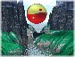

  
[Intangible Textual Heritage](../../index)  [Taoism](../index) 
[Index](index)  [Previous](tao40)  [Next](tao42) 

------------------------------------------------------------------------

[Buy this Book at
Amazon.com](https://www.amazon.com/exec/obidos/ASIN/B0026P3TA0/internetsacredte)

------------------------------------------------------------------------

  
*Laotzu's Tao and Wu Wei*, by Dwight Goddard and Henri Borel, \[1919\],
at Intangible Textual Heritage

------------------------------------------------------------------------

### XLI

### THE UNREALITY OF APPEARANCE

The superior scholar when he considers Tao earnestly practices it; an
average scholar listening to Tao sometimes follows it and sometimes
loses it; an inferior scholar listening to Tao ridicules it. Were it not
thus ridiculed it could not be regarded as Tao.

Therefore the writer says: Those who are most illumined by Tao are the
most obscure. Those advanced in Tao are most retiring. Those best guided
by Tao are the least prepossessing.

The high in virtue (teh) resemble a lowly valley; the whitest are most
likely to be put to shame; the broadest in virtue resemble the
inefficient. The most firmly established in virtue resemble the remiss.
The simplest chastity resembles the fickle, the greatest square has no
corner, the largest vessel is never filled. The greatest sound is void
of speech, the greatest form has no shape. Tao is obscure and without
p. 33 name, and yet it is precisely this Tao
that alone can give and complete.

------------------------------------------------------------------------

[Next: XLII. The Transformation of Tao](tao42)
