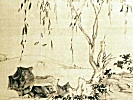

  
[Intangible Textual Heritage](../../index)  [Taoism](../index) 
[Index](index)  [Previous](mcm12)  [Next](mcm14) 

------------------------------------------------------------------------

[Buy this Book at
Amazon.com](https://www.amazon.com/exec/obidos/ASIN/0486419460/internetsacredte)

------------------------------------------------------------------------

[Buy this Book on
Kindle](https://www.amazon.com/exec/obidos/ASIN/B002KCO7KA/internetsacredte)

------------------------------------------------------------------------

  
*Musings of a Chinese Mystic*, by Lionel Giles, \[1906\], at Intangible
Textual Heritage

------------------------------------------------------------------------

p. 82

### IMMORTALITY OF THE SOUL

When Lao Tzŭ died, Ch‘in Shih went to
mourn. He uttered three yells and departed.

A disciple asked him, saying: "Were you not our Master's friend?"

"I was," replied Ch‘in Shih.

"And if so, do you consider that a sufficient expression of grief at his
loss?" added the disciple.

"I do," said Ch‘in Shih. "I had believed him to be the man of all men,
but now I know that he was not. When I went in to mourn, I found old
persons weeping as if for their children, young ones wailing as if for
their mothers. And for him to have gained the attachment of those people
in this way, he too must have uttered words which should not have been
spoken, and dropped tears which should not have been shed, thus
violating eternal principles, increasing the sum of human emotion, and
forgetting the source from which his own life was received. The ancients
called such emotions the trammels of mortality. The Master came, because
it was his

p. 83

time to be born; he went, because it was his time to die. For those who
accept the phenomenon of birth and death in this sense, lamentation and
sorrow have no place. The ancients spoke of death as of God cutting down
a man suspended in the air. The fuel is consumed, but the fire may be
transmitted, and we know not that it comes to an end.

.        .        .        .        .

To have attained to the human form must be always a source of joy. And
then, to undergo countless transitions, with only the infinite to look
forward to,—what incomparable bliss is that! Therefore it is that the
truly wise rejoice in that which can never be lost, but endures alway.

.        .        .        .        .

A son must go whithersoever his parents bid him. Nature is no other than
a man's parents. If she bid me die quickly, and I demur, then I am an
unfilial son. She can do me no wrong. Tao gives me this form, this toil
in manhood, this repose in old age, this rest in death. And surely that
which is such a kind arbiter of my life is the best arbiter of my death.

Suppose that the boiling metal in a smelting-pot were to bubble up and
say: "Make of me an Excalibur"; I think the caster would reject that
metal as uncanny. And if a sinner like

p. 84

myself were to say to God: "Make of me a man, make of me a man"; I think
he too would reject me as uncanny. The universe is the smelting-pot, and
God is the caster. I shall go whithersoever I am sent, to wake
unconscious of the past, as a man wakes from a dreamless sleep.

.        .        .        .        .

Chuang Tzŭ one day saw an empty skull, bleached, but still preserving
its shape. Striking it with his riding-whip, he said: "Wert thou once
some ambitious citizen whose inordinate yearnings brought him to this
pass?—some statesman who plunged his country into ruin and perished in
the fray?—some wretch who left behind him a legacy of shame?—some beggar
who died in the pangs of hunger and cold? Or didst thou reach this state
by the natural course of old age?"

When he had finished speaking, he took the skull and, placing it under
his head as a pillow, went to sleep. In the night he dreamt that the
skull appeared to him and said: "You speak well, sir; but all you say
has reference to the life of mortals, and to mortal troubles. In death
there are none of these. Would you like to hear about death?"

Chuang Tzŭ having replied in the affirmative, the skull began: "In death
there is no sovereign above, and no subject below. The workings of the
four seasons are unknown. Our existences

p. 85

are bounded only by eternity. The happiness of a king among men cannot
exceed that which we enjoy."

Chuang Tzŭ, however, was not convinced, and said: "Were I to prevail
upon God to allow your body to be born again, and your bones and flesh
to be renewed, so that you could return to your parents, to your wife,
and to the friends of your youth,—would you be willing?"

At this the skull opened its eyes wide and knitted its brows and said:
"How should I cast aside happiness greater than that of a king, and
mingle once again in the toils and troubles of mortality?"

------------------------------------------------------------------------

[Next: The Sage, or Perfect Man](mcm14)
