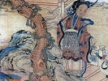

  
[Intangible Textual Heritage](../../index)  [Taoism](../index) 
[Index](index)  [Previous](mt12)  [Next](mt14) 

------------------------------------------------------------------------

[Buy this Book at
Amazon.com](https://www.amazon.com/exec/obidos/ASIN/1428628649/internetsacredte)

------------------------------------------------------------------------

  
*The Tao Teh King: A Short Study in Comparative Religion*, by C.
Spurgeon Medhurst, \[1905\], at Intangible Textual Heritage

------------------------------------------------------------------------

p. 17

### CHAPTER X.

By steadily disciplining the animal nature, until it becomes one
pointed. It is possible to establish the Indivisible. [1](#fn_25)

By undivided attention to the soul, rendering it passive, [2](#fn_26) it is possible to become as an infant
child. [3](#fn_27)

By purifying the mind of phantasms, [4](#fn_28)
it is possible to become without fault. [5](#fn_29)

By perfecting the people, and pacifying the empire, it is possible to
prove non-attachment. [6](#fn_30)

By functioning on the supra-physical planes, [7](#fn_31) it is possible to be independent of the
lower mind. [8](#fn_32)

p. 18

By making intuition omniscient, [8a](#fn_33) it
is impossible to discard knowledge. [9](#fn_34)

Producing! Nourishing! Developing, without self-consciousness! Acting,
without seeking the fruit! Progressing, without thinking of growth! This
is the abyss of energy. [10](#fn_35)

Long and steep the road man has to travel; infinite the distance between
the animalness of the savage, knowing no motive but the gratification of
desire, and the purity of the Saint, whose senses center in the One.
Well might Chuang Tzu say, "The whole of life is a round of incessant
solicitude, its duties are never finished." Moreover, the arena where
effort will be most successful lies in those dim and formless regions of
our wondrous selves, where a formative process is ever going on
controlling the character of the thoughts we put into words. No language
can express it. Lao-tzu has stated the problem as clearly as it can be
framed in speech.

If, however, the ascent be difficult, the summit is glorious. In the
beginning, a discontented, wayward, wilful child; in the end, a God,
performing all duties, yet never leaving the eternal home, where calm
peace and joy unspeakable reign evermore. Such the destiny, such the
reward of him who fathoms perfection's abyss. "He that overcometh, I
will give to him to sit down with me in my throne, as I also overcame,
and sat down with my Father in his throne." (Rev. iii, 21.)

------------------------------------------------------------------------

### Footnotes

[17:1](mt13.htm#fr_25) i.e.: The Ego, becoming
permanently self-conscious on its own plane. Very little is said in the
Confucian classics on this line. The Confucian is scarcely conscious of
the distinction between soul and body.

[17:2](mt13.htm#fr_26) The danger is that the
separated essence will set up a separated will. Conversely the way to
perfection is submission to the simplicity of the eternal purity.

[17:3](mt13.htm#fr_27) An infant has always been
the symbol of the Initiate, or one who has been re-born. Comp. the
conversation of Jesus with Nicodemus. (John iii, 1-5.)

[17:4](mt13.htm#fr_28) Viz.: Living a life of
abstract thought; ever regarding the thought as more important than the
act, or, as Jacob Böhme would say, "forsaking all to become like All."

[17:5](mt13.htm#fr_29) "It is necessary in
attending to the affairs of life to be very careful of those thoughts
which appear insignificant and trifling, lest they find a permanent
lodging in the mind. If they are retained in the heart there is a
disease in the vitals, which no medicine can cure."—*Kuan Yin Tzu*.

[17:6](mt13.htm#fr_30) Anyone practicing the
Yoga of the three first sentences could only accept the office of Ruler
as a sacrifice to duty, and the acceptance would prove the reality of
his non-attachment.

[17:7](mt13.htm#fr_31) Literally—"opening and
shutting heaven's gates."

"There not infrequently occur individuals so constituted that the spirit
can perceive independently of the corporal organs, or can, perhaps,
wholly or partially quit the body for a time and return to it
again."—*Alfred Wallace*, F.R.S.

[17:8](mt13.htm#fr_32) Literally—"The Female
Bird." The bird Karshipta, in Hindoo mythology, represents the human
Mind-Soul.

[18:8a](mt13.htm#fr_33) Possible only by steady
and prolonged concentration on the inner world.

[18:9](mt13.htm#fr_34) i.e.: Information
acquired by the ordinary processes of study and research. The individual
being separated from the universal only by differentiation, his
limitations grow less in proportion to his approximation to and union
with the divine. The idea is again and again expressed by the old Greek
philosophers, the Indian Yogins, Neo-Platonists, as well as by Jacob
Böhme and Swedenborg. Su Cheh gives the following illustration: "A
mirror reflects whatever fronts it, and does so unconsciously; the
beginning of error is the putting of self to the fore."

[18:10](mt13.htm#fr_35) The three first
sentences deal with the purity of the inner; the three next with the
purity of the outer, while the seventh describes the purity of the
whole—the invisibility or interiorness of godliness.

"If, therefore, thine eye be single, thy whole body shall be full of
light." (Matt. vi, 22.)

------------------------------------------------------------------------

[Next: Chapter XI](mt14)
