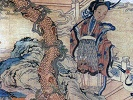

  
[Intangible Textual Heritage](../../index)  [Taoism](../index) 
[Index](index)  [Previous](mt51)  [Next](mt53) 

------------------------------------------------------------------------

[Buy this Book at
Amazon.com](https://www.amazon.com/exec/obidos/ASIN/1428628649/internetsacredte)

------------------------------------------------------------------------

  
*The Tao Teh King: A Short Study in Comparative Religion*, by C.
Spurgeon Medhurst, \[1905\], at Intangible Textual Heritage

------------------------------------------------------------------------

p. 83

### CHAPTER XLIX.

The Holy Man is not inflexible, he plans according to the needs of the
people.

I would return good for good. I would also return good for evil. [1](#fn_156) Thus goodness operates (or "thus all
become good").

I would return trust for trust. I would also return trust for suspicion.
Thus trust operates (or "thus all become trustworthy").

The Holy Man as he dwells in the world is very apprehensive concerning
it, blending his heart with the whole. [2](#fn_157) Most men plan for themselves. [3](#fn_158) The Holy Man treats every one as a
child. [4](#fn_159)

The Sage, calm and passionless, without regrets, without desires, having
risen above all that is separative, adapts himself to the needs of
mankind as water to the shape of the vessel into which it is poured.
Knowing that, as a Japanese proverb expresses it, pleasure is the seed
of pain, pain is

p. 84

the seed of pleasure (raku wa ku no tané; ku wa raku no tané), he treats
all men, the good and the bad, the sincere and the insincere, with equal
benevolence. Alfred Sutro records of Maeterlinck that he regarded the
humble, the foolish, the saint, the sinner, with the same love and
almost the same admiration. "Nothing is contemptible in this world but
scorn." "He maketh his sun to rise on the evil and the good, and sendeth
rain on the just and the unjust."

------------------------------------------------------------------------

### Footnotes

[83:1](mt52.htm#fr_156) cf. of ch.
[63](mt66.htm#an_ch_63). "The man who returns good for evil is as a tree
which renders its shade and its fruit even to those who cast stones at
it."—Persian Proverb.

[83:2](mt52.htm#fr_157) "In the world good and
evil, trustworthiness and hypocrisy arise from too much emphasis being
placed on the personality. In this way mutual recriminations and
injuries arise, without any standard whereby they may be decided. The
Sage, apprehensive concerning these, blends his heart with the whole,
and treats all, the good and the bad, the trustworthy and the hypocrite
alike."—*Su-cheh*. Cp. "*The Path of Discipleship*," by Annie Besant, p.
106.

[83:3](mt52.htm#fr_158) Literally "direct their
thoughts to their own ears and eyes." My rendering is supported by such
commentators as Wang-pi and Ho-shang-kung. The passage has been usually
modeled according to the teachings of *The Doctrine of The Mean*, and
made to say that all the people turned their eyes towards the Sage.

[83:4](mt52.htm#fr_159) He makes no
distinctions but treats all with equal impartiality. The same note was
struck by the Hindu *Mahabharata*—"There is no distinction of castes;
the whole world is created by God."

"The friend, or the enemy, is merely the ascription of the desire nature
to certain patent facts, and varies with the attitude of the
mind."—*Studies in The Bhagavad Gitâ*, by The Dreamer (*The Yoga of
Discrimination*), p. 79.

------------------------------------------------------------------------

[Next: Chapter L](mt53)
