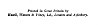

  
[Intangible Textual Heritage](../../index)  [Taoism](../index) 
[Index](index)  [Next](salt01) 

------------------------------------------------------------------------

[Buy this Book on
Kindle](https://www.amazon.com/exec/obidos/ASIN/B002I6314Q/internetsacredte)

------------------------------------------------------------------------

  
*The Sayings of Lao-Tzu*, Lionel Giles translation \[1905\], at
Intangible Textual Heritage

------------------------------------------------------------------------

p. 3

The Wisdom of the East Series

EDITED BY

L. CRANMER-BYNG  
Dr. S. A. KAPADIA

THE SAYINGS OF LAO TZŬ

p. 4 p. 5

###### WISDOM OF THE EAST

# THE SAYINGS OF LAO TZŬ

###### TRANSLATED

###### FROM THE CHINESE, WITH AN INTRODUCTION

### BY LIONEL GILES, M.A. (OXON.)

###### ASSISTANT AT THE BRITISH MUSEUM

#### E. P. DUTTON AND COMPANY, INC.

#### NEW YORK

#### \[1905\]

Scanned, proofed, and formatted at Intangible Textual Heritage,
September 2006, by John Bruno Hare. This text is in the public domain in
the United States because it was published prior to 1923.

  [  
Click to enlarge](img/cover.jpg)  
Front cover and spine  

  [  
Click to enlarge](img/title.jpg)  
Title Page  

 
[  
Click to enlarge](img/verso.jpg)  
Verso  

------------------------------------------------------------------------

[Next: Contents](salt01)
