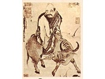

  
[Intangible Textual Heritage](../../index)  [Taoism](../index) 
[Index](index)  [Previous](salt00)  [Next](salt02) 

------------------------------------------------------------------------

[Buy this Book on
Kindle](https://www.amazon.com/exec/obidos/ASIN/B002I6314Q/internetsacredte)

------------------------------------------------------------------------

  
*The Sayings of Lao-Tzu*, Lionel Giles translation \[1905\], at
Intangible Textual Heritage

------------------------------------------------------------------------

p. 6

*Printed in Great Britain by  
Hazell, Watson & Viney, Ld., London and Aylesbury*.

p. 7

### CONTENTS

|        |                                                                    |                                 |
|--------|--------------------------------------------------------------------|---------------------------------|
|        |                                                                    | PAGE |
|        | INTRODUCTION                                                       | [9](salt03.htm#page_9)          |
| I.     | TAO IN ITS TRANSCENDENTAL ASPECT AND IN ITS PHYSICAL MANIFESTATION | [19](salt04.htm#page_19)        |
| II\.   | TAO AS A MORAL PRINCIPLE, OR "VIRTUE"                              | [24](salt05.htm#page_24)        |
| III\.  | THE DOCTRINE OF INACTION                                           | [30](salt06.htm#page_30)        |
| IV\.   | LOWLINESS AND HUMILITY                                             | [33](salt07.htm#page_33)        |
| V.     | GOVERNMENT                                                         | [37](salt08.htm#page_37)        |
| VI\.   | WAR                                                                | [41](salt09.htm#page_41)        |
| VII\.  | PARADOXES                                                          | [43](salt10.htm#page_43)        |
| VIII\. | MISCELLANEOUS SAYINGS AND PRECEPTS                                 | [47](salt11.htm#page_47)        |
| IX\.   | LAO TZŬ ON HIMSELF                                                 | [54](salt12.htm#page_54)        |

------------------------------------------------------------------------

[Next: Editorial Note](salt02)
