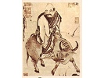

  
[Intangible Textual Heritage](../../index)  [Taoism](../index) 
[Index](index)  [Previous](salt09)  [Next](salt11) 

------------------------------------------------------------------------

[Buy this Book on
Kindle](https://www.amazon.com/exec/obidos/ASIN/B002I6314Q/internetsacredte)

------------------------------------------------------------------------

  
*The Sayings of Lao-Tzu*, Lionel Giles translation \[1905\], at
Intangible Textual Heritage

------------------------------------------------------------------------

p. 43

### PARADOXES

AMONG mankind, the recognition of beauty as such implies the idea of
ugliness, and the recognition of good implies the idea of evil. There is
the same mutual relation between existence and non-existence in the
matter of creation; between difficulty and ease in the matter of
accomplishing; between long and short in the matter of form; between
high and low in the matter of elevation; between treble and bass in the
matter of musical pitch; between before and after in the matter of
priority.

Nature is not benevolent; with ruthless indifference she makes all
things serve their purposes, like the straw dogs we use at sacrifices.
The Sage is not benevolent: he utilises the people with the like
inexorability.

The space between Heaven and Earth,--is it not like a bellows? It is
empty, yet inexhaustible; when it is put in motion, more and more comes
out.

Heaven and Earth are long-lasting. The reason why Heaven and Earth can
last long is that they live not for themselves, and thus they are able
to endure.

Thirty spokes unite in one nave; the utility

p. 44

of the cart depends on the hollow centre in which the axle turns. Clay
is moulded into a vessel; the utility of the vessel depends on its
hollow interior. Doors and windows are cut out in order to make a house;
the utility of the house depends on the empty spaces.

Thus, while the existence of things may be good, it is the non-existent
in them which makes them serviceable.

When the Great Tao falls into disuse, benevolence and righteousness come
into vogue. When shrewdness and sagacity appear, great hypocrisy
prevails. It is when the bonds of kinship are out of joint that filial
piety and paternal affection begin. It is when the State is in a ferment
of revolution that loyal patriots arise.

Cast off your holiness, rid yourself of sagacity, and the people will
benefit an hundredfold. Discard benevolence and abolish righteousness,
and the people will return to filial piety and paternal love. Renounce
your scheming and abandon gain, and thieves and robbers will disappear.
These three precepts mean that outward show is insufficient, and
therefore they bid us be true to our proper nature;--to show simplicity,
to embrace plain dealing, to reduce selfishness, to moderate desire.

A variety of colours makes man's eye blind; a diversity of sounds makes
man's ear deaf; a mixture of flavours makes man's palate dull.

He who knows others is clever, but he who knows himself is enlightened.
He who overcomes others is strong, but he who overcomes himself is
mightier still. He is rich who knows

p. 45

when he has enough. He who acts with energy has strength of purpose. He
who moves not from his proper place is long-lasting. He who dies, but
perishes not, enjoys true longevity.

If you would contract, you must first expand. If you would weaken, you
must first strengthen. If you would overthrow, you must first raise up.
If you would take, you must first give. This is called the dawn of
intelligence.

He who is most perfect seems to be lacking; yet his resources are never
outworn. He who is most full seems vacant; yet his uses are
inexhaustible.

Extreme straightness is as bad as crookedness. Extreme cleverness is as
bad as folly. Extreme fluency is as bad as stammering.

Those who know do not speak; those who .speak do not know.

Abandon learning, and you will be free from trouble and distress.

Failure is the foundation of success, and the means by which it is
achieved. Success is the lurking-place of failure; but who can tell when
the turning-point will come?

He who acts, destroys; he who grasps, loses. Therefore the Sage does not
act, and so does not destroy; he does not grasp, and so he does not
lose.

Only he who does nothing for his life's sake can truly be said to value
his life.

Man at his birth is tender and weak; at his death he is rigid and
strong. Plants and trees when they come forth are tender and crisp; when
dead, they are dry and tough. Thus rigidity and

p. 46

strength are the concomitants of death; softness and weakness are the
concomitants of life.

Hence the warrior that is strong does not conquer; the tree that is
strong is cut down. Therefore the strong and the big take the lower
place; the soft and the weak take the higher place.

There is nothing in the world more soft and weak than water, yet for
attacking things that are hard and strong there is nothing that
surpasses it, nothing that can take its place.

The soft overcomes the hard; the weak overcomes the strong. There is no
one in the world but knows this truth, and no one who can put it into
practice.

Those who are wise have no wide range of learning; those who range most
widely are not wise.

The Sage does not care to hoard. The more he uses for the benefit of
others, the more he possesses himself. The more he gives to his
fellow-men, the more he has of his own.

The truest sayings are paradoxical.

------------------------------------------------------------------------

[Next: Miscellaneous Sayings and Precepts](salt11)
