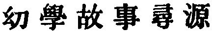
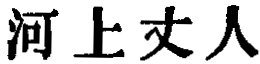
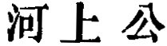

  
[Intangible Textual Heritage](../../index)  [Taoism](../index) 
[Index](index)  [Previous](sbe39003)  [Next](sbe39005) 

------------------------------------------------------------------------

### CHAPTER II.

#### THE TEXTS OF THE TAO TEH KING AND KWANG SZE SHÛ, AS REGARDS THEIR AUTHENTICITY AND GENUINENESS, AND THE ARRANGEMENT OF THEM.

I. 1. I will now state briefly, first, the grounds on which I accept the
Tâo Teh King as a genuine production of the age to which it has been
assigned, and the truth of its authorship by Lâo-dze to whom it has been
ascribed. It would not have been necessary a few years ago to write as
if these points could be called in question, but in 1886 Mr. Herbert A.
Giles, of Her Majesty's Consular Service in China, and one of the ablest
Chinese scholars living, vehemently called them in question in an
article in the China Review for the months of March and April. His
strictures have been replied to, and I am not going to revive here the
controversy which they produced, but only to state a portion of the
evidence which satisfies my own mind on the two points just mentioned.

2\. It has been said above that the year B. C. 604 was, probably, that
of Lâo-dze's birth. The year of his death is not recorded. Sze-mâ Khien,
the first great Chinese historian,

|                                              |
|----------------------------------------------|
| The evidence of Sze-mâ Khien, the historian. |

who died in about B.C. 85, commences his 'Biographies' with a short
account of Lâo-dze. He tells us that the philosopher had been a curator
of the Royal Library of Kâu, and that, mourning over the decadence of
the dynasty, he wished to withdraw from the world, and proceeded to the
pass or defile of Hsien-ku [1](#fn_2),

p. 5

leading from China to the west. There he was recognised by the warden of
the pass, Yin Hsî (often called Kwan Yin), himself a well-known Tâoist,
who insisted on his leaving him a writing before he went into seclusion.
Lâo-dze then wrote his views on 'The Tâo and its Characteristics,' in
two parts or sections, containing more than 5000 characters, gave the
manuscript to the warden, and went his way [1](#fn_3); 'nor is it known where he died.' This
account is strange enough, and we need not wonder that it was by and by
embellished with many marvels. It contains, however, the definite
statements that Lâo-dze wrote the Tâo Teh King in two parts, and
consisting of more than 5000 characters. And that Khien was himself well
acquainted with the treatise is apparent from his quotations from it,
with, in almost every case, the specification of the author. He thus
adduces part of the first chapter, and a large portion of the last
chapter but one. His brief references also to Lâo-dze and his writings
are numerous.

3\. But between Lâo-dze and Sze-mâ Khien there were many Tâoist writers
whose works remain. I may specify

|                                                  |
|--------------------------------------------------|
| Lieh-dze, Han Fei-dze, and other Tâoist authors. |

Lieh-dze (assuming that his chapters, though not composed in their
present form by him, may yet be accepted as fair specimens of his
teaching); Kwang-dze (of the fourth century B.C. We find him refusing to
accept high office from king Wei of Khû, B.C. 339-299); Han Fei, a
voluminous author, who died by his own hand in B.C. 230; and Liû An, a
scion of the Imperial House of Han, king of Hwâi-nan, and better known
to us as Hwâi-nan dze, who also died by his own hand in B.C. 122. In the
books of all these men we find quotations of many passages that are in
our treatise. They are expressly said to be, many of them, quotations
from Lâo-dze; Han Fei several times all but

p. 6

shows the book beneath his eyes. To show how numerous the quotations by
Han Fei and Liû An are, let it be borne in mind that the Tâo Teh King
has come down to us as divided into eighty-one short chapters; and that
the whole of it is shorter than the shortest of our Gospels. Of the
eighty-one chapters, either the whole or portions of seventy-one are
found in those two writers. There are other authors not so decidedly
Tâoistic, in whom we find quotations from the little book. These
quotations are in general wonderfully correct. Various readings indeed
there are; but if we were sure that the writers did trust to memory,
their differences would only prove that copies of the text had been
multiplied from the very first.

In passing on from quotations to the complete text, I will

|                    |
|--------------------|
| Evidence of Pan Kû |

clinch the assertion that Khien was well acquainted with our treatise,
by a passage from the History of the Former Han Dynasty (B.C. 206-A.D.
24), which was begun to be compiled by Pan Kû, who died however in 92,
and left a portion to be completed by his sister, the famous Pan Kâo.
The thirty-second chapter of his Biographies is devoted to Sze-mâ Khien,
and towards the end it is said that 'on the subject of the Great Tâo he
preferred Hwang and Lâo to the six King.' 'Hwang and Lâo' must there be
the writings of Hwang-Tî and Lâo-dze. The association of the two names
also illustrates the antiquity claimed for Tâoism, and the subject of
note 1, p. 2.

4\. We go on from quotations to complete texts, and turn, first, to the
catalogue of the Imperial Library of Han, as compiled by Liû Hsin, not
later than the commencement of our Christian era. There are entered in
it Tâoist works by

|                                           |
|-------------------------------------------|
| Catalogue of the Imperial Library of Han. |

thirty-seven different authors, containing in all 993 chapters or
sections (phien). Î Yin, the premier of Khäng Thang (B.C. 1766), heads
the list with fifty-one sections. There are in it four editions of
Lâo-dze's work with commentaries:--by a Mr. Lin, in four sections; a Mr.
Fû, in thirty-seven sections; a Mr. Hsü, in six sections; and by Liû
Hsiang, Hsin's own father, in four sections. All these four works have
since perished, but there they were in the Imperial Library before

p. 7

our era began. Kwang-dze is in the same list in fifty-two books or
sections, the greater part of which have happily escaped the devouring
tooth of time.

We turn now to the twentieth chapter of Khien's Biographies, in which he
gives an account of Yo Î, the scion of a distinguished family, and who
himself played a famous part, both as a politician and military leader,
and became prince of Wang-kû under the kingdom of Kâo in B. C. 279.
Among his descendants was a Yo Khän, who learned in Khî 'the words,'
that is, the Tâoistic writings 'of Hwang-Tî and Lâo-dze from an old man
who lived on the Ho-side.' The origin of this old man was not known, but
Yo Khän taught what he learned from him to a Mr. Ko, who again became
preceptor to Zhâo Zhan, the chief minister of Khî, and afterwards of the
new dynasty of Han, dying in B.C. 190.

5\. Referring now to the catalogue of the Imperial Library of the
dynasty of Sui (A. D. 589-6 18), we find that

|                                   |
|-----------------------------------|
| The catalogue of the Sui dynasty. |

it contained many editions of Lâo's treatise with commentaries. The
first mentioned is 'The Tâo Teh King,' with the commentary of the old
man of the Ho-side, in the time of the emperor Wän of Han (B. C.
179-142). It is added in a note that the dynasty of Liang (A.D. 502-556)
had possessed the edition of the old man of the Ho-side, of the time of
the Warring States; but that with some other texts and commentaries it
had disappeared.' I find it difficult to believe that there had been two
old men of the Ho-side [1](#fn_4), both teachers
of Tâoism and commentators on our King, but I am willing to content
myself with the more recent work, and accept the copy that has been
current--say from B.C. 150, when Sze-mâ Khien could have been little
more than a boy. Tâoism was a favourite study with many of the Han
emperors and their ladies. Hwâi-nan dze, of whose many quotations from

p. 8

the text of Lâo I have spoken, was an uncle of the emperor Wän. To the
emperor King (B.C. 156-143), the son of Wän, there is attributed the
designation of Lâo's treatise as a King, a work of standard authority.
At the beginning of his reign, we are told, some one was commending to
him four works, among which were those of Lâo-dze and Kwang-dze. Deeming
that the work of Hwang-dze and Lâo-dze was of a deeper character than
the others, he ordered that it should be called a King, established a
board for the study of Tâoism, and issued an edict that the book should
be learned and recited at court, and throughout the country [1](#fn_5). Thenceforth it was so styled. We find
Hwang-fû Mî (A.D. 215-282) referring to it as the Tâo Teh King.

The second place in the Sui catalogue is given to the text and
commentary of Wang Pî or Wang Fû-sze, an

|                      |
|----------------------|
| The work of Wang Pî. |

extraordinary scholar who died in A. D. 249, at the early age of
twenty-four. This work has always been much prized. It was its text
which Lû Teh-ming used in his 'Explanation of the Terms and Phrases of
the Classics,' in the seventh century. Among the editions of it which I
possess is that printed in 1794 with the imperial moveable metal types.

I need not speak of editions or commentaries subsequent to Wang Pî's.
They soon begin to be many, and are only not so numerous as those of the
Confucian Classics.

6\. All the editions of the book are divided into two

|                                                                       |
|-----------------------------------------------------------------------|
| Divisions into parts, chapters; and number of characters in the text. |

parts, the former called Tâo, and the latter Teh, meaning the Qualities
or Characteristics of the Tâo, but this distinction of subjects is by no
means uniformly adhered to.

I referred already to the division of the whole into eighty-one short
chapters (37 + 44), which is by common tradition attributed to Ho-shang
Kung, or 'The old man of the Ho-side.' Another very early commentator,
called Yen Zun or Yen Kün-phing, made a division into seventy-two
chapters (40 + 32), under the influence, no doubt, of some

p. 9

mystical considerations. His predecessor, perhaps, had no better reason
for his eighty-one; but the names of his chapters were, for the most
part, happily chosen, and have been preserved. Wû Khäng arranged the two
parts in sixty-seven chapters (31 + 36). It is a mistake, however, to
suppose, as even Mr. Wylie with all his general accuracy did [1](#fn_6), that Wû 'curtails the ordinary text to some
extent.' He does not curtail, but only re-arranges according to his
fashion, uniting some of Ho-shang Kung's chapters in one, and sometimes
altering the order of their clauses.

Sze-mâ Khien tells us that, as the treatise came from Lâo-dze, it
contained more than 5000 characters; that is, as one critic says, 'more
than 5000 and fewer than 6000.' Ho-shang Kung's text has 5350, and one
copy 5590; Wang Pî's, 5683, and one copy 5610. Two other early texts
have been counted, giving 5720 and 5635 characters respectively. The
brevity arises from the terse conciseness of the style, owing mainly to
the absence of the embellishment of particles, which forms so striking a
peculiarity in the composition of Mencius and Kwang-dze.

In passing on to speak, secondly and more briefly, of the far more
voluminous writings of Kwang-dze, I may say that I do not know of any
other book of so ancient a date as the Tâo Teh King, of which the
authenticity of the origin and genuineness of the text can claim to be
so well substantiated.

II\. 7. In the catalogue of the Han Library we have the entry of
'Kwang-dze in fifty-two books or sections.' By

|                         |
|-------------------------|
| The Books of Kwang-dze. |

the time of the Sui dynasty, the editions of his work amounted to nearly
a score. The earliest commentary that has come down to us goes by the
name of Kwo Hsiang's. He was an officer and scholar of the Zin dynasty,
who died about the year 312. Another officer, also of Zin, called Hsiang
Hsiû, of rather an earlier date, had undertaken the same task, but left
it incomplete; and his manuscripts coming (not, as it appears, by

p. 10

any fraud) into Kwo's hands, he altered and completed them as suited his
own views, and then gave them to the public. In the short account of
Kwo, given in the twentieth chapter of the Biographies of the Zin
history, it is said that several tens of commentators had laboured
unsatisfactorily on Kwang's writings before Hsiang Hsiû took them in
hand. As the joint result of the labours of the two men, however, we
have only thirty-three of the fifty-two sections mentioned in the Han
catalogue. It is in vain that I have tried to discover how and when the
other nineteen sections were lost. In one of the earliest commentaries
on the Tâo Teh King, that by Yen Zun, we have several quotations from
Kwang-dze which bear evidently the stamp of his handiwork, and are not
in the current Books; but they would not altogether make up a single
section. We have only to be thankful that so large a proportion of the
original work has been preserved. Sû Shih (Dze-kan, and Tung-pho), it is
well known, called in question the genuineness of Books 28 to 31 [1](#fn_7). Books 15 and 16 have also been challenged,
and a paragraph here and there in one or other of the Books. The various
readings, according to a collation given by Ziâo Hung, are few.

8\. There can be no doubt that the Books of Kwang-dze were hailed by all
the friends of Tâoism. It has been

|                                                 |
|-------------------------------------------------|
| Importance to Tâoism of the Books of Kwang-dze. |

mentioned above that the names 'Hwang-Tî' and 'Lâo-dze' were associated
together as denoting the masters of Tâoism, and the phrase, 'the words
of Hwang-Tî and Lâo-dze,' came to be no more than a name for the Tâo Teh
King. Gradually the two names were contracted into 'Hwang Lâo,' as in
the passage quoted on p. 6 from Pan Kû. After the Han dynasty, the name
Hwang gave place to Kwang, and the names Lâo Kwang, and, sometimes
inverted, Kwang Lâo, were employed to denote the system or the texts of
Tâoism. In the account, for instance, of Kî

p. 11

Khang, in the nineteenth chapter of the Biographies of Zin, we have a
typical Tâoist brought before us. When grown up, 'he loved Lâo and
Kwang;' and a visitor, to produce the most favourable impression on him,
says, 'Lâo-dze and Kwang Kâu are my masters.'

9\. The thirty-three Books of Kwang-dze are divided into three Parts,
called Nêi, or 'the Inner;' Wâi, or 'the Outer;' and Zâ, 'the
Miscellaneous.' The first Part

|                                         |
|-----------------------------------------|
| Division of the Books into three Parts. |

comprises seven Books; the second, fifteen; and the third, eleven.
'Inner' may be understood as equivalent to esoteric or More Important.
The titles of the several Books are significant, and each expresses the
subject or theme of its Book. They are believed to have been prefixed by
Kwang-dze himself, and that no alteration could be made in the
composition but for the worse. 'Outer' is understood in the sense of
supplementary or subsidiary. The fifteen Books so called are 'Wings' to
the previous seven. Their titles were not given by the author, and are
not significant of the Tâoistic truth which all the paragraphs unite, or
should unite, in illustrating; they are merely some name or phrase taken
from the commencement of the first paragraph in each Book,--like the
names of the Books of the Confucian Analects, or of the Hebrew
Pentateuch. The fixing them originally is generally supposed to have
been the work of Kwo Hsiang. The eleven Miscellaneous Books are also
supplementary to those of the first Part, and it is not easy to see why
a difference was made between them and the fifteen that precede.

10\. Kwang-dze's writings have long been current under the name of Nan
Hwa Kin King. He was a native of

|                                         |
|-----------------------------------------|
| The general title of Kwang-dze's works. |

the duchy of Sung, born in what was then called the district of Mäng,
and belonged to the state or kingdom of Liang or Wei. As he grew up, he
filled some official post in the city of Zhî-yüan,--the site of which it
is not easy to determine with certainty. In A.D. 742, the name of his
birth-place was changed (but only for a time) to Nan-hwa, and an
imperial order was issued that Kwang-Sze should thenceforth

p. 12

be styled 'The True Man of Nan-hwa,' and his Book, 'The True Book of
Nan-hwa [1](sbe39005.htm#fn_8).' To be 'a True
Man' is the highest Tâoistic achievement of a man, and our author thus
canonised communicates his glory to his Book.

------------------------------------------------------------------------

### Footnotes

[4:1](sbe39004.htm#fr_2) In the present district
of Ling-pâo, Shan Kâu, province of Ho-nan.

[5:1](sbe39004.htm#fr_3) In an ordinary Student's
Manual I find a note with reference to this incident to which it may be
worth while to give a place here:--The warden, it is said, set before
Lâo-dze a dish of tea; and this was the origin of the custom of
tea-drinking between host and guest (see the  , ch. 7, on Food and Drink).

[7:1](sbe39004.htm#fr_4) The earlier old man of
the Ho-side is styled in Chinese 
; the other 
; but the designations have the same meaning. Some
critical objections to the genuineness of the latter's commentary on the
ground of the style are without foundation.

[8:1](sbe39004.htm#fr_5) See Ziâo Hung's Wings or
Helps, ch. v, p. 11a.

[9:1](sbe39004.htm#fr_6) Notes on Chinese
Literature, p. 173.

[10:1](sbe39004.htm#fr_7) A brother of Shih, Sû
Kêh (Dze-yû and Ying-pin), wrote a remarkable commentary on the Tâo Teh
King; but it was Shih who first discredited those four Books, in his
Inscription for the temple of Kwang-dze, prepared in 1078.

------------------------------------------------------------------------

[Next: Chapter III: What is the Meaning of the Name Tâo? And the Chief
Points of Belief in Tâoism](sbe39005)
