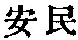

  
[Intangible Textual Heritage](../../index)  [Taoism](../index) 
[Index](index)  [Previous](sbe39009)  [Next](sbe39011) 

------------------------------------------------------------------------

### 3.

3\. 1. Not to value and employ men of superior ability is the way to
keep the people from rivalry among themselves; not to prize articles
which are difficult to procure is the way to keep them from becoming
thieves; not to show them what is likely to excite their desires is the
way to keep their minds from disorder.

2\. Therefore the sage, in the exercise of his government, empties their
minds, fills their bellies, weakens their wills, and strengthens their
bones.

3\. He constantly (tries to) keep them without knowledge and without
desire, and where there are those who have knowledge, to keep them from
presuming to act (on it). When there is this abstinence from action,
good order is universal.

 , 'Keeping the People at
Rest.' The object of the chapter is to show that government according to
the Tâo is unfavourable to the spread of knowledge among the people, and
would keep them rather in the state of primitive simplicity and
ignorance, thereby securing their restfulness and universal good order.
Such is the uniform teaching of Lâo-dze and his great follower
Kwang-dze, and of all Tâoist writers.

------------------------------------------------------------------------

[Next: Chapter 4](sbe39011)
