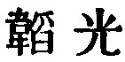

  
[Intangible Textual Heritage](../../index)  [Taoism](../index) 
[Index](index)  [Previous](sbe39013)  [Next](sbe39015) 

------------------------------------------------------------------------

### 7.

7\. 1. Heaven is long-enduring and earth continues long. The reason why
heaven and earth are able to endure and continue thus long is because
they do not live of, or for, themselves. This is how they are able to
continue and endure.

2\. Therefore the sage puts his own person last, and yet it is found in
the foremost place; he treats his person as if it were foreign to him,
and yet that person is preserved. Is it not because he has no personal
and private ends, that therefore such ends are realised?

 , 'Sheathing the Light.'
The chapter teaches that one's best good is realised by not thinking of
it, or seeking for it. Heaven and earth afford a pattern to the sage,
and the sage affords a pattern to all men.

------------------------------------------------------------------------

[Next: Chapter 8](sbe39015)
