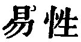

  
[Intangible Textual Heritage](../../index)  [Taoism](../index) 
[Index](index)  [Previous](sbe39014)  [Next](sbe39016) 

------------------------------------------------------------------------

### 8.

8\. 1. The highest excellence is like (that of) water. The excellence of
water appears in its benefiting all things, and in its occupying,
without striving (to the contrary), the low place which all men dislike.
Hence (its way) is near to (that of) the Tâo.

2\. The excellence of a residence is in (the suitability of) the place;
that of the mind is in abysmal stillness; that of associations is in
their being with the virtuous; that of government is in its securing
good order; that of (the conduct of) affairs is in its ability; and that
of (the initiation of) any movement is in its timeliness.

p. 53

3\. And when (one with the highest excellence) does not wrangle (about
his low position), no one finds fault with him.

 , 'The Placid and
Contented Nature.' Water, as an illustration of the way of the Tâo, is
repeatedly employed by Lâo-dze.

The various forms of what is excellent in par. 2 are brought forward to
set forth the more, by contrast, the excellence of the humility
indicated in the acceptance of the lower place without striving to the
contrary.

------------------------------------------------------------------------

[Next: Chapter 9](sbe39016)
