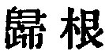
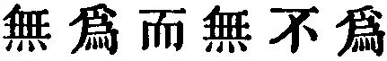

  
[Intangible Textual Heritage](../../index)  [Taoism](../index) 
[Index](index)  [Previous](sbe39022)  [Next](sbe39024) 

------------------------------------------------------------------------

### 16.

16\. 1. The (state of) vacancy should be brought to the utmost degree,
and that of stillness guarded with unwearying vigour. All things alike
go through their processes of activity, and (then) we see them return
(to their original state). When things (in the vegetable world) have
displayed their luxuriant growth, we see each of them return to its
root. This returning to their root is what we call the state of
stillness; and that stillness maybe called a reporting that they have
fulfilled their appointed end.

2\. The report of that fulfilment is the regular, unchanging rule. To
know that unchanging rule is to be intelligent; not to know it leads to
wild movements and evil issues. The knowledge of that unchanging rule
produces a (grand) capacity and forbearance, and

p. 60

that capacity and forbearance lead to a community (of feeling with all
things). From this community of feeling comes a kingliness of character;
and he who is king-like goes on to be heaven-like. In that likeness to
heaven he possesses the Tâo. Possessed of the Tâo, he endures long; and
to the end of his bodily life, is exempt from all danger of decay.

 , 'Returning to the
Root.' The chapter exhibits the operation of the Tâo in nature, in man,
and in government; an operation silent, but all-powerful; unaccompanied
with any demonstration of its presence, but great in its results.

An officer receives a charge or commission from his superior ( ); when he reports the
execution of it he is said 
. So all animate things, including men, receive their
charge from the Tâo as to their life, and when they have fulfilled it
they are represented as reporting that fulfilment; and the fulfilment
and report are described as their unchanging rule, so that they are the
Tâo's impassive instruments, having no will or purpose of their
own,--according to Lâo-dze's formula of 'doing nothing and yet doing all
things ( ).'

The getting to possess the Tâo, or to be an embodiment of it, follows
the becoming Heaven or Heaven-like; and this is in accordance with the
saying in the fourth chapter that 'the Tâo might seem to have been
before God.' But, in Kwang-dze especially, we often find the full
possessor and displayer of the Tâo spoken of as 'Heaven.' The last
sentence, that he who has come to the full possession of the Tâo is
exempt from all danger of decay, is generally illustrated by a reference
to the utterances in ch. 50; as if Lâo-dze did indeed see in the Tâo a
preservative against death.

------------------------------------------------------------------------

[Next: Chapter 17](sbe39024)
