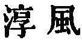
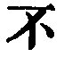
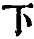
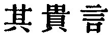

  
[Intangible Textual Heritage](../../index)  [Taoism](../index) 
[Index](index)  [Previous](sbe39023)  [Next](sbe39025) 

------------------------------------------------------------------------

### 17.

17\. 1. In the highest antiquity, (the people) did not know that there
were (their rulers). In the next age they loved them and praised them.
In the

p. 61

next they feared them; in the next they despised them. Thus it was that
when faith (in the Tâo) was deficient (in the rulers) a want of faith in
them ensued (in the people).

2\. How irresolute did those (earliest rulers) appear, showing (by their
reticence) the importance which they set upon their words! Their work
was done and their undertakings were successful, while the people all
said, 'We are as we are, of ourselves!'

 , 'The Unadulterated
Influence.' The influence is that of the Tâo, as seen in the earliest
and paradisiacal times. The two chapters that follow are closely
connected with this, showing how the silent, passionless influence of
the Tâo was gradually and injuriously superseded by 'the wisdom of the
world,' in the conduct of government. In the first sentence there is a
small various reading of  
for  , but it does not
affect the meaning of the passage. The first clause of par. 2 gives some
difficulty;   'they made
their words valuable or precious,' i.e. 'they seldom spake;' cp. 1 Sam.
iii. 1.

------------------------------------------------------------------------

[Next: Chapter 18](sbe39025)
