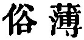

  
[Intangible Textual Heritage](../../index)  [Taoism](../index) 
[Index](index)  [Previous](sbe39024)  [Next](sbe39026) 

------------------------------------------------------------------------

### 18.

18\. 1. When the Great Tâo (Way or Method) ceased to be observed,
benevolence and righteousness came into vogue. (Then) appeared wisdom
and shrewdness, and there ensued great hypocrisy.

2\. When harmony no longer prevailed throughout the six kinships, filial
sons found their manifestation; when the states and clans fell into
disorder, loyal ministers appeared.

 , 'The Decay of Manners.'
A sequel to the preceding chapter, and showing also how the general
decay of manners afforded opportunity for the display of certain virtues
by individuals. Observe 'the Great Tâo,' occurring here for the first
time as the designation of 'the Tâo.'}

------------------------------------------------------------------------

[Next: Chapter 19](sbe39026)
