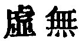

  
[Intangible Textual Heritage](../../index)  [Taoism](../index) 
[Index](index)  [Previous](sbe39029)  [Next](sbe39031) 

------------------------------------------------------------------------

### 23.

23\. 1. Abstaining from speech marks him who is obeying the spontaneity
of his nature. A violent

p. 66

wind does not last for a whole morning; a sudden rain does not last for
the whole day. To whom is it that these (two) things are owing? To
Heaven and Earth. If Heaven and Earth cannot make such (spasmodic)
actings last long, how much less can man!

2\. Therefore when one is making the Tâo his business, those who are
also pursuing it, agree with him in it, and those who are making the
manifestation of its course their object agree with him in that; while
even those who are failing in both these things agree with him where
they fail.

3\. Hence, those with whom he agrees as to the Tâo have the happiness of
attaining to it; those with whom he agrees as to its manifestation have
the happiness of attaining to it; and those with whom he agrees in their
failure have also the happiness of attaining (to the Tâo). (But) when
there is not faith sufficient (on his part), a want of faith (in him)
ensues (on the part of the others).

 , 'Absolute Vacancy.'
This, I think, is the meaning of the title, 'Emptiness and Nothingness,'
an entire conformity to the Tâo in him who professes to be directed by
it. Such an one will be omnipotent in his influence in all others. The
Tâo in him will restrain all (spasmodic) loquacity. Those who are
described in par. 2 as 'failing' are not to be thought of as bad men,
men given up, as Julien has it, au crime. They are simply ordinary men,
who have failed in their study of the Tâo and practice of it, but are
won to truth and virtue by the man whom the author has in mind. As we
might expect, however, the mention of such men has much embarrassed the
commentators.

Compare the concluding sentence with the one at the end of par. 1 in ch.
17.

------------------------------------------------------------------------

[Next: Chapter 24](sbe39031)
