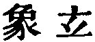
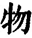
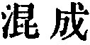
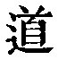

  
[Intangible Textual Heritage](../../index)  [Taoism](../index) 
[Index](index)  [Previous](sbe39031)  [Next](sbe39033) 

------------------------------------------------------------------------

### 25.

25\. 1. There was something undefined and complete, coming into
existence before Heaven and Earth. How still it was and formless,
standing alone, and undergoing no change, reaching everywhere and in no
danger (of being exhausted)! It may be regarded as the Mother of all
things.

2\. I do not know its name, and I give it the designation of the Tâo
(the Way or Course). Making an effort (further) to give it a name I call
it The Great.

3\. Great, it passes on (in constant flow). Passing

p. 68

on, it becomes remote. Having become remote, it returns. Therefore the
Tâo is great; Heaven is great; Earth is great; and the (sage) king is
also great. In the universe there are four that are great, and the
(sage) king is one of them.

4\. Man takes his law from the Earth; the Earth takes its law from
Heaven; Heaven takes its law from the Tâo. The law of the Tâo is its
being what it is.

 , 'Representations of the
Mystery.' In this chapter Lâo approaches very near to give an answer to
the question as to what the Tâo is, and yet leaves the reader
disappointed. He commences by calling it 'a thing ( );' but that term does not
necessitate our regarding it as 'material! We have seen in the preceding
chapter that it is used to signify 'spirits and men.' Nor does his going
on to speak of it as 'chaotic (
) I necessarily lead us to conceive it as made up of
the 'material elements of things;' we have the same term applied in ch.
14 to the three immaterial constituents there said to be blended in the
idea of it.

'He does not know its name,' and he designates it by the term denoting a
course or way (Tâo,  ), and
indicating the phenomenal attribute, the method in which all phenomena
come before our observation, in their development or evolution. And to
distinguish it from all other methods of evolution, he would call it
'the Great Method,' and so he employs that combination as its name in
ch. 18 and elsewhere; but it cannot be said that this name has fully
maintained itself in the writings of his followers. But understood thus,
he here says, as in ch. 1, that it is 'the Mother of all things.' And
yet, when he says that 'it was before Heaven and Earth were produced,'
he comes very near his affirmations in chapters 1 and 4, that 'the
nameless Tâo was the beginning (or originating cause) of Heaven and
Earth,' and 'might seem to have been before

p. 69

God.' Was he groping after God if haply he might find Him? I think he
was, and he gets so far as to conceive of Him as 'the Uncaused Cause,'
but comes short of the idea of His personality. The other subordinate
causes which he mentions all get their force or power from the Tâo, but
after all the Tâo is simply a spontaneity, evolving from itself, and not
acting from a personal will, consciously in the direction of its own
wisdom and love. 'Who can by searching find out God? Who can find out
the Almighty to perfection?'

The predicate of the Tâo in the chapter, most perplexing to myself, is
'It returns,' in par. 3. 'It flows away, far away, and comes back;'--are
not the three statements together equal to 'It is everywhere?'

------------------------------------------------------------------------

[Next: Chapter 26](sbe39033)
