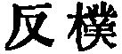

  
[Intangible Textual Heritage](../../index)  [Taoism](../index) 
[Index](index)  [Previous](sbe39034)  [Next](sbe39036) 

------------------------------------------------------------------------

### 28.

28\. 1. Who knows his manhood's strength,  
Yet still his female feebleness maintains;  
As to one channel flow the many drains,  
All come to him, yea, all beneath the sky.  
Thus he the constant excellence retains;  
The simple child again, free from all stains.

Who knows how white attracts,  
Yet always keeps himself within black's shade,  
The pattern of humility displayed,  
Displayed in view of all beneath the sky;  
He in the unchanging excellence arrayed,  
Endless return to man's first state has made.

Who knows how glory shines,  
Yet loves disgrace, nor e'er for it is pale;  
Behold his presence in a spacious vale,  
To which men come from all beneath the sky.  
The unchanging excellence completes its tale;  
The simple infant man in him we hail.

2\. The unwrought material, when divided and distributed, forms vessels.
The sage, when employed, becomes the Head of all the Officers (of
government); and in his greatest regulations he employs no violent
measures.

 , 'Returning to
Simplicity.' The chapter sets forth humility and simplicity, an artless
freedom from all purpose, as characteristic of the man of Tâo, such as
he was in the primeval time. 'The sage' in par. 2 may be 'the Son of
Heaven,'--the Head of all rule in the kingdom, or the feudal lord in a
state.

------------------------------------------------------------------------

[Next: Chapter 29](sbe39036)
