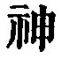

  
[Intangible Textual Heritage](../../index)  [Taoism](../index) 
[Index](index)  [Previous](sbe39035)  [Next](sbe39037) 

------------------------------------------------------------------------

### 29.

29\. 1. If any one should wish to get the kingdom for himself, and to
effect this by what he does, I see

p. 72

that he will not succeed. The kingdom is a spirit-like thing, and cannot
be got by active doing. He who would so win it destroys it; he who would
hold it in his grasp loses it.

2\. The course and nature of things is such that  
What was in front is now behind;  
What warmed anon we freezing find.  
Strength is of weakness oft the spoil;  
The store in ruins mocks our toil.

Hence the sage puts away excessive effort, extravagance, and easy
indulgence.

 , 'Taking no Action. All
efforts made with a purpose are sure to fail. The nature of the Tâo
necessitates their doing so, and the uncertainty of things and events
teaches the same lesson.

That the kingdom or throne is a 'spirit-like vessel' has become a common
enough saying among the Chinese. Julien has, 'L'Empire est comme un vase
divin;' but I always shrink from translating   by 'divine.' Its English
analogue is 'spirit,' and the idea in the text is based on the immunity
of spirit from all material law, and the uncertain issue of attempts to
deal with it according to ordinary methods. Wû Khäng takes the phrase as
equivalent to 'superintended by spirits,' which is as inadmissible as
Julien's 'divin.' The Tâo forbids action with a personal purpose, and
all such action is sure to fail in the greatest things as well as in the
least.}

------------------------------------------------------------------------

[Next: Chapter 30](sbe39037)
