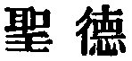
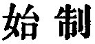

  
[Intangible Textual Heritage](../../index)  [Taoism](../index) 
[Index](index)  [Previous](sbe39038)  [Next](sbe39040) 

------------------------------------------------------------------------

### 32.

32\. 1. The Tâo, considered as unchanging, has no name.

2\. Though in its primordial simplicity it may be small, the whole world
dares not deal with (one embodying) it as a minister. If a feudal prince
or the king could guard and hold it, all would spontaneously submit
themselves to him.

3\. Heaven and Earth (under its guidance) unite together and send down
the sweet dew, which, without

p. 75

the directions of men, reaches equally everywhere as of its own accord.

4\. As soon as it proceeds to action, it has a name. When it once has
that name, (men) can know to rest in it. When they know to rest in it,
they can be free from all risk of failure and error.

5\. The relation of the Tâo to all the world is like that of the great
rivers and seas to the streams from the valleys.

 , Chalmers translates
this by "sagely virtue.' But I cannot adopt that rendering, and find it
difficult to supply a better. The 'virtue' is evidently the Attribute of
the Tâo come out from the condition of the Absolute, and capable of
being named. In the former state it has no name; in the latter, it has.
Par. 1 and the commencement of par. 4 must both be explained from ch. 1.

The 'primordial simplicity' in par. 2 is the Tâo in its simplest
conception, alone, and by itself, and the 
 in par. 4 is that Tâo come forth into operation and
become Teh, the Teh which affords a law for men. From this to the end of
the paragraph is very obscure. I have translated from the text of Wang
Pî. The text of Ho-shang Kung is different, and he comments upon it as
it stands, but to me it is inexplicable.

------------------------------------------------------------------------

[Next: Chapter 33](sbe39040)
