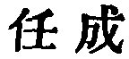
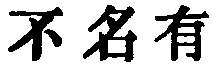

  
[Intangible Textual Heritage](../../index)  [Taoism](../index) 
[Index](index)  [Previous](sbe39040)  [Next](sbe39042) 

------------------------------------------------------------------------

### 34.

34\. 1. All-pervading is the Great Tâo! It may be found on the left hand
and on the right.

2\. All things depend on it for their production, which it gives to
them, not one refusing obedience to it. When its work is accomplished,
it does not claim the name of having done it. It clothes all things as
with a garment, and makes no assumption of being their lord;-it may be
named in the smallest things. All things return (to their root and
disappear), and do not know that it is it which presides over their
doing so;-it may be named in the greatest things.

3\. Hence the sage is able (in the same way) to accomplish his great
achievements. It. is through

p. 77

his not making himself great that he can accomplish them.

 , 'The Task of
Achievement! The subject is the greatness of what the Tâo, called here
by Lâo's own name for it in ch. 25, does; and the unconscious simplicity
with which it does it; and then the achievements of the sage who is
permeated by the Tâo. Par. 2 is descriptive of the influence of the Tâo
in the vegetable world. The statements and expressions are much akin to
those in parts of chapters 2, 10, and 51, and for Ho-shang Kung's
difficult reading of  
some copies give  , as in
chapter 2.

------------------------------------------------------------------------

[Next: Chapter 35](sbe39042)
