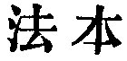
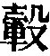
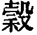
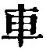
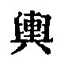

  
[Intangible Textual Heritage](../../index)  [Taoism](../index) 
[Index](index)  [Previous](sbe39045)  [Next](sbe39047) 

------------------------------------------------------------------------

### 39.

39\. 1. The things which from of old have got the One (the Tâo) are--

Heaven which by it is bright and pure;  
Earth rendered thereby firm and sure;  
Spirits with powers by it supplied;  
Valleys kept full throughout their void  
All creatures which through it do live  
Princes and kings who from it get  
The model which to all they give.  
All these are the results of the One (Tâo).

2\. If heaven were not thus pure, it soon would rend;  
If earth were not thus sure, 'twould break and bend;  
Without these powers, the spirits soon would fail;  
If not so filled, the drought would parch each vale;  
Without that life, creatures would pass away;  
Princes and kings, without that moral sway,  
However grand and high, would all decay.

3\. Thus it is that dignity finds its (firm) root in its (previous)
meanness, and what is lofty finds its stability in the lowness (from
which it rises). Hence princes and kings call themselves 'Orphans,' 'Men
of small virtue,' and as 'Carriages without a nave.' Is not this an
acknowledgment that in their considering themselves mean they see the
foundation of

p. 83

their dignity? So it is that in the enumeration of the different parts
of a carriage we do not come on what makes it answer the ends of a
carriage. They do not wish to show themselves elegant-looking as jade,
but (prefer) to be coarse-looking as an (ordinary) stone.

 , 'The Origin of the
Law.' In this title there is a reference to the Law given to all things
by the Tâo, as described in the conclusion of chapter 25. And the Tâo
affords that law by its passionless, undemonstrative nature, through
which in its spontaneity, doing nothing for the sake of doing, it yet
does all things.

The difficulty of translation is in the third paragraph. The way in
which princes and kings speak depreciatingly of themselves is adduced as
illustrating how they have indeed got the spirit of the Tâo; and I
accept the last epithet as given by Ho-shang Kung, 'naveless' ( ), instead of   (='the unworthy'), which is
found in Wang Pî, and has been adopted by nearly all subsequent editors.
To see its appropriateness here, we have only to refer back to chapter
11, where the thirty spokes, and the nave, empty to receive the axle,
are spoken of, and it is shown how the usefulness of the carriage is
derived from that emptiness of the nave. This also enables us to give a
fair and consistent explanation of the difficult clause which follows,
in which also I have followed the text of Ho-shang Kung. For his  , Wang Pî has  , which also is found in a
quotation of it by Hwâi-nan Dze; but this need not affect the meaning.
In the translation of the clause we are assisted by a somewhat similar
illustration about a horse in the twenty-fifth of Kwang-dze's Books,
par. 10.

------------------------------------------------------------------------

[Next: Chapter 40](sbe39047)
