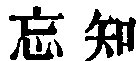

  
[Intangible Textual Heritage](../../index)  [Taoism](../index) 
[Index](index)  [Previous](sbe39054)  [Next](sbe39056) 

------------------------------------------------------------------------

### 48.

48\. 1. He who devotes himself to learning (seeks) from day to day to
increase (his knowledge); he who devotes himself to the Tâo (seeks) from
day to day to diminish (his doing).

2\. He diminishes it and again diminishes it, till he arrives at doing
nothing (on purpose). Having arrived at this point of non-action, there
is nothing which he does not do.

3\. He who gets as his own all under heaven does so by giving himself no
trouble (with that end). If one take trouble (with that end), he is not
equal to getting as his own all under heaven.

 , 'Forgetting
Knowledge;-the contrast between Learning and the Tâo. It is only by the
Tâo that the world can be won.

Ziâo Hung commences his quotations of commentary on this chapter with
the following from Kumâragîva on the second par.:--'He carries on the
process of diminishing till there is nothing coarse about him which is
not put away. He puts it away till he has forgotten all that was bad in
it. He then puts away all that is fine about him. He does so till he has
forgotten all that was good in it. But the bad was wrong, and the good
is right. Having diminished the wrong, and also diminished the right,
the process is carried on till they are both forgotten. Passion and
desire are both cut off; and his virtue and the Tâo are in such union
that he does nothing; but though he does nothing, he allows all things
to do their own doing, and all things are done.' Such is a Buddhistic
view of the passage, not very intelligible, and which I do not endorse.

p. 91

In a passage in the 'Narratives of the School' (Bk. IX, Art. 2), we have
a Confucian view of the passage:--'Let perspicacity, intelligence,
shrewdness, and wisdom be guarded by stupidity, and the service of the
possessor will affect the whole world; let them be guarded by
complaisance, and his dating and strength will shake the age; let them
be guarded by timidity, and his wealth will be all within the four seas;
let them be guarded by humility, and there will be what we call the
method of "diminishing it, and diminishing it again."' But neither do I
endorse this.

My own view of the scope of the chapter has been given above in a few
words. The greater part of it is found in Kwang-dze.

------------------------------------------------------------------------

[Next: Chapter 49](sbe39056)
