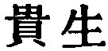
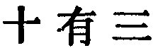
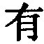

  
[Intangible Textual Heritage](../../index)  [Taoism](../index) 
[Index](index)  [Previous](sbe39056)  [Next](sbe39058) 

------------------------------------------------------------------------

### 50.

50\. 1. Men come forth and live; they enter (again) and die.

2\. Of every ten three are ministers of life (to themselves); and three
are ministers of death.

3\. There are also three in every ten whose aim is to live, but whose
movements tend to the land (or place) of death. And for what reason?
Because of their excessive endeavours to perpetuate life.

4\. But I have heard that he who is skilful in managing the life
entrusted to him for a time travels on the land without having to shun
rhinoceros or

p. 93

tiger, and enters a host without having to avoid buff coat or sharp
weapon. The rhinoceros finds no place in him into which to thrust its
horn, nor the tiger a place in which to fix its claws, nor the weapon a
place to admit its point. And for what reason? Because there is in him
no place of death.

 , 'The Value set on
Life.' The chapter sets forth the Tâo as an antidote against decay and
death.

In par. 1 life is presented to us as intermediate between two
non-existences. The words will suggest to many readers those in Job i.
21.

In pars. 2 and 3 I translate the characters 
 by 'three in ten,' instead of by 'thirteen,' as
Julien and other translators have done. The characters are susceptible
of either translation according to the tone in which we read the  . They were construed as I have
done by Wang Pî; and many of the best commentators have followed in his
wake. 'The ministers of life to themselves' would be those who eschewed
all things, both internal and external, tending to injure health; 'the
ministers of death,' those who pursued courses likely to cause disease
and shorten life; the third three would be those who thought that by
mysterious and abnormal courses they could prolong life, but only
injured it. Those three classes being thus disposed of, there remains
only one in ten rightly using the Tâo, and he is spoken of in the next
paragraph.

This par. 4 is easy of translation, and the various readings in it are
unimportant, differing in this respect from those in par. 3. But the aim
of the author in it is not clear. In ascribing such effects to the
possession of the Tâo, is he 'trifling,' as Dr. Chalmers thinks? or
indulging the play of his poetical fancy? or simply saying that the
Tâoist will keep himself out of danger?

------------------------------------------------------------------------

[Next: Chapter 51](sbe39058)
