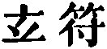
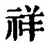
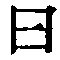
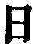
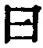

  
[Intangible Textual Heritage](../../index)  [Taoism](../index) 
[Index](index)  [Previous](sbe39061)  [Next](sbe39063) 

------------------------------------------------------------------------

p. 99

### 55.

55\. 1. He who has in himself abundantly the attributes (of the Tâo) is
like an infant. Poisonous insects will not sting him; fierce beasts will
not seize him; birds of prey will not strike him.

2\. (The infant's) bones are weak and its sinews soft, but yet its grasp
is firm. It knows not yet the union of male and female, and yet its
virile member may be excited;--showing the perfection of its physical
essence. All day long it will cry without its throat becoming
hoarse;--showing the harmony (in its constitution).

3\. To him by whom this harmony is known,  
(The secret of) the unchanging (Tâo) is shown,  
And in the knowledge wisdom finds its throne.  
All life-increasing arts to evil turn;  
Where the mind makes the vital breath to burn,  
(False) is the strength, (and o'er it we should mourn.)

4\. When things have become strong, they (then) become old, which may be
said to be contrary to the Tâo. Whatever is contrary to the Tâo soon
ends.

 , 'The Mysterious Charm;'
meaning, apparently, the entire passivity of the Tâo.

With pars. 1 and 2, compare what is said about the infant in chapters 10
and 20, and about the immunity from dangers such as here described of
the disciple of the Tâo in ch. 50. My 'evil' in the second triplet of
par. 3 has been translated by 'felicity;' but a reference to the
Khang-hsî dictionary will show that the meaning which I give to   is well authorised. It is the
only meaning allowable here. The third and fourth   in this par. appear in
Ho-shang Kung's text as  ,
and he comments on the clauses accordingly;

p. 100

but   is now the received
reading. Some light is thrown on this paragraph and the next by an
apocryphal conversation attributed to Lâo-dze in Liû Hsiang's Shwo-wän,
X, 4 a.

------------------------------------------------------------------------

[Next: Chapter 56](sbe39063)
