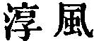
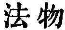
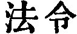

  
[Intangible Textual Heritage](../../index)  [Taoism](../index) 
[Index](index)  [Previous](sbe39063)  [Next](sbe39065) 

------------------------------------------------------------------------

### 57.

57\. 1. A state may be ruled by (measures of) correction; weapons of war
maybe used with crafty dexterity; (but) the kingdom is made one's own
(only) by freedom from action and purpose.

2\. How do I know that it is so? By these

p. 101

facts:--In the kingdom the multiplication of prohibitive enactments
increases the poverty of the people; the more implements to add to their
profit that the people have, the greater disorder is there in the state
and clan; the more acts of crafty dexterity that men possess, the more
do strange contrivances appear; the more display there is of
legislation, the more thieves and robbers there are.

3\. Therefore a sage has said, 'I will do nothing (of purpose), and the
people will be transformed of themselves; I will be fond of keeping
still, and the people will of themselves become correct. I will take no
trouble about it, and the people will of themselves become rich; I will
manifest no ambition, and the people will of themselves attain to the
primitive simplicity.'

 , 'The Genuine
Influence.' The chapter shows how government by the Tâo is alone
effective, and of universal application; contrasting it with the failure
of other methods.

After the 'weapons of war' in par. 1, one is tempted to take 'the sharp
implements' in par. 2 as such weapons, but the meaning which I finally
adopted, especially after studying chapters 36 and 80, seems more
consonant with Lâo-dze's scheme of thought. In the last member of the
same par., Ho-shang Kung has the strange reading of  , and uses it in his
commentary; but the better text of 
 is found both in Hwâi-nan and Sze-mâ Khien, and in
Wang Pî.

We do not know if the writer were quoting any particular sage in par. 3,
or referring generally to the sages of the past;--men like the
'sentence-makers' of ch. 41.

------------------------------------------------------------------------

[Next: Chapter 58](sbe39065)
