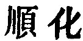

  
[Intangible Textual Heritage](../../index)  [Taoism](../index) 
[Index](index)  [Previous](sbe39064)  [Next](sbe39066) 

------------------------------------------------------------------------

### 58.

58\. 1. The government that seems the most unwise,  
Oft goodness to the people best supplies;

p. 102

That which is meddling, touching everything,  
Will work but ill, and disappointment bring.

Misery!--happiness is to be found by its side! Happiness!--misery lurks
beneath it! Who knows what either will come to in the end?

2\. Shall we then dispense with correction? The (method of) correction
shall by a turn become distortion, and the good in it shall by a turn
become evil. The delusion of the people (on this point) has indeed
subsisted for a long time.

3\. Therefore the sage is (like) a square which cuts no one (with its
angles); (like) a corner which injures no one (with its sharpness). He
is straightforward, but allows himself no license; he is bright, but
does not dazzle.

 , 'Transformation
according to Circumstances;' but this title does not throw light on the
meaning of the chapter; nor are we helped to an understanding of it by
Han Fei, with his additions and comments (XI, 3 b, 4 b), nor by Hwâi-nan
with his illustrations (XII, 21 a, b). The difficulty of it is increased
by its being separated from the preceding chapter of which it is really
the sequel. It contrasts still further government by the Tâo, with that
by the method of correction. The sage is the same in both chapters, his
character and government both marked by the opposites or contraries
which distinguish the procedure of the Tâo, as stated in ch. 40.

------------------------------------------------------------------------

[Next: Chapter 59](sbe39066)
