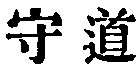
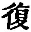
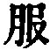
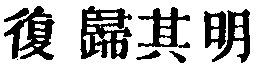

  
[Intangible Textual Heritage](../../index)  [Taoism](../index) 
[Index](index)  [Previous](sbe39065)  [Next](sbe39067) 

------------------------------------------------------------------------

### 59.

59\. 1. For regulating the human (in our constitution) and rendering the
(proper) service to the heavenly, there is nothing like moderation.

2\. It is only by this moderation that there is effected an early return
(to man's normal state). That early return is what I call the repeated
accumulation of the attributes (of the Tâo). With that

p. 103

repeated accumulation of those attributes, there comes the subjugation
(of every obstacle to such return). Of this subjugation we know not what
shall be the limit; and when one knows not what the limit shall be, he
may be the ruler of a state.

3\. He who possesses the mother of the state may continue long. His case
is like that (of the plant) of which we say that its roots are deep and
its flower stalks firm:--this is the way to secure that its enduring
life shall long be seen.

 , 'Guarding the Tâo.' The
chapter shows how it is the guarding of the Tâo that ensures a
continuance of long life, with vigour and success. The abuse of it and
other passages in our King helped on, I must believe, the later Tâoist
dreams about the elixir vitae and life-preserving pills. The whole of
it, with one or two various readings, is found in Han Fei (VI, 4 b-6 a),
who speaks twice in his comments of 'The Book.'

Par. 1 has been translated, 'In governing men and in serving Heaven,
there is nothing like moderation.' But by 'Heaven' there is not intended
'the blue sky' above us, nor any personal Power above it, but the Tâo
embodied in our constitution, the Heavenly element in our nature. The
'moderation' is the opposite of what we call 'living fast,' 'burning the
candle at both ends.'

In par. 2 I must read  ,
instead of the more common 
. I find it in Lû Teh-ming, and that it is not a
misprint in him appears from his subjoining that it is pronounced like
 . Its meaning is the same
as in   in ch. 52, par. 5.
Teh is not 'virtue' in our common meaning of the term, but 'the
attributes of the Tâo,' as almost always with Lâo-dze.

In par. 3 'the mother of the state' is the Tâo as in ch. 1, and
especially in ch. 52, par. 1.

------------------------------------------------------------------------

[Next: Chapter 60](sbe39067)
