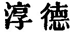

  
[Intangible Textual Heritage](../../index)  [Taoism](../index) 
[Index](index)  [Previous](sbe39071)  [Next](sbe39073) 

------------------------------------------------------------------------

### 65.

65\. 1. The ancients who showed their skill in practising the Tâo did
so, not to enlighten the people, but rather to make them simple and
ignorant.

2\. The difficulty in governing the people arises from their having much
knowledge. He who (tries to) govern a state by his wisdom is a scourge
to it while he who does not (try to) do so is a blessing.

3\. He who knows these two things finds in them also his model and rule.
Ability to know this

p. 109

model and rule constitutes what we call the mysterious excellence (of a
governor). Deep and far-reaching is such mysterious excellence, showing
indeed its possessor as opposite to others, but leading them to a great
conformity to him.

 , 'Pure, unmixed
Excellence.' The chapter shows the powerful and beneficent influence of
the Tâo in government, in contrast with the applications and
contrivances of human wisdom. Compare ch. 19. My 'simple and ignorant'
is taken from Julien. More literally the translation would be 'to make
them stupid.' My 'scourge' in par. 2 is also after Julien's 'fléau.'

------------------------------------------------------------------------

[Next: Chapter 66](sbe39073)
