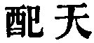
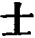

  
[Intangible Textual Heritage](../../index)  [Taoism](../index) 
[Index](index)  [Previous](sbe39074)  [Next](sbe39076) 

------------------------------------------------------------------------

### 68.

68\. He who in (Tâo's) wars has skill  
    Assumes no martial port;  
He who fights with most good will  
    To rage makes no resort.  
He who vanquishes yet still  
    Keeps from his foes apart;  
He whose hests men most fulfil  
    Yet humbly plies his art.  
Thus we say, 'He ne'er contends,  
    And therein is his might.'  
Thus we say, 'Men's wills he bends,  
    That they with him unite.'  
Thus we say, 'Like Heaven's his ends,  
    No sage of old more bright.'

p. 112

 , 'Matching Heaven.' The
chapter describes the work of the practiser of the Tâo as accomplished
like that of Heaven, without striving or crying. He appears under the
figure of a mailed warrior (
) of the ancient chariot. The chapter is a sequel of
the preceding, and is joined on to it by Wû Khäng, as is also the next.

------------------------------------------------------------------------

[Next: Chapter 69](sbe39076)
