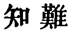
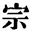

  
[Intangible Textual Heritage](../../index)  [Taoism](../index) 
[Index](index)  [Previous](sbe39076)  [Next](sbe39078) 

------------------------------------------------------------------------

### 70.

70\. 1. My words are very easy to know, and very easy to practise; but
there is no one in the world who is able to know and able to practise
them.

2\. There is an originating and all-comprehending

p. 113

(principle) in my words, and an authoritative law for the things (which
I enforce). It is because they do not know these, that men do not know
me.

3\. They who know me are few, and I am on that account (the more) to be
prized. It is thus that the sage wears (a poor garb of) hair cloth,
while he carries his (signet of) jade in his bosom.

 , 'The Difficulty of
being (rightly) Known.' The Tâo comprehends and rules all Lâo-dze's
teaching, as the members of a clan were all in the loins of their first
father ( ), and continue
to look up to him; and the people of a state are all under the direction
of their ruler; yet the philosopher had to complain of not being known.
Lâo-dze's principle and rule or ruler was the Tâo. His utterance here is
very important. Compare the words of Confucius in the Analects, XIV, ch.
37, et al.

Par. 2 is twice quoted by Hwâi-nan, though his text is not quite the
same in both cases.

------------------------------------------------------------------------

[Next: Chapter 71](sbe39078)
