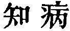
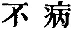
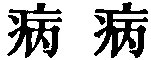
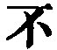

  
[Intangible Textual Heritage](../../index)  [Taoism](../index) 
[Index](index)  [Previous](sbe39077)  [Next](sbe39079) 

------------------------------------------------------------------------

### 71.

71\. 1. To know and yet (think) we do not know is the highest
(attainment); not to know (and yet think) we do know is a disease.

2\. It is simply by being pained at (the thought of) having this disease
that we are preserved from it. The sage has not the disease. He knows
the pain that would be inseparable from it, and therefore he does not
have it.

 , 'The Disease of
Knowing.' Here, again, we have the Tâo working 'by contraries,'--in the
matter of knowledge. Compare par. 1 with Confucius's account of what
knowledge is in the Analects, 11, ch. 17. The par. 1 is found in one
place in Hwâi-nan, lengthened out by the addition of particles; but the
variation is unimportant. In another place, however, he seems to have
had the correct text before him.

Par. 2 is in Han Fei also lengthened out, but with an

p. 114

important variation (  for
 ), and I cannot construe
his text. His   is
probably a transcriber's error.

------------------------------------------------------------------------

[Next: Chapter 72](sbe39079)
