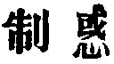

  
[Intangible Textual Heritage](../../index)  [Taoism](../index) 
[Index](index)  [Previous](sbe39080)  [Next](sbe39082) 

------------------------------------------------------------------------

### 74.

74\. 1. The people do not fear death; to what purpose is it to (try to)
frighten them with death? If the people were always in awe of death, and
I could always seize those who do wrong, and put them to death, who
would dare to do wrong?

2\. There is always One who presides over the infliction of death. He
who would inflict death in the room of him who so presides over it may
be described as hewing wood instead of a great carpenter. Seldom is it
that he who undertakes the hewing, instead of the great carpenter, does
not cut his own hands!

 , 'Restraining Delusion.'
The chapter sets forth the inefficiency of capital punishment, and warns
rulers against the infliction of it. Who is it that superintends the
infliction of death? The answer of Ho-shang Kung is very clear:--'It is
Heaven, which, dwelling on high and ruling all beneath, takes note of
the transgressions of men.' There is a slight variation in the readings
of the second sentence of par. 2 in the texts of Ho-shang Kung and Wang
Pî, and the reading adopted by Ziâo Hung differs a little from them
both; but the meaning is the same in them all.

This chapter and the next are rightly joined on to the preceding by Wû
Khäng.

------------------------------------------------------------------------

[Next: Chapter 75](sbe39082)
