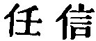

  
[Intangible Textual Heritage](../../index)  [Taoism](../index) 
[Index](index)  [Previous](sbe39084)  [Next](sbe39086) 

------------------------------------------------------------------------

### 78.

78\. 1. There is nothing in the world more soft and weak than water, and
yet for attacking things that are firm and strong there is nothing that
can take precedence of it;--for there is nothing (so effectual) for
which it can be changed.

2\. Every one in the world knows that the soft overcomes the hard, and
the weak the strong, but no one is able to carry it out in practice.

3\. Therefore a sage has said,  
He who accepts his state's reproach,  
Is hailed therefore its altars' lord;  
To him who bears men's direful woes  
They all the name of King accord.'

4\. Words that are strictly true seem to be paradoxical.

 , 'Things to be
Believed.' It is difficult to give a short and appropriate translation
of this title. The chapter shows how the most unlikely results follow
from action according to the Tâo.

Par. 1. Water was Lâo-dze's favourite emblem of the Tâo. Compare
chapters 8, 66, et al.

Par. 2. Compare ch. 36, par. 2.

Par. 3. Of course we do not know who the sage was from whom Lâo-dze got
the lines of this paragraph. They may suggest to some readers the lines
of Burns, as they have done to me:--

'The honest man, though e'er so poor,  
Is king o' men for a' that.'

But the Tâoist of Lâo-dze is a higher ideal than Burns's honest man.

p. 121

Par. 4 is separated from this chapter, and made to begin the next by Wû
Khäng.

------------------------------------------------------------------------

[Next: Chapter 79](sbe39086)
