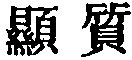
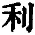
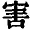

  
[Intangible Textual Heritage](../../index)  [Taoism](../index) 
[Index](index)  [Previous](sbe39087)  [Next](sbe39089) 

------------------------------------------------------------------------

### 81.

81\. 1. Sincere words are not fine; fine words are not sincere. Those
who are skilled (in the Tâo) do not dispute (about it); the disputatious
are not skilled in it. Those who know (the Tâo) are not extensively
learned; the extensively learned do not know it.

2\. The sage does not accumulate (for himself). The more that he expends
for others, the more does he possess of his own; the more that he gives
to others, the more does he have himself.

3\. With all the sharpness of the Way of Heaven, it injures not; with
all the doing in the way of the sage he does not strive.

 , 'The Manifestation of
Simplicity.' The chapter shows how quietly and effectively the Tâo
proceeds, and by contraries in a way that only the master of it can
understand. The author, says Wû Khäng, 'sums up in this the
subject-matter of the two Parts of his Treatise, showing that in all its
five thousand characters, there is nothing beyond what is here said.'

p. 124

Par. 2 suggests to Dr. Chalmers the well-known lines of Bunyan as an
analogue of it:--

'A man there was, though some did count him mad,  
The more he gave away, the more he had.'

Wû Khäng brings together two sentences from Kwang-dze (XXXIII, 21 b, 22
a), written evidently with the characters of this text in mind, which,
as from a Tâoist mint, are a still better analogue, and I venture to put
them into rhyme:--

Amassing but to him a sense of need betrays;  
He hoards not, and thereby his affluence displays.'

I have paused long over the first pair of contraries in par. 3 (  and  ). Those two characters
primarily mean 'sharpness' and 'wounding by cutting;' they are also
often used in the sense of I being beneficial,' and 'being
injurious;'--'contraries,' both of them. Which 'contrary' had Lâo-dze in
mind? I must think the former, though differing in this from all
previous translators. The Jesuit version is, 'Celestis Tâo natura ditat
omnes, nemini nocet;' Julien's, 'Il est utile aux êtres, et ne leur nuit
point;' Chalmers's, 'Benefits and does not injure;' and V. von
Strauss's, 'Des Himmels Weise ist wolthun und nicht beschddigen.'

------------------------------------------------------------------------

[Next: Book I: Hsiâo-yâo Yû](sbe39089)
