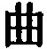

  
[Intangible Textual Heritage](../../index)  [Taoism](../index) 
[Index](index)  [Previous](sbe39130)  [Next](sbe39132) 

------------------------------------------------------------------------

p. 281

## BOOK X.

### PART II. SECTION III.

### Khü Khieh, or 'Cutting open Satchels [1](#fn_366).'

1\. In taking precautions against thieves who cut open satchels, search
bags, and break open boxes, people are sure to cord and fasten them
well, and to employ strong bonds and clasps; and in this they are
ordinarily said to show their wisdom. When a great thief comes, however,
he shoulders the box, lifts up the satchel, carries off the bag, and
runs away with them, afraid only that the cords, bonds, and clasps may
not be secure; and in this case what was called the wisdom (of the
owners) proves to be nothing but a collecting of the things for the
great thief. Let me try and set this matter forth. Do not those who are
vulgarly called wise prove to be collectors for the great thieves? And
do not those who are called sages prove to be but guardians in the
interest of the great thieves?

How do I know that the case is so? Formerly, in the state of Khî, the
neighbouring towns could see one another; their cocks and dogs never
ceased to answer the crowing and barking of other cocks and dogs
(between them). The nets were set (in the water and on the land); and
the ploughs and hoes were employed over more than a space of two
thousand lî square. All within its four boundaries, the

p. 282

establishment of the ancestral temples and of the altars of the land and
grain, and the ordering of the hamlets and houses, and of every corner
in the districts, large, medium, and small, were in all particulars
according to the rules of the sages [1](#fn_367). So it was; but yet one morning, Thien
Khäng-dze [2](#fn_368) killed the ruler of Khî,
and stole his state. And was it only the state that he stole? Along with
it he stole also the regulations of the sages and wise men (observed in
it). And so, though he got the name of being a thief and a robber, yet
he himself continued to live as securely as Yâo and Shun had done. Small
states did not dare to find fault with him; great states did not dare to
take him off; for twelve generations (his descendants) have possessed
the state of Khî [3](#fn_369). Thus do we not
have a case in which not only did (the party) steal the state of Khî,

p. 283

but at the same time the regulations of its sages and wise men, which
thereby served to guard the person of him, thief and robber as he was?

2\. Let me try to set forth this subject (still further). Have not there
been among those vulgarly styled the wisest, such as have collected
(their wealth) for the great chief? and among those styled the most sage
such as have guarded it for him? How do I know that it has been so?
Formerly, Lung-fäng [1](#fn_370) was beheaded;
Pî-kan [2](#fn_371) had his heart torn out;
Khang Hung [3](#fn_372) was ripped open; and
Dze-hsü [4](#fn_373) was reduced to pulp (in
the Kiang). Worthy as those four men were, they did not escape such
dreadful deaths. The followers of the robber Kih [5](#fn_374) asked him, saying, 'Has the robber also
any method or principle (in his proceedings)?' He replied, 'What
profession is there which has not its principles? That the robber in his
recklessness comes to the conclusion that there are valuable deposits in
an apartment shows his sageness; that he is the first to enter it shows
his bravery; that he is the last to quit it shows his righteousness;
that he knows whether (the robbery) may be attempted or not shows his
wisdom; and that he makes an equal

p. 284

division of the plunder shows his benevolence. Without all these five
qualities no one in the world has ever attained to become a great
robber.' Looking at the subject in this way, we see that good men do not
arise without having the principles of the sages, and that Kih could not
have pursued his course without the same principles. But the good men in
the world are few, and those who are not good are many;--it follows that
the sages benefit the world in a few instances and injure it in many.
Hence it is that we have the sayings, 'When the lips are gone the teeth
are cold [1](#fn_375);' 'The poor wine of Lû
gave occasion to the siege of Han-tan [2](#fn_376);' 'When sages are born great robbers
arise [3](#fn_377).' When the stream is dried,
the valley is empty; when the mound is levelled, the deep pool (beside
it) is filled up. When the sages have died, the great robbers will not
arise; the world would be at peace, and there would be no more troubles.
While the sagely men have not died, great robbers will not cease to
appear. The more right that is attached to (the views of) the sagely men
for the government of the world, the more advantage will accrue to (such
men as) the robber Kih. If we make for men pecks and bushels

p. 285

to measure (their wares), even by means of those pecks and bushels
should we be teaching them to steal [1](#fn_378); if we make for them weights and
steelyards to weigh (their wares), even by means of those weights and
steelyards shall we be teaching them to steal. If we make for them
tallies and seals to secure their good faith, even by means of those
tallies and seals shall we be teaching them to steal. If we make for
them benevolence and righteousness to make their doings correct, even by
means of benevolence and righteousness shall we be teaching them to
steal. How do I know that it is so? Here is one who steals a hook (for
his girdle);--he is put to death for it: here is another who steals a
state;--he becomes its prince. But it is at the gates of the princes
that we find benevolence and righteousness (most strongly)
professed;--is not this stealing benevolence and righteousness, sageness
and wisdom? Thus they hasten to become great robbers, carry off
princedoms, and steal benevolence and righteousness, with all the gains
springing from the use of pecks and bushels, weights and steelyards,
tallies and seals:--even the rewards of carriages and coronets have no
power to influence (to a different course), and the terrors of the axe
have no power to restrain in such cases. The giving of so great gain to
robbers (like) Kih, and making it impossible to restrain them;--this is
the error committed by the sages.

3\. In accordance with this it is said, 'Fish should

p. 286

not be taken from (the protection of) the deep waters; the agencies for
the profit of a state should not be shown to men [1](#fn_379).' But those sages (and their teachings)
are the agencies for the profit of the world, and should not be
exhibited to it. Therefore if an end were put to sageness and wisdom put
away, the great robbers would cease to arise. If jade were put away and
pearls broken to bits, the small thieves would not appear. If tallies
were burned and seals broken in pieces, the people would become simple
and unsophisticated. If pecks were destroyed and steelyards snapped in
two, the people would have no wrangling. If the rules of the sages were
entirely set aside in the world, a beginning might be made of reasoning
with the people. If the six musical accords were reduced to a state of
utter confusion, organs and lutes all burned, and the ears of the
(musicians like the) blind Khwang [2](#fn_380)
stopped up, all men would begin to possess and employ their (natural)
power of hearing. If elegant ornaments were abolished, the five
embellishing colours disused, and the eyes of (men like) Lî Kû [3](#fn_381) glued up, all men would begin to possess
and employ their (natural) power of vision. If the hook and line were
destroyed, the compass and square thrown away, and the fingers of men
(like) the artful Khui [4](#fn_382) smashed,
all men would begin to possess and employ their (natural) skill;--as it
is said, 'The greatest art is

p. 287

like stupidity [1](#fn_383).' If conduct such
as that of Zäng (Shän) [2](#fn_384) and Shih
(Khiû) [3](#fn_385) were discarded, the mouths
of Yang (Kû) [4](#fn_386) and Mo (Tî) gagged,
and benevolence and righteousness seized and thrown aside, the virtue of
all men would begin to display its mysterious excellence. When men
possessed and employed their (natural) power of vision, there would be
no distortion in the world. When they possessed and employed their
(natural) power of hearing, there would be no distractions in the world.
When they possessed and employed their (natural) faculty of knowledge,
there would be no delusions in the world. When they possessed and
employed their (natural) virtue, there would be no depravity in the
world. Men like Zäng (Shän), Shih (Khiû), Yang (Kû), Mo (Tî), Shih
Khwang (the musician), the artist Khui, and Lî Kû, all display their
qualities outwardly, and set the world in a blaze (of admiration) and
confound it;--a method which is of no use!

4\. Are you, Sir, unacquainted with the age of perfect virtue? Anciently
there were Yung-khäng, Tâ-thing, Po-hwang, Kang-yang, Lî-lû, Lî-khû,
Hsien-yüan, Ho-hsü, Zun-lû, Kû-yung, Fû-hsî, and Shän-näng [5](#fn_387). In their times the people made

p. 288

knots on cords in carrying on their affairs. They thought their (simple)
food pleasant, and their (plain) clothing beautiful. They were happy in
their (simple) manners, and felt at rest in their (poor) dwellings. (The
people of) neighbouring states might be able to descry one another; the
voices of their cocks and dogs might be heard (all the way) from one to
the other; they might not die till they were old; and yet all their life
they would have no communication together [1](#fn_388). In those times perfect good order
prevailed.

Now-a-days, however, such is the state of things that you shall see the
people stretching out their necks, and standing on tiptoe, while they
say, 'In such and such a place there is a wise and able man.' Then they
carry with them whatever dry provisions they may have left, and hurry
towards it, abandoning their parents in their homes, and neglecting the
service of their rulers abroad. Their footsteps may be traced in lines
from one state to another, and the ruts of their chariot-wheels also for
more than a thousand lî. This is owing to the error of their superiors
in their (inordinate) fondness for knowledge. When those superiors do
really love knowledge, but do not follow the (proper) course, the whole
world is thrown into great confusion.

How do I know that the case is so? The knowledge shown in the (making
of) bows, cross-bows, hand-nets, stringed arrows, and contrivances with
springs is great, but the birds are troubled by them

p. 289

above; the knowledge shown in the hooks, baits, various kinds of nets,
and bamboo traps is great, but the fishes are disturbed by them in the
waters; the knowledge shown in the arrangements for setting nets, and
the nets and snares themselves, is great, but the animals are disturbed
by them in the marshy grounds. (So), the versatility shown in artful
deceptions becoming more and more pernicious, in ingenious discussions
as to what is hard and what is white, and in attempts to disperse the
dust and reconcile different views, is great, but the common people are
perplexed by all the sophistry. Hence there is great disorder
continually in the world, and the guilt of it is due to that fondness
for knowledge. Thus it is that all men know to seek for the knowledge
that they have not attained to; and do not know to seek for that which
they already have (in themselves); and that they know to condemn what
they do not approve (in others), and do not know to condemn what they
have allowed in themselves;--it is this which occasions the great
confusion and disorder. It is just as if, above, the brightness of the
sun and moon were darkened; as if, beneath, the productive vigour of the
hills and streams were dried up; and as if, between, the operation of
the four seasons were brought to an end:--in which case there would not
be a single weak and wriggling insect, nor any plant that grows up,
which would not lose its proper nature. Great indeed is the disorder
produced in the world by the love of knowledge. From the time of the
three dynasties downwards it has been so. The plain and honest-minded
people are neglected, and the plausible representations of restless
spirits

p. 290

received with pleasure; the quiet and unexciting method of non-action is
put away, and pleasure taken in ideas garrulously expressed. It is this
garrulity of speech which puts the world in disorder.

------------------------------------------------------------------------

### Footnotes

[281:1](sbe39131.htm#fr_406) See pp.
[141](sbe39097.htm#page_141), [142](sbe39098.htm#page_142).

[282:1](sbe39131.htm#fr_407) The meaning is
plain; but to introduce the various geographical terms would make the
translation cumbrous. The concluding 
 is perplexing.

[282:2](sbe39131.htm#fr_408) This event is
mentioned in the Analects, XIV, xxii, where the perpetrator of the
murder is called Khän Khäng-dze, and Khän Häng. Häng was his name, and
Khäng the honorary title given to him after his death. The family to
which he belonged had originally taken refuge in Khî from the state of
Khän in B. C. 672. Why and when its chiefs adopted the surname Thien
instead of Khän is not well known. The murder took place in 482. Häng
did not immediately usurp the marquisate; but he and his successors
disposed of it at their pleasure among the representatives of the old
House till 386, when Thien Ho was recognised by the king of Kâu as the
marquis; and his next successor but one took the title of king.

[282:3](sbe39131.htm#fr_409) The kingdom of Khî
came to an end in B. C. 221, the first year of the dynasty of Khin,
after it had lasted through five reigns. How Kwang-dze made out his
'twelve generations' we cannot tell. There may be an interpolation in
his text made in the time of Khin, or subsequently.

[283:1](sbe39131.htm#fr_410) See on Book IV,
par. 1.

[283:2](sbe39131.htm#fr_411) See on Book IV,
par. 1.

[283:3](sbe39131.htm#fr_412) A historiographer
of Kâu, with whom Confucius is said to have studied music. He was weakly
and unjustly put to death, as here described by king Käng, in B. C. 492.

[283:4](sbe39131.htm#fr_413) Wû Dze-hsü, the
hero of revenge, who fled from Khû to Wû, which he long served. He was
driven at last to commit suicide, and his body was then put into a
leathern wine-sack, and thrown into the Kiang near the present
Sû-kâu;--about B. C. 475.

[283:5](sbe39131.htm#fr_414) See on Book VIII,
par. 4.

[284:1](sbe39131.htm#fr_415) This is an
instance of cause and effect naturally happening.

[284:2](sbe39131.htm#fr_416) At a meeting of
the princes, presided over by king Hsüan of Khû (B. C. 369-340), the
ruler of Lû brought very poor wine for the king, which was presented to
him as wine of Kâo, in consequence of a grudge against that kingdom by
his officer of wines. In consequence of this king Hsüan ordered siege to
be laid to Han-tan, the capital of Kâo. This is an instance of cause and
effect occurring irregularly.

[284:3](sbe39131.htm#fr_417) There seems to be
no connexion of cause and effect here; but Kwang-dze goes on in his own
way to make out that there is such a connexion.

[285:1](sbe39131.htm#fr_418) The verb 'to
steal' is here used transitively, and with a hiphil force.

[286:1](sbe39131.htm#fr_419) See the Tâo Teh
King, ch. 36. Our author's use of it throws light on its meaning.

[286:2](sbe39131.htm#fr_420) Note
 [1](sbe39123.htm#fn_98), p. 186.

[286:3](sbe39131.htm#fr_421) Note
 [2](sbe39129.htm#fn_343), p. 269.

[286:4](sbe39131.htm#fr_422) A skilful maker of
arrows of the time of Yâo,--the Kung-kung of the Shû, II, i, 21; V,
xxii, 19.

[287:1](sbe39131.htm#fr_423) The Tâo Teh King,
ch. 45.

[287:2](sbe39131.htm#fr_424) Note
 [6](sbe39129.htm#fn_347), p. 269.

[287:3](sbe39131.htm#fr_425) Note
 [7](sbe39129.htm#fn_348), p. 269.

[287:4](sbe39131.htm#fr_426) Note
 [5](sbe39128.htm#fn_324), p. 261.

[287:5](sbe39131.htm#fr_427) Of the twelve
names mentioned here the reader is probably familiar with those of
Fû-hsî and Shan-näng, the first and second of the Tî in chronology.
Hsien-yüan is another name for Hwang-Tî, the third of them. Kû-yung was,
perhaps, a minister of Hwang-Tî. Ho-hsü has occurred before in Book IV.
Of the other seven, five occur among the fifteen sovereigns placed in
the 'Compendium p. 288 of History' between
Fû-hsî and Shän-näng. The remaining two may be found, I suppose, in the
Lû Shih of Lo Pî.

[288:1](sbe39131.htm#fr_428) See the eightieth
chapter of the Tâo Teh King.

------------------------------------------------------------------------

[Next: Book XI: Zâi Yû, or 'Letting Be, and Exercising
Forbearance.'](sbe39132)
