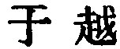
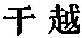
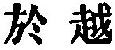
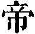

  
[Intangible Textual Heritage](../../index)  [Taoism](../index) 
[Index](index)  [Previous](sbe39135)  [Next](sbe39137) 

------------------------------------------------------------------------

p. 363

## BOOK XV.

### PART II. SECTION VIII.

### Kho Î, or 'Ingrained Ideas [1](#fn_548).'

1\. Ingrained ideas and a high estimate of their own conduct; leaving
the world, and pursuing uncommon ways; talking loftily and in resentful
disparagement of others;--all this is simply symptomatic of arrogance.
This is what scholars who betake themselves to the hills and valleys,
who are always blaming the world, and who stand aloof like withered
trees, or throw themselves into deep pools [2](#fn_549), are fond of.

Discoursing of benevolence, righteousness, loyalty, and good faith;
being humble and frugal, self-forgetful and courteous;--all this is
simply symptomatic of (self-)cultivation. This is what scholars who wish
to tranquillise the world, teachers and instructors, men who pursue
their studies at home and abroad, are fond of.

Discoursing of their great merit and making a great name for themselves;
insisting on the ceremonies between ruler and minister; and rectifying
the relations between high and low;--all this shows their one object to
be the promotion of government. This is what officers of the court, men
who honour their lord and would strengthen the state and who

p. 364

would do their utmost to incorporate other states with their own, are
fond of

Resorting to marshes and lakes; dwelling in solitary places; occupying
themselves with angling and living at ease;--all this shows their one
object to be to do nothing. This is what gentlemen of the rivers and
seas, men who avoid the society of the world and desire to live at
leisure, are fond of.

Blowing and breathing with open mouth; inhaling and exhaling the breath;
expelling the old breath and taking in new; passing their time like the
(dormant) bear [1](#fn_550), and stretching and
twisting (the neck) like a bird [1](#fn_550);--all this simply shows the desire for
longevity. This is what the scholars who manipulate their breath, and
the men who nourish the body and wish to live as long as Päng Zû, are
fond of.

As to those who have a lofty character without any ingrained ideas; who
pursue the path of self-cultivation without benevolence and
righteousness; who succeed in government without great services or fame;
who enjoy their ease without resorting to the rivers and seas; who
attain to longevity without the management (of the breath); who forget
all things and yet possess all things; whose placidity is unlimited,
while all things to be valued attend them:--such men pursue the way of
heaven and earth, and display the characteristics of the sages. Hence it
is said [2](#fn_551), 'Placidity, indifference,
silence, quietude,

p. 365

absolute vacancy, and non-action:--these are the qualities which
maintain the level of heaven and earth and are the substance of the Tâo
and its characteristics.'

2\. In accordance with this it is said, 'The sage is entirely restful,
and so (his mind) is evenly balanced and at ease. This even balance and
ease appears in his placidity and indifference. In this state of even
balance and ease, of placidity and indifference, anxieties and evils do
not find access to him, no depraving influence can take him by surprise;
his virtue is complete, and his spirit continues unimpaired.'

Therefore it is (also) said, 'The life of the sage is (like) the action
of Heaven; and his death is the transformation common to (all) things.
In his stillness his virtue is the same as that of the Yin, and in
movement his diffusiveness is like that of the Yang. He does not take
the initiative in producing either happiness or calamity. He responds to
the influence acting on him, and moves as he feels the pressure. He
rises to act only when he is obliged to do so. He discards wisdom and
the memories of the past; he follows the lines of his Heaven (-given
nature); and therefore he suffers no calamity from Heaven, no
involvement from things, no blame from men, and no reproof from the
spirits of the dead [1](#fn_552). His life
seems to float along; his death seems to be a resting. He does not
indulge any

p. 366

anxious doubts; he does not lay plans beforehand. His light is without
display; his good faith is without previous arrangement. His sleep is
untroubled by dreams; his waking is followed by no sorrows. His spirit
is guileless and pure; his soul is not subject to weariness. Vacant and
without self-assertion, placid and indifferent, he agrees with the
virtue of Heaven.'

Therefore it is said (further), 'Sadness and pleasure show a depraving
element in the virtue (of those who feel them); joy and anger show some
error in their course; love and hatred show a failure of their virtue.
Hence for the mind to be free from sorrow and pleasure is the perfection
of virtue; to be of one mind that does not change is the perfection of
quietude; to be conscious of no opposition is the perfection of vacancy;
to have no intercourse with (external) things is the perfection of
indifference; and to have no rebellious dissatisfactions is the
perfection of purity.'

3\. Therefore it is said (still further), 'If the body be toiled, and
does not rest, it becomes worn out; if the spirit be used without
cessation, it becomes toiled; and when toiled, it becomes exhausted. It
is the nature of water, when free from admixture, to be clear, and, when
not agitated, to be level; while if obstructed and not allowed to flow,
it cannot preserve its clearness;--being an image of the virtue of
Heaven.' Hence it is said (once again), 'To be guileless and pure, and
free from all admixture; to be still and uniform, without undergoing any
change; to be indifferent and do nothing; to move and yet to act like
Heaven:--this is the way to nourish the spirit. Now he who possesses a

p. 367

sword made at Kan-yüeh [1](#fn_553) preserves
it carefully in a box, and does not dare to use it;--it is considered
the perfection of valuable swords. But the human spirit [2](#fn_554) goes forth in all directions, flowing on
without limit, reaching to heaven above, and wreathing round the earth
beneath. It transforms and nourishes all things, and cannot be
represented by any form. Its name is "the Divinity (in man) [3](#fn_555)." It is only the path of pure simplicity
which guards and preserves the Spirit. When this path is preserved and
not lost, it becomes one with the Spirit; and in this ethereal
amalgamation, it acts in harmony with the orderly operation of Heaven.'

There is the vulgar saying, 'The multitude of men consider gain to be
the most important thing; pure scholars, fame; those who are wise and
able value their ambition; the sage prizes essential purity.' Therefore
simplicity is the denomination of that in which there is no admixture;
purity of that in which the spirit is not impaired. It is he who can
embody simplicity and purity whom we call the True Man [4](#fn_556).

------------------------------------------------------------------------

### Footnotes

[363:1](sbe39136.htm#fr_599) See pp.
[146](sbe39102.htm#page_146), [147](sbe39103.htm#page_147).

[363:2](sbe39136.htm#fr_600) As did Shän-thû
Tî. See in Book VI, par. 3.

[364:1](sbe39136.htm#fr_602) This is probably
the meaning. The text is simply:--'Bear passing, bird-stretching.'

[364:2](sbe39136.htm#fr_603) 'It is
said:'--where? and by whom? These questions we cannot answer. We have
met indeed already with the same characteristics of the Tâo; but
Kwang-Sze is not likely to be quoting p. 365
himself. On the 'It is said,' and the five recurrences of the phrase
below, Lû Shû-kih says that Kwang-dze is quoting from sentences current
among the adherents of Tâoism,--the sentence-makers often drawn on by
Lâo-dze; compare the Tâo Teh King, ch. xli.

[365:1](sbe39136.htm#fr_604) See Book XIII,
par. 2.

[367:1](sbe39136.htm#fr_605) Both of the
seaboard states of Wû and Yüeh were famous for the swords produced in
them. Kan-yüeh appears to have been the name of a valley or place in Wû,
famous for the weapons made in it; unless indeed we should read  , instead of   and take   as equivalent to  , which is found in the Zo
Khwan as the name of Yüeh.

[367:2](sbe39136.htm#fr_606) Might be
translated 'the subtle spirit.'

[367:3](sbe39136.htm#fr_607) A very remarkable
use of Tî ( ) for the
human spirit in the sense of God. The subject of the clause, let the
reader observe, is that spirit, and not the Tâo. See pp. 146, 147, where
I have said something about it.

[367:4](sbe39136.htm#fr_608) See the full
account of 'the True Man' in Book VI.

------------------------------------------------------------------------

[Next: Book XVI: Shan Hsing, or 'Correcting the Nature.'](sbe39137)
