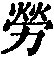
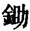
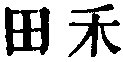
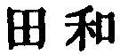
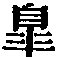

  
[Intangible Textual Heritage](../../index)  [Taoism](../index) 
[Index](index)  [Previous](sbe4007)  [Next](sbe4009) 

------------------------------------------------------------------------

p. 91

## BOOK XXIV.

### PART III. SECTION II.

### Hsü Wû-kwei [1](#fn_191).

1\. Hsü Wû-kwei having obtained through Nü Shang [2](#fn_192) an introduction to the marquis Wû of
Wei [3](#fn_193), the marquis, speaking to him
with kindly sympathy [4](#fn_194), said, 'You
are ill, Sir; you have suffered from your hard and laborious toils [4](#fn_194) in the forests, and still you have been
willing to come and see poor me [5](#fn_195).'
Hsü Wû-kwei replied, 'It is I who have to comfort your lordship; what
occasion have you to comfort me? If your lordship go on to fill up the
measure of your sensual desires, and to prolong your likes and dislikes,
then the condition of your mental nature will be diseased, and if you
discourage and repress those desires, and deny your likings and
dislikings, that will be an affliction to your ears and eyes

p. 92

(deprived of their accustomed pleasures);--it is for me to comfort your
lordship, what occasion have you to comfort me?' The marquis looked
contemptuous, and made no reply.

After a little time, Hsü Wû-kwei said, 'Let me tell your lordship
something:--I look at dogs and judge of them by their appearance [1](#fn_196). One of the lowest quality seizes his
food, satiates himself, and stops;--he has the attributes of a fox. One
of a medium quality seems to be looking at the sun. One of the highest
quality seems to have forgotten the one thing,--himself. But I judge
still better of horses than I do of dogs. When I do so, I find that one
goes straightforward, as if following a line; that another turns off, so
as to describe a hook; that a third describes a square as if following
the measure so called; and that a fourth describes a circle as exactly
as a compass would make it. These are all horses of a state; but they
are not equal to a horse of the kingdom. His qualities are complete. Now
he looks anxious; now to be losing the way; now to be forgetting
himself. Such a horse prances along, or rushes on, spurning the dust and
not knowing where he is.' The marquis was greatly pleased and laughed.

When Hsü Wû-kwei came out, Nü Shang said to him, 'How was it, Sir, that
you by your counsels produced such an effect on our ruler? In my
counsellings of him, now indirectly, taking my subjects from the Books
of Poetry, History, Rites, and Music; now directly, from the Metal
Tablets [2](#fn_197), and the six
Bow-cases [2](#fn_197), all calculated for the
service (of the

p. 93

state), and to be of great benefit;--in these counsellings, repeated
times without number, I have never seen the ruler show his teeth in a
smile:--by what counsels have you made him so pleased to-day?' Hsü
Wû-kwei replied, 'I only told him how I judged of dogs and horses by
looking at their appearance.' 'So?' said Nü Shang, and the other
rejoined, 'Have you not heard of the wanderer [1](#fn_198) from Yüeh? when he had been gone from
the state several days, he was glad when he saw any one whom he had seen
in it; when he had been gone a month, he was glad when he saw any one
whom he had known in it; and when he had been gone a round year, he was
glad when he saw any one who looked like a native of it. The longer he
was gone, the more longingly did he think of the people;--was it not so?
The men who withdraw to empty valleys, where the hellebore bushes stop
up the little paths made by the weasels, as they push their way or stand
amid the waste, are glad when they seem to hear the sounds of human
footsteps; and how much more would they be so, if it were their brothers
and relatives talking and laughing by their side! How long it is since
the words of a True [2](#fn_199) man were heard
as he talked and laughed by our ruler's side!'

2\. At (another) interview of Hsü Wû-kwei with the marquis Wû, the
latter said, 'You, Sir, have been dwelling in the forests for a long
time, living

p. 94

on acorns and chestnuts, and satiating yourself with onions and chives,
without thinking of poor me. Now (that you are here), is it because you
are old? or because you wish to try again the taste of wine and meat? or
because (you wish that) I may enjoy the happiness derived from the
spirits of the altars of the Land and Grain?' Hsü Wû-kwei replied, 'I
was born in a poor and mean condition, and have never presumed to drink
of your lordship's wine, or eat of your meat. My object in coming was to
comfort your lordship under your troubles.' 'What? comfort me under my
troubles?' 'Yes, to comfort both your lordship's spirit and body.' The
marquis said, 'What do you mean?' His visitor replied, 'Heaven and Earth
have one and the same purpose in the production (of all men). However
high one man be exalted, he should not think that he is favourably dealt
with; and however low may be the position of another, he should not
think that he is unfavourably dealt with. You are indeed the one and
only lord of the 10,000 chariots (of your state), but you use your
dignity to embitter (the lives of) all the people, and to pamper your
cars, eyes, nose, and mouth. But your spirit does not acquiesce in this.
The spirit (of man) loves to be in harmony with others and hates selfish
indulgence [1](#fn_200). This selfish
indulgence is a disease, and therefore I would comfort you under it. How
is it that your lordship more than others brings this disease on
yourself?' The marquis said, 'I have wished to see you, Sir, for a long
time. I want to love my people, and by the exercise of righteous-

p. 95

ness to make an end of war;--will that be sufficient?' Hsü Wû-kwei
replied, 'By no means. To love the people is the first step to injure
them'. By the exercise of righteousness to make an end of war is the
root from which war is produced [1](#fn_201).
If your lordship try to accomplish your object in this way, you are not
likely to succeed. All attempts to accomplish what we think good (with
an ulterior end) is a bad contrivance. Although your lordship practise
benevolence and righteousness (as you propose), it will be no better
than hypocrisy. You may indeed assume the (outward) form, but successful
accomplishment will lead to (inward) contention, and the change thence
arising will produce outward fighting. Your lordship also must not mass
files of soldiers in the passages of your galleries and towers, nor have
footmen and horsemen in the apartments about your altars [2](#fn_202). Do not let thoughts contrary to your
success lie hidden in your mind; do not think of conquering men by
artifice, or by (skilful) plans, or by fighting. If I kill the officers
and people of another state, and annex its territory, to satisfy my
selfish desires, while in my spirit I do not know whether the fighting
be good, where is the victory that I gain? Your lordship's best plan is
to abandon (your purpose). If you will cultivate in your breast the
sincere purpose (to love the people), and so respond to the feeling of
Heaven and Earth, and not (further) vex yourself, then your people will
already have- escaped death;--what

p. 96

occasion will your lordship have to make an end of war?'

3\. Hwang-Tî was going to see Tâ-kwei [1](#fn_203) at the hill of Kü-zhze. Fang Ming was
acting as charioteer, and Khang Yü was occupying the third place in the
carriage. Kang Zo and Hsî Phäng went before the horses; and Khwän Hwun
and Kû Khî followed the carriage. When they arrived at the wild of
Hsiang-khäng, the seven sages were all perplexed, and could find no
place at which to ask the way. just then they met with a boy tending
some horses, and asked the way of him. 'Do you know,' they said, 'the
hill of Kü-zhze?' and he replied that he did. He also said that he knew
where Tâ-kwei was living. 'A strange boy is this!' said Hwang-Tî. 'He
not only knows the hill of Kü-zhze, but he also knows where Tâ-kwei is
living. Let me ask him about the government of mankind.' The boy said,
'The administration of the kingdom is like this (which I am
doing);--what difficulty should there be in it? When I was young, I
enjoyed myself roaming over all within the six confines of the world of
space, and then I began to suffer from indistinct sight. A wise elder
taught me, saying, "Ride in the chariot of the

p. 97

sun, and roam in the wild of Hsiang-Khäng." Now the trouble in my eyes
is a little better, and I am again enjoying myself roaming outside the
six confines of the world of space. As to the government of the kingdom,
it is like this (which I am doing);what difficulty should there be in
it?' Hwang-Tî said, 'The administration of the world is indeed not your
business, my son; nevertheless, I beg to ask you about it.' The little
lad declined to answer, but on Hwang-Tî putting the question again, he
said, 'In what does the governor of the kingdom differ from him who has
the tending of horses, and who has only to put away whatever in him
would injure the horses?'

Hwang-Tî bowed to him twice with his head to the ground, called him his
'Heavenly Master [1](#fn_204),' and withdrew.

4\. If officers of wisdom do not see the changes which their anxious
thinking has suggested, they have no joy; if debaters are not able to
set forth their views in orderly style, they have no joy; if critical
examiners find no subjects on which to exercise their powers of
vituperation, they have no joy:--they are all hampered by external
restrictions.

Those who try to attract the attention of their age (wish to) rise at
court; those who try to win the regard of the people [2](#fn_205) count holding office a glory; those who
possess muscular strength boast of doing what is difficult; those who
are bold and daring exert themselves in times of calamity; those who are
able

p. 98

swordmen and spearmen delight in fighting; those whose powers are
decayed seek to rest in the name (they have gained); those who are
skilled in the laws seek to enlarge the scope of government; those who
are proficient in ceremonies and music pay careful attention to their
deportment; and those who profess benevolence and righteousness value
opportunities (for displaying them).

The husbandmen who do not keep their fields well weeded are not equal to
their business, nor are traders who do not thrive in the markets. When
the common people have their appropriate employment morning and evening,
they stimulate one another to diligence; the mechanics who are masters
of their implements feel strong for their work. If their wealth does not
increase, the greedy are distressed; if their power and influence is not
growing, the ambitious are sad.

Such creatures of circumstance and things delight in changes, and if
they meet with a time when they can show what they can do, they cannot
keep themselves from taking advantage of it. They all pursue their own
way like (the seasons of) the year, and do not change as things do. They
give the reins to their bodies and natures, and allow themselves to sink
beneath (the pressure of) things, and all their lifetime do not come
back (to their proper selves):--is it not sad [1](#fn_206)?

5\. Kwang-dze said, 'An archer, without taking aim beforehand, yet may
hit the mark. If we say that he is a good archer, and that all the world
may

p. 99

be is Îs [1](#fn_207), is this allowable?'
Hui-dze replied, 'It is.' Kwang-dze continued, 'All men do not agree in
counting the same thing to be right, but every one maintains his own
view to be right; (if we say) that all men may be Yâos, is this
allowable?' Hui-dze (again) replied, 'It is;' and Kwang-dze went on,
'Very well; there are the literati, the followers of Mo (Tî), of Yang
(Kû), and of Ping [2](#fn_208);--making four
(different schools). Including yourself, Master, there are five. Which
of your views is really right? Or will you take the position of La
Kü [3](#fn_209)? One of his disciples said to
him, "Master, I have got hold of your method. I can in winter heat the
furnace under my tripod, and in summer can produce ice." Lû Kü said,
"That is only with the Yang element to call out the same, and with the
Yin to call out the yin;--that is not my method. I will show you what my
method is." On this he tuned two citherns, placing one of them in the
hall, and the other in one of the inner apartments. Striking the note
Kung [4](#fn_210) in the one, the same note
vibrated in the other, and so it was with the note Kio [4](#fn_210); the two instruments being tuned in the
same way. But if he had differently tuned them on other strings
different

p. 100

from the normal arrangement of the five notes, the five-and-twenty
strings would all have vibrated, without any difference of their notes,
the note to which he had tuned them ruling and guiding all the others.
Is your maintaining your view to be right just like this?'

Hui-dze replied, 'Here now are the literati, and the followers of Mo,
Yang, and Ping. Suppose that they have come to dispute with me. They put
forth their conflicting statements; they try vociferously to put me
down; but none of them have ever proved me wrong --what do you say to
this?' Kwang-dze said, 'There was a man of Khî who cast away his son in
Sung to be a gatekeeper there, and thinking nothing of the mutilation
lie would incur; the same man, to secure one of his sacrificial vessels
or bells, would have it strapped and secured, while to find his son who
was lost, he would not go out of the territory of his own state:--so
forgetful was he of the relative importance of things. If a man of Khû,
going to another state as a lame gate-keeper, at midnight, at a time
when no one was nigh, were to fight with his boatman, he would not be
able to reach the shore, and he would have done what he could to provoke
the boatman's animosity [1](#fn_211).'

6\. As Kwang-dze was accompanying a funeral, when passing by the grave
of Hui-dze [2](#fn_212), he looked

p. 101

round, and said to his attendants, 'On the top of the nose of that man
of Ying [1](#fn_213) there is a (little) bit of
mud like a fly's wing,' He sent for the artisan Shih to cut it away.
Shih whirled his axe so as to produce a wind, which immediately carried
off the mud entirely, leaving the nose uninjured, and the (statue of)
the man of Ying' standing undisturbed. The ruler Yüan of Sung [2](#fn_214) heard of the feat, called the artisan
Shih, and said to him, 'Try and do the same thing on me.' The artisan
said, 'Your servant has been able to trim things in that way, but the
material on which I have worked has been dead for a long time.'
Kwang-dze said, 'Since the death of the Master, I have had no material
to work upon. I have had no one with whom to talk.'

7\. Kwan Kung being ill, duke Hwan went to ask for him, and said, 'Your
illness, father Kung, is very severe; should you not speak out your mind
to me? Should this prove the great illness, to whom will it be best for
me to entrust my State?' Kwan Kung said, 'To whom does your grace wish
to entrust it?' 'To Pâo Shû-yâ [3](#fn_215),'
was the reply. 'He will not do. He is an admirable officer, pure and
incorruptible, but with others who are not like himself he will not
associate. And when he once hears

p. 102

of another man's faults, he never forgets them. If you employ him to
administer the state, above, he will take the leading of your Grace,
and, below, he will come into collision with the people;--in no long
time you will be holding him as an offender.' The duke said, 'Who, then,
is the man?' The reply was, 'If I must speak, there is Hsî Phäng [1](#fn_216);--he will do. He is a man who forgets
his own high position, and against whom those below him will not revolt.
He is ashamed that he is not equal to Hwang-Tî, and pities those who are
not equal to himself. Him who imparts of his virtue to others we call a
sage; him who imparts of his wealth to others we call a man of worth. He
who by his worth would preside over others, never succeeds in winning
them; he who with his worth condescends to others, never but succeeds in
winning them. Hsî Phäng has not been (much) heard of in the state; he
has not been (much) distinguished in his own clan. But as I must speak,
he is the man for you.'

8\. The king of Wû, floating about on the Kiang, (landed and) ascended
the Hill of monkeys, which all, when they saw him, scampered off in
terror, and hid themselves among the thick hazels. There was one,
however, which, in an unconcerned way, swung about on the branches,
displaying its cleverness to the king, who thereon discharged an arrow
at it. With a nimble motion it caught the swift arrow, and the king
ordered his attendants to hurry forward and shoot it; and thus the
monkey was seized and killed. The king then, looking round, said to his
friend Yen

p. 103

\[paragraph continues\] Pû-î [1](#fn_217),
'This monkey made a display of its artfulness, and trusted in its
agility, to show me its arrogance;--this it was which brought it to this
fate. Take warning from it. Ah! do not by your looks give yourself
haughty airs!' Yen Pû-î [1](#fn_217), when he
returned home, put himself under the teaching of Tung Wû [1](#fn_217), to root up [2](#fn_218) his pride. He put away what he delighted
in and abjured distinction. In three years the people of the kingdom
spoke of him with admiration.

9\. Nan-po Dze-khî [3](#fn_219) was seated,
leaning forward on his stool, and sighing gently as he looked up to
heaven. (just then) Yen Khäng-dze [3](#fn_219)
came in, and said, when he saw him, 'Master, you surpass all others. Is
it right to make your body thus like a mass of withered bones, and your
mind like so much slaked lime?' The other said, 'I formerly lived in a
grotto on a hill. At that time Thien Ho [4](#fn_220) once came to see me, and all the
multitudes of Khî congratulated him thrice (on his having found the
proper man). I must first have shown myself, and so it was that he knew
me; I must first have been selling (what I had), and so it was that he
came to buy. If I had not shown what I possessed, how should he have
known it; if I had not been selling (myself), how should he have come to
buy me? I pity

p. 104

the men who lose themselves [1](#fn_221); I
also pity the men who pity others (for not being known); and I also pity
the men who pity the men who pity those that pity others. But since then
the time is long cone by; (and so I am in the state in which you have
found me) [2](#fn_222).

10\. Kung-nî, having gone to Khû, the king ordered wine to be presented
to him. Sun Shû-âo [3](#fn_223) stood, holding
the goblet in his hand. Î-liâo of Shih-nan [3](#fn_223), having received (a cup), poured its
contents out as a sacrificial libation, and said, 'The men of old, on
such an occasion as this, made some speech.' Kung-nî said, 'I have heard
of speech without words; but I have never spoken it; I will do so now.
Î-liâo of Shih-nan kept (quietly) handling his little spheres,

p. 105

and the difficulties between the two Houses were resolved; Sun Shû-âo
slept undisturbed on his couch, with his (dancer's) feather in his hand,
and the men of Ying enrolled themselves for the war. I wish I had a beak
three cubits long [1](#fn_224).'

In the case of those two (ministers) we have what is called 'The Way
that cannot be trodden [2](#fn_225);' in (the
case of Kung-nî) we have what is called 'the Argument without
words [2](#fn_225).' Therefore when all
attributes are comprehended in the unity of the Tâo, and speech stops at
the point to which knowledge does not reach, the conduct is complete.
But where there is (not) [3](#fn_226) the unity
of the Tâo, the attributes cannot (always) be the same, and that which
is beyond the reach of knowledge cannot be exhibited by any reasoning.
There may be as many names as those employed by the Literati and the
Mohists, but (the result is) evil. Thus when the sea does not reject the
streams that flow into it in their eastward course, we have the
perfection of greatness. The sage embraces in his regard both Heaven and
Earth; his beneficent influence extends to all under the sky; and we do
not know from whom it comes. Therefore though when living one may have
no rank, and when dead no honorary epithet; though the reality (of what
he is) may not be acknowledged and his name not established; we have in
him what is called 'The Great Man.'

A dog is not reckoned good because it barks well; and a man is not
reckoned wise because he speaks

p. 106

skilfully;--how much less can he be deemed Great! If one thinks he is
Great, he is not fit to be accounted Great;--how much less is he so from
the practice of the attributes (of the Tâo) [1](#fn_227)! Now none are so grandly complete as
Heaven and Earth; but do they seek for anything to make them so grandly
complete? He who knows this grand completion does not seek for it; he
loses nothing and abandons nothing; he does not change himself from
regard to (external) things; he turns in on himself, and finds there an
inexhaustible store; he follows antiquity and does not feel about (for
its lessons);--such is the perfect sincerity of the Great Man.

11\. Dze-khî [2](#fn_228) had eight sons.
Having arranged them before him, he called Kiû-fang Yän [3](#fn_229), and said to him, 'Look at the
physiognomy of my sons for me;--which will be the fortunate one?' Yän
said, 'Khwän is the fortunate one.' .Dze-khî looked startled, and
joyfully said, 'In what way?' Yän replied, 'Khwän will share the meals
of the ruler of a state to the end of his life.' The father looked
uneasy, burst into tears, and said, 'What has my son done that he should
come to such a fate?' Yin replied, 'When one shares the meals of the
ruler of a state, blessings reach to all within the three branches of
his kindred [4](#fn_230), and how much more to
his father and mother! But you, Master, weep when you hear this;--you
oppose (the idea of) such happiness. It is the good fortune of your son,
and

p. 107

you count it his misfortune.' Dze-khî said, 'O Yän, what sufficient
ground have you for knowing that this will be Khwän's good fortune? (The
fortune) that is summed up in wine and flesh affects only the nose and
the mouth, but you are not able to know how it will come about. I have
never been a shepherd, and yet a ewe lambed in the south-west corner of
my house. I have never been fond of hunting, and yet a quail hatched her
young in the south-east corner. If these were not prodigies, what can be
accounted such? Where I wish to occupy my mind with my son is in (the
wide sphere of) heaven and earth; I wish to seek his enjoyment and mine
in (the idea of) Heaven, and our support from the Earth. I do not mix
myself up with him in the affairs (of the world); nor in forming plans
(for his advantage); nor in the practice of what is strange. I pursue
with him the perfect virtue of Heaven and Earth, and do not allow
ourselves to be troubled by outward things. I seek to be with him in a
state of undisturbed indifference, and not to practise what affairs
might indicate as likely to be advantageous. And now there is to come to
us this vulgar recompense. Whenever there is a strange realisation,
there must have been strange conduct. Danger threatens;--not through any
sin of me or of my son, but as brought about, I apprehend, by Heaven. It
is this which makes me weep!'

Not long after this, .Dze-khî sent off Khwän to go to Yen [1](#fn_231), when he was made prisoner by some
robbers on the way. It would have been difficult to sell him if he were
whole and entire, and they thought

p. 108

their easiest plan was to cut off (one of his) feet first. They did so,
and sold him in Khî, where he became Inspector of roads for a Mr.
Khü [1](#fn_232). Nevertheless he had flesh to
eat till he died.

12\. Nieh Khüeh met Hsü Yû (on the way), and said to him, 'Where, Sir,
are you going to?' 'I am fleeing from Yâo,' was the reply. 'What do you
mean?' 'Yâo has become so bent on his benevolence that I am afraid the
world will laugh at him, and that in future ages men will be found
eating one another [2](#fn_233). Now the people
are collected together without difficulty. Love them, and they respond
with affection; benefit them, and they come to you; praise them, and
they are stimulated (to please you); make them to experience what they
dislike, and they disperse. When the loving and benefiting proceed from
benevolence and righteousness, those who forget the benevolence and
righteousness, and those who make a profit of them, are the many. In
this way the practice of benevolence and righteousness comes to be
without sincerity and is like a borrowing of the instruments with which
men catch birds [3](#fn_234). In all this the
one man's seeking to benefit the world by his decisions and enactments
(of such a nature) is as if he were to cut through (the nature of all)
by one operation;--Yâo knows how wise and superior men can benefit the
world, but he does not

p. 109

also know how they injure it. It is only those who stand outside such
men that know this [1](#fn_235).'

There are the pliable and weak; the easy and hasty; the grasping and
crooked. Those who are called the pliable and weak learn the words of
some one master, to which they freely yield their assent, being secretly
pleased with themselves, and thinking that their knowledge is
sufficient, while they do not know that they have not yet begun (to
understand) a single thing. It is this which makes them so pliable and
weak. The easy and hasty are like lice on a pig. The lice select a place
where the bristles are more wide apart, and look on it as a great palace
or a large park. The slits between the toes, the overlappings of its
skin, about its nipples and its thighs,--all these seem to them safe
apartments and advantageous places;--they do not know that the butcher
one morning, swinging about his arms, will spread the grass, and kindle
the fire, so that they and the pig will be roasted together. So do they
appear and disappear with the place where they harboured:--this is why
they are called the easy and hasty.

Of the grasping and crooked we have an example in Shun. Mutton has no
craving for ants, but ants have a craving for mutton, for it is rank.
There was a rankness about the conduct of Shun, and the people were
pleased with him. Hence when he thrice changed his residence, every one
of them became a capital city [2](#fn_236).
When he came to the wild

p. 110

of Täng [1](#fn_237), he had 100,000 families
about him. Yâo having heard of the virtue and ability of Shun, appointed
him to a new and uncultivated territory, saying, 'I look forward to the
benefit of his coming here.' When Shun was appointed to this new
territory, his years were advanced, and his intelligence was
decayed;--and yet he could not find a place of rest or a home. This is
an example of being grasping and wayward.

Therefore (in opposition to such) the spirit-like man dislikes the
flocking of the multitudes to him. When the multitudes come, they do not
agree; and when they do not agree, no benefit results from their coming.
Hence there are none whom he brings very near to himself, and none whom
he keeps at a great distance. He keeps his virtue in close embrace, and
warmly nourishes (the spirit of) harmony, so as to be in accordance with
all men. This is called the True man [2](#fn_238) . Even the knowledge of the ant he puts
away; his plans are simply those of the fishes [3](#fn_239); even the notions of the sheep he
discards. His seeing is simply that of the eye; his hearing that of the
ear; his mind is governed by its general exercises. Being such, his
course is straight and level as if marked out by a line, and its every
change is in accordance (with the circumstances of the case).

13\. The True men of old waited for the issues of events as the
arrangements of Heaven, and did not by their human efforts try to take
the place of Heaven. The True men of old (now) looked on

p. 111

success as life and on failure as death; and (now) on success as death
and on failure as life. The operation of medicines will illustrate
this:--there are monk's-bane, the kieh-käng, the tribulus fruit, and
china-root; each of these has the time and case for which it is
supremely suitable; and all such plants and their suitabilities cannot
be mentioned particularly. Kâu-kien [1](#fn_240) took his station on (the hill of)
Kwâi-khî with 3,000 men with their buff-coats and shields:--(his
minister) Kung knew how the ruined (Yüeh) might still be preserved, but
the same man did not know the sad fate in store for himself [1](#fn_240). Hence it is said, 'The eye of the owl
has its proper fitness; the leg of the crane has its proper limit, and
to cut off any of it would distress (the bird).' Hence (also) it is
(further) said, 'When the wind passes over it, the volume of the river
is diminished, and so it is when the sun passes over it. But let the
wind and sun keep a watch together on the river, and it will not begin
to feel that they are doing it any injury:--it relies on its springs and
flows on.' Thus, water does its part to the ground with undeviating
exactness; and so does the shadow to the substance; and one thing to
another. Therefore there is danger from the power of vision in the eyes,
of hearing in the ears, and of the inordinate thinking of the mind; yea,
there is danger from the exercise of every power of which man's
constitution is the depository.

p. 112

\[paragraph continues\] When the danger has come to a head, it cannot be
averted, and the calamity is perpetuated, and goes on increasing. The
return from this (to a state of security) is the result of (great)
effort, and success can be attained only after a long time; and yet men
consider (their power of self-determination) as their precious
possession:--is it not sad? It is in this way that we have the ruin of
states and the slaughtering of the people without end; while no one
knows how to ask how it comes about.

14\. Therefore, the feet of man on the earth tread but on a small space,
but going on to where he has not trod before, he traverses a great
distance easily; so his knowledge is but small, but going on to what he
does not already know, he comes to know what is meant by Heaven [1](#fn_241). He knows it as The Great Unity; The
Great Mystery; The Great Illuminator; The Great Framer; The Great
Boundlessness; The Great Truth; The Great Determiner. This makes his
knowledge complete. As The Great Unity, he comprehends it; as The Great
Mystery, he unfolds it; as the Great Illuminator, he contemplates it; as
the Great Framer, it is to him the Cause of all; as the Great
Boundlessness, all is to him its embodiment; as The Great Truth, he
examines it; as The Great Determiner, he holds it fast.

Thus Heaven is to him all; accordance with it is the brightest
intelligence. Obscurity has in this its pivot; in this is the beginning.
Such being the

p. 113

case, the explanation of it is as if it were no explanation; the
knowledge of it is as if it were no knowledge. (At first) he does not
know it, but afterwards he comes to know it. In his inquiries, he must
not set to himself any limits, and yet he cannot be without a limit. Now
ascending, now descending, then slipping from the grasp, (the Tâo) is
yet a reality, unchanged now as in antiquity, and always without
defect:--may it not be called what is capable of the greatest display
and expansion? Why should we not inquire into it? Why should we be
perplexed about it? With what does not perplex let us explain what
perplexes, till we cease to be perplexed. So may we arrive at a great
freedom from all perplexity!

------------------------------------------------------------------------

### Footnotes

[91:1](sbe4008.htm#fr_222) See vol. xxxix, pp.
153, 154.

[91:2](sbe4008.htm#fr_223) A favourite and
minister of the marquis Wû.

[91:3](sbe4008.htm#fr_224) This was the second
marquis of Wei, one of the three principalities into which the great
state of Zin had been broken up, and which he ruled as the marquis Kî
for sixteen years, B.C. 386-371. His son usurped the title of king, and
was the 'king Hui of Liang,' whom Mencius had interviews with. Wû, or
'martial,' was Kî's honorary, posthumous epithet.

[91:4](sbe4008.htm#fr_226) The character ( ) which I thus translate, has
two tones, the second and fourth. Here and elsewhere in this paragraph
and the next, it is with one exception in the fourth tone, meaning 'to
comfort or reward for toils endured.' The one exception is its next
occurrence,--'hard and laborious toils.'

[91:5](sbe4008.htm#fr_227) The appropriate and
humble designation of himself by the ruler of a state.

[92:1](sbe4008.htm#fr_228) Literally, 'I
physiognomise dogs.'

[92:2](sbe4008.htm#fr_230) The names of two
Books, or Collections of Tablets, the former p.
93 containing Registers of the Population, the latter treating of
military subjects.

[93:1](sbe4008.htm#fr_231) Kwo Hsiang makes
this 'a banished criminal.' This is not necessary.

[93:2](sbe4008.htm#fr_232) Wû-kwei then had a
high opinion of his own attainments in Tâoism, and a low opinion of Nü
Shang and the other courtiers.

[94:1](sbe4008.htm#fr_233) Wü-kwei had a high
idea of the constitution of human nature.

[95:1](sbe4008.htm#fr_234) Tâoistic teaching,
but questionable.

[95:2](sbe4008.htm#fr_235) We need more
information about the customs of the feudal princes fully to understand
the language of this sentence.

[96:1](sbe4008.htm#fr_236) Tâ (or Thâi)-kwei
(or wei) appears here as the name of a person. It cannot be the name of
a hill, as it is said by some to be. The whole paragraph is parabolic or
allegorical; and Tâ-kwei is probably a personification of the Great Tâo
itself, though no meaning of the character kwei can be adduced to
justify this interpretation. The horseherd boy is further supposed to be
a personification of the 'Great Simplicity,' which is characteristic of
the Tâo, the spontaneity of it, unvexed by the wisdom of man. The lesson
of the paragraph is that taught in the eleventh Book, and many other
places.

[97:1](sbe4008.htm#fr_237) This is the title
borne to the present day by the chief or pope of Tâoism, the
representative of Mang Tâo-ling of our first century.

[97:2](sbe4008.htm#fr_238) Taking the initial
kung in the third tone. If we take it in the first tone, the meaning is
different.

[98:1](sbe4008.htm#fr_239) All the parties in
this paragraph disallow the great principle of Tâoism, which does
everything by doing nothing.

[99:1](sbe4008.htm#fr_240) The famous archer of
the Hsiâ dynasty, in the twenty-second century B.C.

[99:2](sbe4008.htm#fr_241) The name of Kung-sun
Lung, the Lung Li-khän of Bk. XXI. par. 1.

[99:3](sbe4008.htm#fr_242) Only mentioned here.
The statement of his disciple and his remark on it are equally obscure,
though the latter is partially illustrated from the twenty-third,
twenty-fourth, and other hexagrams of the Yih King.

[99:4](sbe4008.htm#fr_244) The sounds of the
first and third notes of the Chinese musical scale, corresponding to our
A and E. I know too little of music myself to pronounce further on Lû
Kü's illustration.

[100:1](sbe4008.htm#fr_245) The illustrations
in this last member of the paragraph are also obscure. Lin Hsî-kung says
that all the old explanations of them are defective; his own explanation
has failed to make itself clear to me.

[100:2](sbe4008.htm#fr_246) The expression in
the last sentence of the paragraph, 'the Master,' makes it certain that
this was the grave of Kwang-dze's friend with whom he had had so many
conversations and arguments.

[101:1](sbe4008.htm#fr_247) Ying was the
capital of Khû. I have seen in China about the graves of wealthy and
distinguished men many life-sized statues of men somehow connected with
them.

[101:2](sbe4008.htm#fr_248) Yüan is called the
'ruler' of Sung. That duchy was by this time a mere dependency of Khî.
The sacrifices of its old ruling House were finally extinguished by Khî
in B.C. 206.

[101:3](sbe4008.htm#fr_249) Pâo Shû-yâ had been
the life-long friend of the dying premier, and to him in the first place
had been owing the elevation of Hwan to the marquisate.

[102:1](sbe4008.htm#fr_250) For a long time a
great officer of Khî, but he died in the same year as Kwan Kung himself.

[103:1](sbe4008.htm#fr_253) We know these names
only from their occurrence here. Tung Wû must have been a professor of
Tâoism.

[103:2](sbe4008.htm#fr_254) The text here is
 , to help;' but it is
explained as =  , 'a hoe.'
The Khang-hsî dictionary does not give this meaning of the character,
but we find it in that of Yen Yüan.

[103:3](sbe4008.htm#fr_256) See the first
paragraph of Bk. II.

[103:4](sbe4008.htm#fr_257)   must be the   of Sze-mâ Khien, who became
marquis of Khî in B.C. 389.

[104:1](sbe4008.htm#fr_258) In seeking for
worldly honours.

[104:2](sbe4008.htm#fr_259) That is, I have
abjured all desire for worldly honour, and desire attainment in the Tho
alone.

[104:3](sbe4008.htm#fr_261) See Mencius VI, ii,
15. Sun Shû-âo was chief minister to king Khwang who died in B.C. 591,
and died, probably, before Confucius was born, and Î-liâo (p. 28, n. 3)
appears in public life only after the death of the sage. The three men
could not have appeared together at any time. This account of their
doing so was devised by our author as a peg on which to hang his own
lessons in the rest of the paragraph. The two historical events referred
to I have found it difficult to discover. They are instances of doing
nothing, and yet thereby accomplishing what is very great. The action of
Î-liâo in 'quietly handling his balls' recalls my seeing the same thing
done by a gentleman at Khü-fâu, the city of Confucius, in 1873. Being
left there with a companion, and not knowing how to get to the Grand
Canal, many gentlemen came to advise with us how we should proceed.
Among them was one who, while tendering his advice, kept rolling about
two brass balls in one palm with the fingers of the other hand. When I
asked the meaning of his action, I was told, 'To show how he is at his
ease and master of the situation.' I mention the circumstance because I
have nowhere found the phrase in the text adequately explained.

[105:1](sbe4008.htm#fr_262) This strange wish
concludes the speech of Confucius. What follows is from Kwang-dze.

[105:2](sbe4008.htm#fr_264) Compare the opening
chapters of the Tâo Teh King.

[105:3](sbe4008.htm#fr_265) The Tâo is greater
than any and all of its attributes.

[106:1](sbe4008.htm#fr_266) See note
 [3](#fn_226) on previous page.

[106:2](sbe4008.htm#fr_267) This can hardly be
any other but Nan-kwo Dze-khî.

[106:3](sbe4008.htm#fr_268) A famous
physiognomist; some say, of horses. Hwâi-nan Dze calls him Kiû-fang Kâo
( ).

[106:4](sbe4008.htm#fr_269) See Mayers's
Manual, p. 303.

[107:1](sbe4008.htm#fr_270) The state so
called.

[108:1](sbe4008.htm#fr_271) One expert supposes
the text here to mean 'duke Khü;' but there was no such duke of Khî. The
best explanation seems to be that Khü was a rich gentleman, inspector of
the roads of Khî, or of the streets of its capital, who bought Khwän to
take his duties for him.

[108:2](sbe4008.htm#fr_272) Compare in Bk.
XXIII, par. 2.

[108:3](sbe4008.htm#fr_273) A scheming for
one's own advantage.

[109:1](sbe4008.htm#fr_274) I suppose that the
words of Hsü Yû stop with this sentence, and that from this to the end
of the paragraph we have the sentiments of Kwang-dze himself. The style
is his,--graphic but sometimes coarse.

[109:2](sbe4008.htm#fr_275) See note on Mencius
V, i, 2, 3.

[110:1](sbe4008.htm#fr_276) Situation unknown.

[110:2](sbe4008.htm#fr_277) The spirit-like man
and the true man are the same.

[110:3](sbe4008.htm#fr_278) Fishes forget
everything in the water.

[111:1](sbe4008.htm#fr_280) See the account of
the struggle between Kâu-kien of Yüeh and Fû-khâi of Wû in the eightieth
and some following chapters of the 'History of the various States of the
Eastern Kâu (Lieh Kwo Kîh).' We have sympathy with Kâu-kien, till his
ingratitude to his two great ministers, one of whom was Wän Kung (the
Kung of the text), shows the baseness of his character.

[112:1](sbe4008.htm#fr_281) This paragraph
grandly sets forth the culmination of all inquiries into the Tâo as
leading to the knowledge of Heaven; and the means by which it may be
attained to.

------------------------------------------------------------------------

[Next: Book XXV. Zeh-yang](sbe4009)
