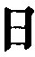
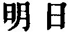
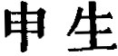

  
[Intangible Textual Heritage](../../index)  [Taoism](../index) 
[Index](index)  [Previous](sbe4012)  [Next](sbe4014) 

------------------------------------------------------------------------

p. 166

## BOOK XXIX.

### PART III. SECTION VII.

### Tâo Kih, or 'The Robber Kih [1](#fn_350).'

1\. Confucius was on terms of friendship with Liû-hsîa Kî [2](#fn_351), who had a brother named Tâo Kih. This
Tâo Kih had 9,000 followers, who marched at their will through the
kingdom, assailing and oppressing the different princes. They dug
through walls and broke into houses; they drove away people's cattle and
horses; they carried off people's wives and daughters. In their greed to
get, they forgot the claims of kinship, and paid no regard to their
parents and brethren. They did not sacrifice to their ancestors.
Wherever they passed through the country, in the larger states the
people guarded their city walls, and in the smaller the people took to
their strongholds. All were distressed by them.

Confucius spoke to Liû-hsiâ Kî, saying, 'Fathers should be able to lay
down the law to their sons,

p. 167

and elder to instruct their younger brothers. If they are unable to do
so, they do not fulfil the duties of the relationships which they
sustain. You, Sir, are one of the most talented officers of the age, and
your younger brother is this Robber Kih. He is a pest in the kingdom,
and you are not able to instruct him better; I cannot but be ashamed of
you, and I beg to go for you and give him counsel.' Liû-hsiâ Kî replied,
'You say, Sir, that fathers must be able to lay down the law to their
sons, and elder to instruct their younger brothers, but if sons will not
listen to the orders of their fathers, nor the younger receive the
lessons of their elder brothers, though one may have your powers of
persuasion, what is to be done? And, moreover, Kih is a man whose mind
is like a gushing fountain, and his will like a whirlwind; he is strong
enough to resist all enemies, and clever enough to gloss over his
wrong-doings. If you agree with him, he is glad; if you oppose him, he
is enraged; and he readily meets men with the language of abuse. You
must not go to him.'

Confucius, however, did not attend to this advice. With Yen Hui as his
charioteer, and Dze-kung seated on the right, he went to see Tâo Kih,
whom he found with his followers halted on the south of Thâi-shan, and
mincing men's livers, which he gave them to eat. Confucius alighted from
his carriage, and went forward, till he saw the usher, to whom he said,
'I, Khung Khiû of Lî, have heard of the general's lofty righteousness,'
bowing twice respectfully to the man as he said so. The usher went in
and announced the visitor. But when Tâo Kih heard of the arrival, he
flew into a great

p. 168

rage; his eyes became like blazing stars, and his hair rose up and
touched his cap. 'Is not this fellow,' said he, 'Khung Khiû, that artful
hypocrite of Lû? Tell him from me, "You invent speeches and babble away,
appealing without ground to (the examples of) Wän and Wû The ornaments
on your cap are as many as the branches of a tree, and your girdle is (a
piece of skin) from the ribs of a dead ox. The more you talk, the more
nonsense you utter. You get your food without (the labour of) ploughing,
and your clothes without (that of) weaving. You wag your lips and make
your tongue a drum-stick. You arbitrarily decide what is right and what
is wrong, thereby leading astray the princes throughout the kingdom, and
making its learned scholars not occupy their thoughts with their proper
business. You recklessly set up your filial piety and fraternal duty,
and curry favour with the feudal princes, the wealthy and the noble.
Your offence is great; your crime is very heavy. Take yourself off home
at once. If you do not do so, I will take your liver, and add it to the
provision for to-day's food."'

But Confucius sent in another message, saying, I enjoy the good will of
(your brother) Kî, and I wish and hope to tread the ground beneath your
tent [1](#fn_352).' When the usher had
communicated this message, Tâo Kih said, 'Make him come forward.' On
this Confucius hastened forwards. Declining to take a mat, he drew
hastily back, and bowed twice to Tâo Kih, who in a great rage stretched

p. 169

his legs apart, laid his hand on his sword, and with glaring eyes and a
voice like the growl of a nursing tigress, said, 'Come forwards, Khiû.
If what you say be in accordance with my mind, you shall live; but, if
it be contrary to it, you shall die.' Confucius replied, 'I have heard
that everywhere under the sky there are three (most excellent)
qualities. To be naturally tall and large, to be elegant and handsome
without a peer, so that young and old, noble and mean, are pleased to
look upon him;--this is the highest of those qualities. To comprehend
both heaven and earth in his wisdom, and to be able to speak eloquently
on all subjects;--this is the middle one of them. To be brave and
courageous, resolute and daring, gathering the multitudes round him, and
leading on his troops;--this is the lowest of them. Whoever possesses
one of these qualities is fit to stand with his face to the south [1](#fn_353), and style himself a Prince. But you,
General, unite in yourself all the three. Your person is eight cubits
and two inches in height; there is a brightness about your face and a
light in your eyes; your lips look as if stained with vermilion; your
teeth are like rows of precious shells; your voice is attuned to the
musical tubes, and yet you are named "The Robber Kih." I am ashamed of
you, General, and cannot approve of you. If you are inclined to listen
to me, I should like to go as your commissioner to Wû and Yüeh in the
south; to Khî and Lû in the north; to Sung and Wei in the east; and to
Zin and Khû in the west. I will get them to build for you a great city
several hundred lî in size, to

p. 170

establish under it towns containing several hundred thousands of
inhabitants, and honour you there as a feudal lord. The kingdom will see
you begin your career afresh; you will cease from your wars and disband
your soldiers; you will collect and nourish your brethren, and along
with them offer the sacrifices to your ancestors [1](#fn_354):--this will be a course befitting a sage
and an officer of ability, and will fulfil the wishes of the whole
kingdom.'

'Come forward, Khiû,' said Tâo Kih, greatly enraged. 'Those who can be
persuaded by considerations of gain, and to whom remonstrances may be
addressed with success, are all ignorant, low, and ordinary people. That
I am tall and large, elegant and handsome, so that all who see me are
pleased with me;--this is an effect of the body left me by my parents.
Though you were not to praise me for it, do I not know it myself? And I
have heard that he who likes to praise men to their face will also like
to speak ill of them behind their back. And when you tell me of a great
wall and a multitudinous people, this is to try to persuade me by
considerations of gain, and to cocker me as one of the ordinary people.
But how could such advantages last for long? Of all great cities there
is none so great as the whole kingdom, which was possessed by Yâo and
Shun, while their descendants (now) have not so much territory as would
admit an awl [2](#fn_355). Thang and Wa were
both set up as the Sons of Heaven, but in after ages (their posterity)
were cut

p. 171

off and extinguished;--was not this because the gain of their position
was so great a prize [1](#fn_356)?

'And moreover I have heard that anciently birds and beasts were
numerous, and men were few, so that they lived in nests in order to
avoid the animals. In the daytime they gathered acorns and chestnuts,
and in the night they roosted on the trees; and on account of this they
are called the people of the Nest-builder. Anciently the people did not
know the use of clothes. In summer they collected great stores of
faggots, and in winter kept themselves warm by means of them; and on
account of this they are called the people who knew how to take care of
their lives. In the age of Shän Näng, the people lay down in simple
innocence, and rose up in quiet security. They knew their mothers, but
did not know their fathers. They dwelt along with the elks and deer.
They ploughed and ate; they wove and made clothes; they had no idea of
injuring one another:--this was the grand time of Perfect virtue [2](#fn_357). Hwang-Tî, however, was not able to
perpetuate this virtuous state. He fought with Khih-yû [3](#fn_358) in the wild of Ko-lû [4](#fn_359) till the blood flowed over a hundred lî.
When Yâo and Shun arose, they instituted their crowd of ministers. Thang
banished his lord. King Wû killed Kâu. Since that time the strong have
oppressed the weak, and the many tyrannised over the few. From Thang and
Wû downwards, (the

p. 172

rulers) have all been promoters of disorder and confusion. You yourself
now cultivate and inculcate the ways of Wän and Wû; you handle whatever
subjects are anywhere discussed for the instruction of future ages. With
your peculiar robe and narrow girdle, with your deceitful speech and
hypocritical conduct, you delude the lords of the different states, and
are seeking for riches and honours. There is no greater robber than you
are;--why does not all the world call you the Robber Khiû, instead of
styling me the Robber Kih?

'You prevailed by your sweet speeches on Dze-lû, and made him your
follower; you made him put away his high cap, lay aside his long sword,
and receive your instructions, so that all the world said, "Khung Khiû
is able to arrest violence and repress the wrong-doer;" but in the end,
when Dze-lû wished to slay the ruler of Wei, and the affair proved
unsuccessful, his body was exhibited in pickle over the eastern gate of
the capital;--so did your teaching of him come to nothing.

'Do you call yourself a scholar of talent, a sage? Why, you were twice
driven out of Lû; you had to run away from Wei; you were reduced to
extremity in Khî; you were held in a state of siege between Khän and
Zhâi; there is no resting-place for your person in the kingdom; your
instructions brought Dze-lû to pickle. Such have been the misfortunes
(attending your course). You have done no good either for yourself or
for others;--how can your doctrines be worth being thought much of?

'There is no one whom the world exalts so much as it does Hwang-Tî, and
still he was not able to perfect his virtue, but fought in the
wilderness of

p. 173

\[paragraph continues\] Ko-lû, till the blood flowed over a hundred lî.
Yâo was not kind to his son [1](#fn_360). Shun
was not filial [2](#fn_361). Yü was paralysed
on one side [3](#fn_362). Thang banished his
sovereign. King Wû smote Kâu. King Wän was imprisoned in Yû-lî [4](#fn_363). These are the six men of whom the world
thinks the most highly, yet when we accurately consider their history,
we see that for the sake of gain they all disallowed their true
(nature), and did violence to its proper qualities and
tendencies:--their conduct cannot be thought of but with deep shame.

'Among those whom the world calls men of ability and virtue were (the
brothers) Po-Î and Shû-khî. They declined the rule of Kû-kû, and died of
starvation on the hill of Shâu-yang, leaving their bones and flesh
unburied. Pâo Ziâo vaunted his conduct, and condemned the world, but he
died with his arms round a tree [5](#fn_364).
When Shän-thû Tî's remonstrances were not listened to, he fastened a
stone on his back, and threw himself into the Ho, where he was eaten by
the fishes and turtles [6](#fn_365). Kieh
Dze-thui was the most devoted (of followers), and cut a piece from his
thigh as food for duke Wän. But when the duke afterwards overlooked him
(in

p. 174

his distribution of favours), he was angry, and went away, and was
burned to death with a tree in his arms [1](#fn_366). Wei Shäng had made an appointment with
a girl to meet him under a bridge; but when she did not come, and the
water rose around him, he would not go away, and died with his arms
round one of the pillars [2](#fn_367). (The
deaths of) these four men were not different from those of the dog that
is torn in pieces, the pig that is borne away by a current, or the
beggar (drowned in a ditch) with his alms-gourd in his hand. They were
all caught as in a net by their (desire for) fame, not caring to nourish
their life to its end, as they were bound to do.

'Among those whom the world calls faithful ministers there have been
none like the prince Pî-kan and Wû Dze-hsü. But Dze-hsü's (dead) body
was cast into the Kiang, and the heart of Pî-kan was cut out. These two
were what the world calls loyal ministers, but the end has been that
everybody laughs at them. Looking at all the above cases, down to those
of Dze-hsü and Pî-kan, there is not one worthy to be honoured; and as to
the admonitions which you, Khiû, wish to impress on me, if you tell me
about the state of the dead, I am unable to know anything about it; if
you tell me about the things of men (alive), they are only such as I
have stated, what I have heard and know all about. I will now tell you,
Sir, my views about the condition of man. The eyes wish to look on
beauty; the cars to hear music; the mouth to enjoy flavours; the will to
be gratified. The greatest longevity man

p. 175

can reach is a hundred years; a medium longevity is eighty years; the
lowest longevity is sixty. Take away sickness, pining, bereavement,
mourning, anxieties, and calamities, the times when, in any of these,
one can open his mouth and laugh, are only four or five days in a month.
Heaven and earth have no limit of duration, but the death of man has its
(appointed) time. Take the longest amount of a limited time, and compare
it with what is unlimited, its brief existence is not different from the
passing of a crevice by one of king Mû's horses [1](#fn_368). Those who cannot gratify their will and
natural aims, and nourish their appointed longevity, are all
unacquainted with the (right) Way (of life). I cast from me, Khiû, all
that you say. Be quick and go. Hurry back and say not a word more. Your
Way is only a wild recklessness, deceitful, artful, vain, and
hypocritical. It is not available to complete the true (nature of man);
it is not worth talking about!'

Confucius bowed twice, and hurried away. He went out at the door, and
mounted his carriage. Thrice he missed the reins as he tried to take
hold of them. His eyes were dazed, and he could not see; and his colour
was that of slaked lime. He laid hold of the cross-bar, holding his head
down, and unable to draw his breath. When he got back, outside the east
gate of (the capital of) Lû, he encountered Liû-hsiâ Kî, who said to
him, 'Here you are, right in the gate. For some days I have not seen
you. Your carriage and horses are travel-stained;--have you not been to
see Tâo Kih?' Confucius

p. 176

looked up to heaven, sighed, and said, 'Yes.' The other went on, 'And
did he not set himself in opposition to all your views, as I said he
would do?' 'He did. My case has been that of the man who cauterised
himself without being ill. I rushed away, stroked the tiger's head,
played with his whiskers, and narrowly escaped his mouth.'

2\. Dze-kang [1](#fn_369) asked Mân
Kâu-the [2](#fn_370), saying, 'Why do you not
pursue a (righteous) course? Without such a course you will not be
believed in; unless you are believed in, you will not be employed in
office; and if not employed in office, you will not acquire gain. Thus,
if you look at the matter from the point of reputation, or estimate it
from the point of gain, a righteous course is truly the right thing. If
you discard the thought of reputation and gain, yet when you think over
the thing in your own mind, you will see that the scholar should not be
a single day without pursuing a (righteous) course.' Man Kau-teh said,
'He who has no shame becomes rich, and he in whom many believe becomes
illustrious. Thus the greatest fame and gain would seem to spring from
being without shame and being believed in. Therefore if you look at the
matter from the point of reputation, or estimate it from the point of
gain, to be believed in is the right thing. If you discard the thought
of fame and gain, and think over the thing in your own mind, you will
see that the scholar in the course which he pursues is (simply) holding
fast his Heavenly (nature, and gaining nothing).'

p. 177

Dze-kang said, 'Formerly Kieh and Kâu each enjoyed the honour of being
the sovereign, and all the wealth of the kingdom was his; but if you now
say to a (mere) money-grabber, "Your conduct is like that of Kieh or
Kâu," he will look ashamed, and resent the imputation:--(these two
sovereigns) are despised by the smallest men. Kung-nî and Mo Tî (on the
other hand) were poor, and common men; but if you say to a Prime
Minister that his conduct is like that of Kung-nî or Mo Tî, then he will
be put out and change countenance, and protest that he is not worthy (to
be so spoken of):--(these two philosophers) are held to be truly noble
by (all) scholars. Thus it is that the position of sovereign does not
necessarily connect with being thought noble, nor the condition of being
poor and of common rank with being thought mean. The difference of being
thought noble or mean arises from the conduct being good or bad.' Mân
Kâu-teh replied, 'Small robbers are put in prison; a great robber
becomes a feudal lord; and in the gate of the feudal lord your righteous
scholars will be found. For instance, Hsiâo-po [1](#fn_371), the duke Hwan, killed his elder
brother, and took his sister-in-law to himself, and yet Kwan Kung became
his minister; and Thien Khang, styled Khäng-dze, killed his ruler, and
usurped the state [2](#fn_372), and yet
Confucius received a present of silks from him. In their discussions
they would condemn the men, but

p. 178

in their conduct they abased themselves before them. In this way their
words and actions must have been at war together in their breasts;--was
it not a contradiction and perversity? As it is said in a book, "Who is
bad? and who is good? The successful is regarded as the Head, and the
unsuccessful as the Tail."

Dze-kang said, 'If you do not follow the usual course of what is held to
be right, but observe no distinction between the near and remote degrees
of kin, no difference between the noble and the mean, no order between
the old and the young, then how shall a separation be made of the
fivefold arrangement (of the virtues), and the six parties (in the
social organisation)?' Mân Kâu-teh replied, 'Yâo killed his eldest son,
and Shun banished his half-brother [1](#fn_373):--did they observe the rules about the
different degrees of kin? Thang deposed Kieh; king Wa overthrew
Kâu:--did they observe the righteousness that should obtain between the
noble and the mean? King Kî took the place of his elder brother [2](#fn_374), and the duke of Kâu killed his [3](#fn_375):--did they observe the order that should
obtain between the elder and the younger? The Literati make hypocritical
speeches; the followers of Mo hold that all should be loved equally:--do
we find in them the separation of the fivefold arrangement (of the

p. 179

virtues) [1](#fn_376), and the six parties (in
the social organisation) [2](#fn_377)? And
further, you, Sir, are all for reputation, and I am all for gain; but
where the actual search for reputation and gain may not be in accordance
with principle and will not bear to be examined in the light of the
right way, let me and you refer the matter to-morrow [3](#fn_378) to the decision of Wû-yo [4](#fn_379).'

(This Wû-yo) said, 'The small man pursues after wealth; the superior man
pursues after reputation. The way in which they change their feelings
and alter their nature is different; but if they were to cast away what
they do, and replace it with doing nothing, they would be the same.
Hence it is said, "Do not be a small man;--return and pursue after the
Heavenly in you. Do not be a superior man;--follow the rule of the
Heavenly in you. Be it crooked, be it straight, view the thing in the
light of Heaven as revealed in you. Look all round on every side of it,
and as the time indicates, cease your endeavours. Be it right, be it
wrong, hold fast the ring in yourself in which all conditions converge.
Alone by yourself, carry out your idea; ponder over the right way. Do
not turn your course; do not try to complete your righteousness. You
will fail in what you do. Do not haste to be rich; do not follow after
your perfection. If you do, you will lose the heavenly in you."

p. 180

'Pî-kan had his heart cut out; Dze-hsü had his eyes gouged out:--such
were the evil consequences of their loyalty. The upright person [1](#fn_380) bore witness against his father; Wei
Shäng was drowned:--such were the misfortunes of good faith. Pao-dze
stood till he was dried up; Shän-dze would not defend himself [2](#fn_381):--such were the injuries brought on by
disinterestedness. Confucius did not see his mother [3](#fn_382); Khwang-dze [4](#fn_383) did not see his father:--such were the
failures of the righteous. These are instances handed down from former
ages, and talked about in these later times. They show us how superior
men, in their determination to be correct in their words and resolute in
their conduct, paid the penalty of these misfortunes, and were involved
in these distresses.'

3\. Mr. Dissatisfied [5](#fn_384), asked Mr.
Know-the-Mean [5](#fn_384), saying, 'There is
no man after all who does not strive for reputation and pursue after
gain. When men are rich, then others go to them. Going to them, they put
themselves beneath them. In that position they do honour to them as
nobler than themselves. But to

p. 181

see others taking that position and doing honour to us is the way to
prolong life, and to secure the rest of the body and the satisfaction of
the mind. You alone, Sir, however, have no idea of this. Is it that your
knowledge is deficient? Is it that you have the knowledge, but want the
strength to carry it into practice? Or is it that your mind is made up
to do what you consider right, and never allow yourself to forget it?'
Know-the-Mean replied, 'Here now is this man judging of us, his
contemporaries, and living in the same neighbourhood as himself, that we
consider ourselves scholars who have abjured all vulgar ways and risen
above the world. He is entirely without the thought of submitting to the
rule of what is right. He therefore studies ancient times and the
present, and the differing questions about the right and wrong, and
agrees with the vulgar ideas and influences of the age, abandoning what
is most important and discarding what is most honourable, in order to be
free to act as he does. But is he not wide of the mark when he thinks
that this is the way to promote long life, and to secure the rest of the
body and the satisfaction of the mind? He has his painful afflictions
and his quiet repose, but he does not inquire how his body is so
variously affected; he has his apprehensive terrors, and his happy joys,
but he does not inquire how his mind has such different experiences. He
knows how to pursue his course, but he does not know why he does so.
Even if he had the dignity of the Son of Heaven, and all the wealth of
the kingdom were his, he would not be beyond the reach of misfortunes
and evils.' Dissatisfied rejoined, 'But riches are in every way
advantageous to man.

p. 182

With them his attainment of the beautiful and mastery of every art
become what the perfect man cannot obtain nor the sagely man reach to;
his appropriation of the bravery and strength of others enables him to
exercise a powerful sway; his availing himself of the wisdom and plans
of others makes him be accounted intelligent and discriminating; his
taking advantage of the virtues of others makes him be esteemed able and
good. Though he may not be the holder of a state, he is looked to with
awe as a ruler and father. Moreover, music, beauty, with the pleasures
of the taste and of power, are appreciated by men's minds and rejoiced
in without any previous learning of them; the body reposes in them
without waiting for the example of others. Desire and dislike, avoidance
and pursuit, do not require any master;--this is the nature of man.
Though the world may condemn one's indulgence of them, who can refrain
from it?' Know-the-Mean replied, 'The action of the wise is directed for
the good of the people, but they do not go against the (proper) rule and
degree. Therefore when they have enough, they do not strive (for more);
they have no further object, and so they do not seek for one. When they
have not enough, they will seek for it; they will strive for it in every
quarter, and yet not think of themselves as greedy. If they have
(already) a superfluity, they will decline (any more); they will decline
the throne, and yet not think of themselves as disinterested:--the
conditions of disinterestedness and greediness are (with them) not from
the constraint of anything external. Through their exercise of
introspection, their power may be that of the sovereign, but they will
not in

p. 183

their nobility be arrogant to others; their wealth may be that of the
whole kingdom, but they will not in their possession of it make a mock
of others. They estimate the evils to which they are exposed, and are
anxious about the reverses which they may experience. They think how
their possessions may be injurious to their nature, and therefore they
will decline and not accept them;--but not because they seek for
reputation and praise.

'Yâo and Shun were the sovereigns, and harmony prevailed. It did so, not
because of their benevolence towards the people;--they would not, for
what was (deemed) admirable, injure their lives. Shan Küan and Hsü Yû
might have been the sovereigns, but they would not receive the
throne;--not that they declined it without purpose, but they would not
by its occupancy injure themselves. These all followed after what was
advantageous to them, and declined what was injurious, and all the world
celebrates their superiority. Thus, though they enjoy the distinction,
they did what they did, not for the sake of the reputation and praise.'

Dissatisfied (continued his argument), saying, 'In thus thinking it
necessary for their reputation, they bitterly distressed their bodies,
denied themselves what was pleasant, and restricted themselves to a bare
sustenance in order to sustain their life; but so they had life-long
distress, and long-continued pressure till their death arrived.'
Know-the-Mean replied, 'Tranquil ease is happiness; a superfluity is
injurious:--so it is with all things, and especially it is so, where the
superfluity is of wealth. The ears of the rich are provided with the
music of bells, drums, flageolets and flutes; and their mouths are

p. 184

stuffed with the flesh of fed beasts and with wine of the richest
flavour; so are their desires satisfied, till they forget their proper
business:--theirs may be pronounced a condition of disorder. Sunk deeply
in their self-sufficiency, they resemble individuals ascending a height
with a heavy burden on their backs:--their condition may be pronounced
one of bitter suffering. They covet riches, thinking to derive comfort
from them; they covet power, and would fain monopolise it; when quiet
and retired, they are drowned in luxurious indulgence; their persons
seem to shine, and they are full of boasting:--they may be said to be in
a state of disease. In their desire to be rich and striving for gain,
they fill their stores, and, deaf to all admonition, refuse to desist
from their course. They are even more elated, and hold on their
way:--their conduct may be pronounced disgraceful. When their wealth is
amassed till they cannot use it, they clasp it to their breasts and will
not part with it; when their hearts are distressed with their very
fulness, they still seek for more and will not desist:--their condition
may be said to be sad. In-doors they are apprehensive of pilfering and
begging thieves, and out-of-doors they are afraid of being injured by
plundering robbers; in-doors they have many chambers and partitions, and
out-of-doors they do not dare to go alone:--they may be said to be in a
state of (constant) alarm.

'These six conditions are the most deplorable in the world, but they
forget them all, and have lost their faculty of judgment. When the evil
comes, though they begged it with all the powers of their nature, and by
the sacrifice of all their wealth, they could

p. 185

not bring back one day of untroubled peace. When they look for their
reputation, it is not to be seen; when they seek for their wealth, it is
not to be got. To task their thoughts, and destroy their bodies,
striving for (such an end as) this;--is it not a case of great
delusion?'

------------------------------------------------------------------------

### Footnotes

[166:1](sbe4013.htm#fr_399) See vol. xxxix, pp.
157, 158.

[166:2](sbe4013.htm#fr_400) Better known as
Liû-hsiâ Hui, under which designation he is mentioned both in the
Confucian Analects and in Mencius, but it is an anachronism to say that
Confucius was on terms of friendship with him. He was a scion of the
distinguished family of Kan in Lû, and was called Kan Hwo and Kan Khin.
We find, in the Zo Kwan, a son of his employed in an important
expedition in B.C. 634, so that he, probably, had passed away before
Confucius was born in B.C. 551, and must certainly have deceased before
the death of Dze-lû (480), which is mentioned in the Book.

[168:1](sbe4013.htm#fr_401) That is, I wish to
have an interview with you, to see and speak to you face to face.

[169:1](sbe4013.htm#fr_402) To take the
position of a ruler in his court.

[170:1](sbe4013.htm#fr_403) It is said near the
beginning that Kih and his followers had ceased to offer such
sacrifices;--they had no religion.

[170:2](sbe4013.htm#fr_404) The descendants of
those worthies were greatly reduced; but they still had a name and a
place.

[171:1](sbe4013.htm#fr_405) See note
 [2](#fn_355), p. 170.

[171:2](sbe4013.htm#fr_406) Compare the
description of this primeval time in Book X, par. 4.

[171:3](sbe4013.htm#fr_407) Commonly spoken of
as 'the first rebel.' See Mayers's Manual, p. 36.

[171:4](sbe4013.htm#fr_408) Perhaps in the
present Pâo-an Kâu, department of Hsüan-hwâ, Kih-lî.

[173:1](sbe4013.htm#fr_409) Referring to his
setting aside his unworthy son, Tan-kû, and giving the throne to Shun.

[173:2](sbe4013.htm#fr_410) See in Mencius, V,
i, 1. 3, 4.

[173:3](sbe4013.htm#fr_411) This, I think, is
the meaning; the fact was highly honourable to Yû, and brought on by his
devotion to his labours.

[173:4](sbe4013.htm#fr_412) In the present
district of Thang-yin, department Khang-teh, Ho-nan. There king Wän
pursued his labours on the Yî King.

[173:5](sbe4013.htm#fr_413) A recluse of the
time of Confucius, according to Han Ying (I, art. 27). After a dispute
with Dze-kung, he committed suicide in the way described.

[173:6](sbe4013.htm#fr_414) See art. 26, in the
same Book of Han Ying.

[174:1](sbe4013.htm#fr_415) See Mayers's
Manual, p. 80.

[174:2](sbe4013.htm#fr_416) Supposed to be the
same with the Wei-shäng Kâo, mentioned in Analects, V, 23;--see Mayers's
Manual, p. 251.

[175:1](sbe4013.htm#fr_417) King Mû had eight
famous horses, each having its own name. The name of only
one--Khih-ki--is given here. See Bk. XVII, par. 5.

[176:1](sbe4013.htm#fr_418) We are told
(Analects, II, 18) that Dze-kang 'studied with a view to official
emolument.' This is, probably, the reason why he appears as interlocutor
in this paragraph.

[176:2](sbe4013.htm#fr_419) A fictitious name,
meaning, 'Full of gain recklessly got.'

[177:1](sbe4013.htm#fr_420) The name of duke
Hwan.

[177:2](sbe4013.htm#fr_421) Compare the account
of the same transaction in Book X, par. 1. See also Analects, XIV, 22.
But there is no evidence but rather the contrary, that Confucius ever
received a gift from Thien or Khän Häng.

[178:1](sbe4013.htm#fr_422) Exaggerations or
misrepresentations.

[178:2](sbe4013.htm#fr_423) King Kî was the
so-called king Kî-lî, the father of king Wän. His elder brother, that
the state of Kâu might descend to him, left it, and withdrew south to
what was then the wild region of Wû. See Analects, VIII, i; the Shih
King, III, i, Ode 7. 3, 4.

[178:3](sbe4013.htm#fr_424) Who had joined with
Wû-käng, son of the tyrant of Yin, in rebellion, thus threatening the
stability of the new dynasty of Kâu.

[179:1](sbe4013.htm#fr_425) Probably what are
called 'the five constant virtues.'

[179:2](sbe4013.htm#fr_426) The parties in the
'Three Bonds of Society,' or Three Cardinal Objects of Duty.

[179:3](sbe4013.htm#fr_427) So Lû Shû-kih
(  =  ).

[179:4](sbe4013.htm#fr_428) If we take Wû-yo as
a name, which is the simplest construction, we must still recognise its
meaning as denoting 'one who is unbound by the conventionalities of
opinion.' Much of what he is made to say is in rhyme, and might also be
so translated.

[180:1](sbe4013.htm#fr_429) See the Analects,
XIII, 18.

[180:2](sbe4013.htm#fr_430) The reading of the
name here is not certain. The best identification perhaps is with Shan
Shäng ( ), the eldest son
of duke Hsien of Zin, who was put to death on a false charge of having
put poison into his father's food, from which he would not defend
himself.

[180:3](sbe4013.htm#fr_431) A false charge.

[180:4](sbe4013.htm#fr_432) The Khwang Kang of
Mencius, IV, ii, 30, q.v.

[180:5](sbe4013.htm#fr_434) Both of these names
are fictitious. About the meaning of the first, there can be no
difference of opinion. I have given that of the second according to my
understanding of it,--see in the Lî Kî, Book XXVIII, section I.

------------------------------------------------------------------------

[Next: Book XXX. Yüeh Kien, or 'Delight in the Sword-fight.'](sbe4014)
