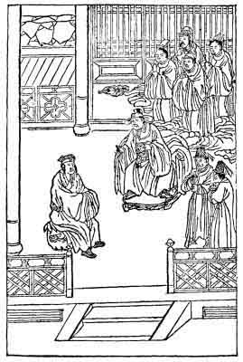

[Intangible Textual Heritage](../../index)  [Taoism](../index) 
[Index](index)  [Previous](ts16)  [Next](ts18) 

------------------------------------------------------------------------

### PHILANTHROPY REWARDED.

The people in the province of Chiang-Hsi had an objection to raising
daughters, and on that account there were a great many bachelors there.
The governor wanted to put a stop to the inhuman custom of drowning
infants, and so he summoned some of his old councilors to see what
measures could best be taken to effect this. Old state documents were
consulted and it appeared that many of the preceding governors had
attempted the same reform but had signally failed. So the task seemed to
be beset with insurmountable difficulties.

After a meeting with his councilors the governor retired, still thinking
that there must be some method which would effectively put an end to the
barbarous practice, and he thought, what could cause people to suppress
parental love but the expense and trouble they must undergo at the time
of giving their daughters in marriage. If there were built a sort of
public nursery where all the female children could be provided for by
the state, the cruelty of drowning girls would naturally cease.

{p. 90}

While going over the old records, the governor had found that there were
deserted temples and shrines to which a regular annual revenue was still
attached. He thought these revenues might be used with great benefit to
the public. In the morning he would go to the temple of the Heavenly
Mother and ask her gracious assistance for this scheme.

That same night the priest of the temple was informed in a dream by the
Heavenly Mother concerning the governor's humane project and his
impending visit in the morning. She added that though his philanthropic
scheme had not yet been executed, the very thought of lovingkindness
that prompted it, had caused a commotion in heaven and he was attended
by a host of angels.

According to the divine command, every preparation was made in the
temple to receive the governor. After due salutation, the priest
inquired whether his mission was about the establishment of a nursery.
The governor was greatly surprised to find him well informed in regard
to the secret plan which had not been divulged to anybody. The priest
then told him all about the previous night's communication from the
Heavenly Mother.

The benevolent plan was successfully put into execution and general
prosperity began

{p. 91}

to reign in the district. The governor was promoted by the Emperor and
died at an advanced age, surrounded by his children who were all
prosperous and respected.

------------------------------------------------------------------------

[Next: The Power of a Good Man's Name](ts18)
