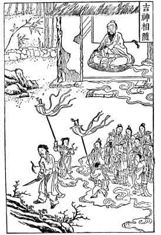

[Intangible Textual Heritage](../../index)  [Taoism](../index) 
[Index](index)  [Previous](ts18)  [Next](ts20) 

------------------------------------------------------------------------

### GOOD SPIRITS IN ATTENDANCE.

Yuen, having conceived a violent hatred against an acquaintance, set out
one morning, knife in hand, with the purpose of killing him. A venerable
man sitting in a convent saw him pass, and was amazed to observe several
scores of spirits closely following him, some of whom clutched his
weapon, while others seemed endeavoring to delay his progress. About the
space of a meal-time the patriarch noticed Yuen's return, accompanied
this time by more than a hundred spirits wearing golden caps and bearing
banners raised on high. Yuen himself appeared with so happy a face, in
place of his gloomy countenance of the early morning, that the old man
sadly concluded that his enemy must be dead and his revenge gratified.

"When you passed this way at daybreak," he asked, "where were you going,
and why do you return so soon?"

"It was owing to my quarrel with Miu,"

{p. 93}

said Yuen, "that made me wish to kill him. But in passing this convent
door better thoughts came to me as I pondered upon the distress his wife
and children would come to, and of his aged mother, none of whom had
done me wrong. I determined then not to kill him, and return thus
promptly from my evil Purpose."

It hardly needed the sage's commendations to increase the reformed
murderer's inner contentment, imparted by the train of ghostly helpers;
he continued on his way rejoicing.

\[This story, reproduced from Williams' *Middle Kingdom*, is not
contained in the moral tales annexed to the *Kan-Ying P'ien* but is
taken from a similar collection following the *Sacred Edict of Kang-Hi*.
Its insertion here is justified since it illustrates a quotation from
the *Kan-Ying P'ien* (1184-1188) which is almost literal and is
inscribed in a corner of the picture.\]

------------------------------------------------------------------------

[Next: A Ruffian's Reform](ts20)
