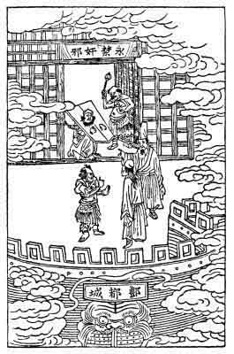
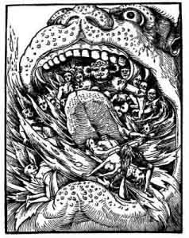

[Intangible Textual Heritage](../../index)  [Taoism](../index) 
[Index](index)  [Previous](ts20)  [Next](ts22) 

------------------------------------------------------------------------

### THE IMPIOUS MAGISTRATE.

Wang An-shih, a high magistrate of the Sung dynasty (960-1278 A. D.),
was a learned scholar but recklessly irreverent, and so introduced,
radical innovations in his administration. People complained, officers
demurred, and the emperor expressed surprise; but he would say,
"Heavenly omens should not be heeded, human discontent need not be
minded, and there is no sense in following the ancestral laws." He and
his son, who assisted him in his office, even attempted to revive the
ancient cruel custom of corporal punishment; but before the law was
passed, the son died, and

{p. 96}

Wang An-shih built a Buddhist temple on the site of his son's residence.

While the magistrate was performing the customary Buddhist rite, he
thought he faintly perceived in the flame of a burning candle the image
of his son, bound hand and foot in a cangue,\[1\] crying:
"Our attempt to revive corporal mutilation angered Heaven, and I have no
chance of getting out of this infernal torture."

Later An-shih fell in disgrace; he lost his position and died miserably
in exile.

Now it happened that soon afterwards, one of An-shih's relatives was
taken ill, and swooned, and when he recovered, he said that he had been
ushered into a special department in hell, where hung the sign:
"Wickedness and Crime Eternally Prohibited," and there lie saw a
noble-looking man in a cangue, who had gray hair and large eyes. Though
he did not mention the name of this unfortunate person, every one around
knew that it was Wang An-shih of whom he spoke. When An-shih's daughter
inquired what could be done, the sick man simply said: "All that is
necessary is to accumulate merits and nothing more."

\[1. The Chinese pillory.\]

{p. 97}

\[Our illustration shows the vision in which the magistrate's son is
seen to suffer. The inscription above the door reads, translated
verbatim, "Eternally Prohibited Depravities and Crimes," which means
that here is the department for punishing evil-doers of this class.

A CHRISTIAN CONCEPTION OF HELL.

It is interesting to notice that the Chinese conception of the maws of
hell which has apparently developed

{p. 98}

quite independently of Christian influence, is nevertheless, practically
the same. This may be seen by a comparison of the lower part of the
illustrations of this story and the next with the typical conception of
hell as held in Christendom during the Middle Ages. Our picture is a
reproduction of a German woodcut made at the time of the Reformation,
but similar representations can be met with in the literature of the
same age in other Christian countries. One of these appears on the main
entrance of the Cathedral of Bourges, France (Carus, *History of the
Devil*, p. 181). The Chinese conception was directly derived from India,
indirectly from Babylon, and the Christian view can be traced to the
same source.\]

------------------------------------------------------------------------

[Next: A Visit to Hell](ts22)
