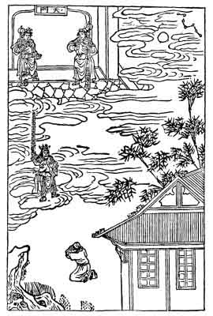

[Intangible Textual Heritage](../../index)  [Taoism](../index) 
[Index](index)  [Previous](ts24)  [Next](ts26) 

------------------------------------------------------------------------

### THE NORTHERN CONSTELLATION.

P'ang Hêng-Hsiu organized with his friends an association the purpose of
which was to worship the Northern Constellation. He observed all
necessary religious disciplines

{p. 106}

and recited the *sutras* with reverence. One day, however, he became so
intoxicated that he forgot himself. He stripped off his garments and
slept facing the north. Waking up in the night, he showed his disrespect
toward the constellation, when suddenly he heard a series of
thunderclaps in the northwestern quarter, and lo! the gate of heaven was
thrown wide open. Awed by this unexpected turn of affairs, P'ang hastily
put on his clothing and was at the point of paying due homage to the
Lord, when a god with dark face and dragonlike whiskers, carrying a
golden rod in his hand, came down from above. He severely censured Pang
for his offence, saying: "You have organized a religious society
yourself and are well aware of the sacred laws. Therefore, your
violation of them becomes doubly punishable."

P'ang humbly begged for divine mercy, excusing his deportment by the
temporary derangement of his mind.

The god said: "The reason why men of good behavior are free from blame,
is that they never relax their moral vigilance at any moment. Remember
the story of Ch'ü Pai-Yü who at night passed by the royal palace, yet he
dismounted from his carriage as was customary to do in the daytime, and
paid proper

{p. 107}

reverence to the Imperial house. People are still praising his
unparalleled sincerity. Even in darkness men must not unbridle
themselves and yield to their wanton passions. We will let you go at
present, but you will have to suffer for your offence later on in life
by receiving some civil punishment."

Ever since, P'ang shut himself up in his house and did not dare to go
outside lest some misfortune should befall him. But how could a poor
mortal escape heavenly ordained punishment? One day he received an
invitation from one of his honorable relatives who had just been
promoted to an eminent official position at the capital. He accepted
gladly and went to the capital. While there, he went out and in at
pleasure. Once he passed by an Imperial shrine, and, not knowing the
official regulations, kept on riding apace. Thereupon the guard of the
shrine arrested him for the offence, and the judge sentenced him to one
hundred stripes. Fang then came to realize the significance of the
divine prophecy.

\[The Northern Constellation, called in Chinese "the Bushel" and in
Western countries "Ursa Major," is sacred to Ti Chün, (the Lord
Superior), and any intentional irreverence shown to it is regarded as
disrespect toward the good Lord himself. Our illustration

{p. 108}

shows a messenger of Ti Chün stepping forth from the gate of heaven to
warn the trespasser.\]

------------------------------------------------------------------------

[Next: The Incensed Goddess](ts26)
