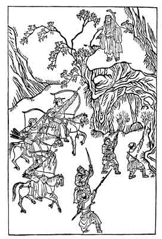

[Intangible Textual Heritage](../../index)  [Taoism](../index) 
[Index](index)  [Previous](ts29)  [Next](ts31) 

------------------------------------------------------------------------

### THE CRUEL HUNTERS.

In the county of Hsiang-Tan in Hu-Kuang there was an old and much
respected gentleman. He had three sons who did not care for culture and
refinement but spent every day in sports and roaming through the
mountains.

One day the three went out hunting with a large company of young people
and they met unexpectedly an old man in white garments who knelt and
thus addressed them: "To refrain from injuring all growing things and
from killing whatever is awakening into life is the part of universal
lovingkindness as observed by saints and sages. It is now springtime
when everything in nature is starting to life again. If you pay no
attention to the tenderness of heart as practiced by holy men., and by
unchecking the wild passions lurking in men's hearts, if you set the
woods afire and exterminate the animals and insects that inhabit them,
you will surely incur heavenly displeasure and suffer the consequences
thereof. I, poor old creature, have seven young children in my family,
and there is not time to remove

{p. 129}

them to a place of safety; but if you, gentlemen, have pity on us, we
will never forget your mercy and will reward you later."

The three leaders of the party did not exactly understand what the old
man wanted but without further thought promised to do as he had
requested.

When the old man was gone some of the party began to wonder who he could
have been and whence he might have come into this wilderness; and they
argued that his appeal to their sympathy did not sound human. Possibly
he was the spirit of some old wild animal living around in the
mountains.

Upon this suggestion they pursued him, and seeing him enter a cave,
spread a net before it and started a fire in the entrance. Suddenly a
white stag darted forth from the hole, and breaking through the
besiegers, climbed tip to a near rock, and then assuming the form of an
old man, turned back to the hunting party, exclaiming: "You have killed
my seven young daughters. You shall have to pay a penalty for this
heartless act. A calamity ten times greater than I have suffered, will
befall your family."

The three young men tried to shoot him, but he caught up the arrows in
his hands and breaking them to pieces disappeared.

{p. 130}

Later, there came to their house a Taoist monk who predicted for them an
imperial career and great prosperity for the future. Incited by this
prophecy, they organized a rebellion in which many of their friends
joined, for the purpose of overthrowing the reigning dynasty and
establishing a new government under their own leadership. While the
preparations were going on secretly, somebody betrayed their conspiracy
to the authorities. Soldiers were immediately dispatched to their home,
and, surrounding the house, put every one of the family under arrest. On
examination they were found guilty of treason. Seventy members of their
families and associates were executed according to law; but nobody ever
knew what became of the Taoist monk who had been the real leader of the
scheme. He as well as the man who had betrayed them disappeared.

\[This curious story, especially the figure of the mountain spirit who
acts as a protector of wild animals, reminds us of Schiller's poem, Der
Alpenjäger, which we quote entire from Bulwer-Lytton's translation,
slightly modified:

THE ALPINE HUNTER.

"'Wilt thou not be lambkins heeding?  
Innocent and gentle, they  
Meekly on sweet herbs are feeding, {p. 131}  
And beside the brook they play.'  
Mother, keep me not at home,  
Let me as a hunter roam!'

'Wilt thou not, thy herds assembling,  
Lure with lively horn along?--  
Sweet their clear bells tinkle trembling,  
Sweet the echoing woods among!'  
'Mother, mother, let me go,  
O'er the wilds to chase the roe.'

"'Wilt thou nurture not the flowers,  
Tend them like my own dear child?  
Dark and drear the mountain lowers,  
Wild is nature on the wild!'  
'Leave the flowers in peace to blow.  
Mother, mother, let me go!'

"Forth the hunter bounds unheeding,  
On his hardy footsteps press;  
Hot and eager, blindly speeding  
To the mountain's last recess.  
Swift before him, as the wind,  
Panting trembling, flies the hind.

"Up the ribbed crag-tops driven,  
Up she clambers, steep on steep;  
O'er the rocks asunder riven  
Springs her dizzy, daring leap:  
Still unwearied, with the bow  
Of death, behind her flies the foe.

"On the peak that rudely, drearly  
Jags the summit, bleak and hoar,  
Where the rocks, descending sheerly, {p. 132}  
Leave to flight no path before;  
There she halts at last, to find  
Chasms beneath--the foe behind!

"To the hard man--dumb-lamenting,  
Turns her look of pleading woe;  
Turns in vain--the Unrelenting  
Meets the look--and bends the bow,  
Yawn'd the rock; from his abode  
Th' Ancient of the mountain strode;

"And his godlike hand extending,  
To protect her from her foe,  
'Wherefore death and slaughter sending,  
Bringst thou to my realm this woe?  
Shall my herds before thee fall?  
Room there is on earth for all!'"\]

------------------------------------------------------------------------

[Next: A Chinese Home Mission Publishing Company](ts31)
