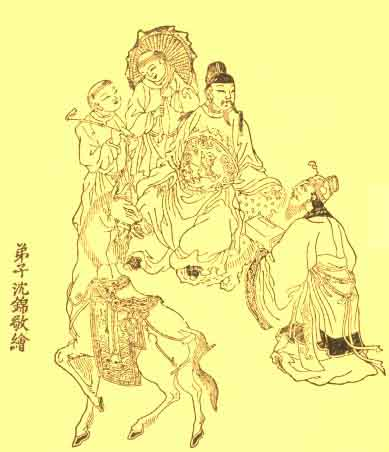

[Intangible Textual Heritage](../../index)  [Taoism](../index) 
[Index](index)  [Next](ycw01) 

------------------------------------------------------------------------

# YIN CHIH WEN

#### THE TRACT OF THE QUIET WAY WITH EXTRACTS FROM THE CHINESE COMMENTARY

###### TRANSLATED FROM THE CHINESE BY

## TEITARO SUZUKI AND DR. PAUL CARUS

###### EDITED BY

### DR. PAUL CARUS

###### WITH FRONTISPIECE

###### scanned at Intangible Textual Heritage, May 2002. J.B. Hare, redactor.

##### CHICAGO THE OPEN COURT PUBLISHING COMPANY

##### LONDON AGENTS KEGAN PAUL, TRENCH, TRÜBNER & CO., LTD.

1906

p. verso

COPYRIGHT BY

THE OPEN COURT PUBLISHING CO.

CHICAGO, U. S. A.

1906\.

All Rights Reserved.

------------------------------------------------------------------------

[Next: Contents.](ycw01)
