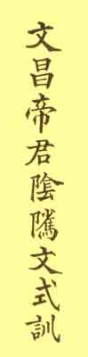

[Intangible Textual Heritage](../../index)  [Taoism](../index) 
[Index](index)  [Previous](ycw01)  [Next](ycw03) 

------------------------------------------------------------------------

p. 3

# INTRODUCTION.

THE *Yin Chih Wen* is a religio-ethical tract, which, in spite of its
popularity all over the Middle Kingdom, has not as yet, so far as we
know, been translated into any Western language. Next to the *Kan-Ying
P'ien* it is read and studied and taught both in schools and at the
home, and there is probably no family in China without it; but its
contents are very little known in the. Western world, and we have only
once met with references to it by Professor Douglas in his *Confucianism
and Taouism* under the title of "Book of Secret Blessings." [1](#fn_3:1)

### YIN CHIH.

It is difficult to translate the title of the book. All we can say is
that the rendering by Douglas, "Book of Secret Blessings," does not
recommend itself; but the truth is that a-n exact translation which
would be as terse and as expressive as is the Chinese, appears to be all
but impossible.

We have long been in doubt as to what English words would best express
the term *Yin Chih*, and we

p. 4

have seriously considered the following three possibilities: "secret
virtue," "heaven's quiet dispensation," and "mysterious workings." None
of these versions would be incorrect, but they do not sufficiently
express the full meaning of the term. The first and second express two
meanings which ought to be combined into one such as is the third, in
order to serve as an equivalent of this peculiar expression; and we have
finally decided to render our title *The Tract of the Quiet Way*, which,
however, though it is sufficiently broad and brief, is not intelligible
without further explanation.

The word *chih* is used both as verb and as noun. As a verb it means "to
determine," "to raise"; as a noun it may be defined by "principle,"
"rule," "method," "dispensation," "way." [1](#fn_4:1) The word *yin* means "in secret," either
in the sense of "unheeded" or "unostentatious." It also conveys the idea
of anything possessed with a deeper meaning, anything mysterious; and
the two words together, *yin chih*, denote the quiet way of Heaven,
which works out the ends of divine dispensation, invisibly yet
unfailingly, to the awe and astonishment of every sapient observer, as
says the Christian hymn:

"God moves in a mysterious way  
His wonders to perform."

If we had to translate these lines into Chinese, we

p. 5

might render the words "a mysterious way" very appropriately by *yin
chih*.

It is an old maxim of the traditional wisdom of China which is most
emphatically insisted upon by Lao Tze and all the sages of his school,
that these quiet ways of Heaven should be imitated by man. As Heaven
lets its sun shine upon good and evil, without discrimination and also
without expecting reward or advantages; so man should do good to his
fellows, perform acts of rectitude, of justice, and of mercy, show
benevolence and kindness toward all in an impartial spirit without
cherishing ulterior motives, without hope of reward, and without desire
for praise. The man who thus imitates "Heaven's quiet way" in
unostentatiously realizing the ideal of heavenly goodness is truly
virtuous, and so yin chih has also come to denote a condition which may
be characterized as, and translated by, "secret virtue," reminding us of
Christ's injunction not to let our right hand know what the left hand is
doing (Matt. vi. 1-4).

In the title of the book the words *Yin Chih* cover the general idea of
the "secret ways" both as they are working in the divine dispensation
and in human action, and if either meaning predominates we should say
that it is certainly the former--the quiet ways of Heaven which
determine the destiny of man and which are described by Shakespeare as

"A divinity that shapes our ends,  
Rough-hew them how we will."

--Hamlet, VI, 1-4.

The word *chih* occurs for the first time in Chinese literature in the
"Great Plan" of the *Shu King*, and there it is used in the verbal sense
"to regulate, to rule,

p. 6

to determine." The commentator of the Fin Chill Wen explains the title
in the following words:

"In the 'Great Plan,' a chapter of the Shuh King, we read: '*wei tien
yin chih hsia min*.' \[Only \| Heaven \| mysteriously \| rules \| below
\| the people\] and a gloss explains the word *chih* by *ting*, 'to
determine.'"

The quoted passage means that "Heaven alone, in a quiet or mysteriously
unnoticeable way, directs the affairs of mankind living below on earth."

The commentator continues:

"The human soul is most intelligent and its essential nature is
intrinsically good. All our moral relations and daily actions have their
reasons why they should be so. When Heaven above created these beings it
mysteriously endowed them with something to guide (*ting*) them, and
this something appears when the people practise goodness. Indeed it is
the guiding (*ting*) principle of creation that good men never lose an
opportunity to do what is good. If you really practise it (i. e., the
good) in your heart it is not necessary that others should know of it,
for there is something in the unseen which fully regulates and
determines (*ting*) your affairs. Those who deny this fact commit a
secret (*yin*) sin (*o*) and their retribution will be speedy. Therefore
this book is called *Yin Chih*."

The words *Yin Chih* ("the quiet way," or more explicitly, "the
mysterious dispensation of Heaven showing itself in man's unostentatious
virtue") are opposed to *yin o*, i. e., "the hidden evil in the bad
man's heart." The word *o* (a compound of "crookedness" and "heart") is
the common term for evil or badness.

p. 7

The contrast in which *yin chih* stands to *yin o* explains title by how
far it would be proper to translate our "secret virtue."

Considering the fact that the word "way" in English is as broad as the
meaning of *chih* in Chinese, and that the former is widely used with a
deep religious significance, we have finally chosen as a translation of
our title the term "the quiet way." We are fully conscious of the
shortcomings of our rendering, but our readers will bear in mind the
original sense and become accustomed to our translation by associating
it with its right interpretation.

### WEN CH'ANG TI CHÜN.

Our frontispiece, drawn by Shen Chin-Ching, represents Wen Ch'ang Ti
Chün, one of the highest divinities of China, revealing himself to the
author of the tract. Wen Ch'ang is the name of the god, and Ti Chün his
title.

The picture represents the god as accompanied by two attendants. The
white charger on which he has come down from heaven stands in the
foreground. The god is seated on a stool and the scribe of the book
reverently kneels before him holding the *Yin Chih Wen* in his hands.

The inscription of the picture reads *Ti tze Shen Chin-Ching hui*, which
means "the humble disciple Shen Chin-Ching pinxit." *Ti* means "younger
brother," and *tze* "child," here used as a diminutive. "Little Younger
brother" is the usual term meaning "disciple," or "devotee," by which
title the artist here calls himself to indicate that he is a follower of
the religious doctrines taught in the *Yin Chih Wen*.

p. 8

Wen Ch'ang means "scripture glory."

The word *wen* is the same character which occurs in the last word of
the title of our book. It denotes writing in general, and is especially
applied to short exhortations of a religious nature such as are commonly
called in Western terminology "tracts." Hence we translate "The Tract of
the Quiet Way," not "the book," as Douglas has it. With reference to the
god's name, we translate *wen* by "scripture," because in English the
term scripture refers mainly to religious literature and is similar to
the Chinese original in so far as it has a devotional ring.

Ch'ang means "glory" or "radiance," the character being composed of two
suns, indicating an intensified brightness of light.

To characterize the god Wen Ch'ang or "scripture glory" as god of
literature (as is sometimes done) is, to say the least, misleading. He
is the god of learning in general, and in Chinese high schools a hall is
dedicated to him as the patron saint of education, refinement, and
especially moral instruction through religious books. *Belles lettres*
form only one and in fact an insignificant branch of his department. He
is, above all, the god of divine revelation through scripture.

The rank of Wen Ch'ang in the world of gods, is "Emperor" or "Ti," and
the word Ti Chün, "the higher emperor," is commonly translated by "lord
superior."

The word *chün* means "superior," or "master" and so "Ti Chün" (Lord
Superior) might also be translated "imperial master." Chün is the term
by which *chün tze* the "higher man" is denoted in Lao Tze's *Tao Teh
King*, an anticipation of Nietzsche's

p. 9

"superman," only with this difference that Lao Tze's "higher man" bears
a great resemblance to Christ and Buddha, while Nietzsche's "superman"
is more like Kubla Khan, or Attila, or Napoleon. The term *chün* is
commonly applied also to leading thinkers such as Lao Tze and Confucius.

### KWAN TI AND WEN CH'ANG.

The title Ti, "emperor," is also borne by the god of war, Kwan Ti, and
if the latter is compared to the archangel Michael, the former, Wen
Ch'ang, should be likened to Gabriel. In fact, we cannot deny that there
is a strong probability of historical connection between these highest
princes among the angels, for the conception of both may have been
derived from Babylonian prototypes, Michael being represented by Marduk
and Gabriel by Nebo.

Michael means literally "who is like God," and seems to designate that
divine presence (viz. the ineffable name) which is believed to be equal
to God; but in the classical period of Jewish monotheism the word
Michael was explained not as a characterization of the archangel as
being like God, but as expressing faith in monotheism, implying the
proposition that there is no second to God. Michael, according to the
angel lore of the Hebrews, is the representative of God, and so he is
identified with God's cause. He is the guardian angel of Israel, the
chosen people, and also commander-in-chief of the angelic hosts. As
Marduk fought with Tiamat, so Michael wages war against the dragon (Rev.
xii. 7).

Gabriel is as different in character from Michael as Wen Ch'ang is from
Kwan Ti. Gabriel means

p. 10

"the man of God." He is deemed superior to all other angels except
Michael and is generally represented as the angel of God's special
revelation and the interpreter of God's intentions. Thus, it is Gabriel
who explains Daniel's vision; nor can we doubt that the angel with an
inkhorn by his side, mentioned in Ezekiel x. 2-3, was Gabriel, the
scribe of God. Old Testament scholars have pointed out his resemblance
to the Babylonian god Nebo, who in the monuments is depicted in human
form with an inkhorn at his side, differently from the Cherubim (the
human-headed winged bulls), which fact throws light on the vision of
Ezekiel, alluded to above, and shows that there is a specific meaning in
the name "man of God."

In the New Testament Gabriel continues to represent God's revelation. It
is he who announces the birth of John the Baptist and of Jesus. There is
no figure in Christian tradition which would resemble Wen Ch'ang more
closely than Gabriel.

### CHANG-O.

As Kwan Ti, the god of war, was represented to have lived on earth as a
man, so Wen Ch'ang, or "scripture glory," is said to have been an
ancient Chinese sage, but little is known of the man to whom the Chinese
tradition refers.

According to the commentator, "he lived during the T'ang dynasty
(620-950 A. D.), and his secular name was Chang-O. Yüeh was his native
province, but later he moved to Tzu T'ung in the district of Shu. We are
told that his personality was distinguished by nobility and piety. His
writings were clear, luminous, and forcible. He began to exercise a
moral power

p. 11

over the people, who unconsciously felt his spirituality. He entered for
a while upon an official career, but, not satisfied with the course of
politics, he resigned his government position and lived as a saintly
recluse. The people of Shu showed great affection for him. and, when he
died, built a temple in his honor calling it 'Temple of the Sage of Tzu
T'ung.' People far and near came to offer prayers which were remarkably
well responded to by the sage. Everybody, then, said, 'There is in the
heavens a star called Wen Ch'ang; the sage \[i. e., Chang-O\] must have
been its incarnation.'"

Our tract bears the name of the god Wen Ch'ang, and accordingly he is
regarded as its author, or at least as the divinity who has guided the
pen of the man who composed it; but (unless we assume that Chang-O was
the author which is not positively impossible) the name of the scribe
who made himself the mouthpiece of Wen Ch'ang and who in human
consideration ought to be regarded as its author, is not recorded.

### THE CHINESE TITLE.

We reproduce the complete title of the Tract of the Quiet Way in its
original Chinese characters on the fly leaf preceding our translation,
and there it reads: "*Wen-Chang Ti-Chün Yin Chih Wen Shih-Hsün*." This
means in a verbatim translation, "\[Of\] Scripture Glory, \[the\]
Imperial Master, \[the\] Quiet-Way-tract, normal instruction." The last
two words form one idea which might be translated "educational." *Shih*
means "model," "norm" or "pattern"; and *hsün*, "instruction." In their
combination the two denote that the present book is intended to serve
educational purposes,

p. 12

and that it contains the established or orthodox standard of conduct.

### THE AGE OF THE YIN CHIH WEN.

The date of the Yin Chih Wen can only approximately be determined. It
appears that it cannot be older than Chang-O and must not therefore be
dated earlier than the time of the T'ang dynasty. In the days of
Kang-Hi, however, the pamphlet was not only well known, but commented
upon and supplied with explanatory stories. Accordingly we cannot stray
far from truth when we look upon the *Yin Chih Wen* as approximately
simultaneous with the *Kan-Ying P'ien* which in many respects it greatly
resembles, and so we would say that we should certainly not set the date
of its composition later than about 1600 A. D.

Specialists of Chinese literature will probably be able to ascertain the
age of the *Yin Chih Wen* more accurately by pointing out quotations
from it in other books whose date of composition is unquestionable.

The original *Yin Chih Wen* consists (1) of the tract itself which is
here translated, (2) of glosses added by commentators, and finally (3)
of a great many stories which are similar to the stories of the
*Kan-Ying P'ien*, except that they are more rational and appear to avoid
all reference to miracles and superstitious agencies. The book has
apparently appealed more to the rationalistic Confucianists or literati,
who, while upon the whole agnostic, exhibit at the same time due respect
for the officially recognized religions.

p. 13

### EDITORIAL COMMENTS.

The sinological part of the present version is more exclusively the work
of Mr. Teitaro Suzuki than in our edition of the *Kan-Ying P'ien*; and
in our own version of terms and other details we have not been satisfied
until we had his assent.

In addition to the text of the *Yin Chih Wen*, the editor has picked out
from the Notes of the Chinese Commentator those passages that appealed
to him, and has abstained from publishing any one of the stories,
because he thought that Western readers would not take a great interest
in them. The general tenor of these moralizing tales is sufficiently
indicated in the stories of the *Kan-Ying P'ien*.

### L'ENVOI.

We hope that the publication of this book will help Western readers to
understand better the Chinese character and especially its undeniable
fervor for moral ideals. Though the Chinese mind, especially among the
uneducated classes, is filled with superstitious notions, we cannot help
granting that the character of their moral maxims ranges very high; and
we must confess that among all the nations of the world there is perhaps
none other so seriously determined to live up to the highest standard of
ethical culture.

An appreciation of the virtues of the Chinese will help Western people
to treat them with more consideration, and so we contribute our
interpretation of this treatise as a mite towards a better understanding
between the East and the West, between the white races of Europe and
America and the natives of Asia. We

p. 14

hope that the day will come when the mutual distrust will disappear, and
when both in reciprocal appreciation of their natural good qualities,
will be anxious to treat each other with fairness and brotherly
kindness.

P. C.

 

p. 15

 

------------------------------------------------------------------------

[Next: The Tract of the Quiet Way.](ycw03)

------------------------------------------------------------------------

### Footnotes

[3:1](#fr_3:1) Professor Douglas's book is one
in the series of *Non-Christian Religious Systems* published by the
Society for the Advancement of Christian Knowledge. His reference to the
*Yin Chih Wen* is made on pp. 256 and 272.

[4:1](#fr_4:1) The character is presumably
phonetic. It consists of the radical "horse," which is modified by the
symbol "to ascend," "to go up higher," the latter being a compound of
"higher" and "to step up." In common language the word *chih* means
"stallion," but we may bc sure that this is an accidental homophony. A
sameness of sound led to the use of the same character, an occurrence
which is very frequent in the Chinese language.
