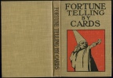

  
[Intangible Textual Heritage](../../index)  [Tarot](../index) 
[Index](index)  [Next](ftc01) 

------------------------------------------------------------------------

[Buy this Book at
Amazon.com](https://www.amazon.com/exec/obidos/ASIN/0879800356/internetsacredte)

------------------------------------------------------------------------

*Fortune Telling by Cards*, by P.R.S. Foli, \[1915\], at Intangible
Textual Heritage

------------------------------------------------------------------------

p. v

Fortune-Telling by Cards

p. vi p. vii

# Fortune-Telling by Cards

###### By

### Professor P. R. S. Foli

##### Author of "Fortune Teller"

##### "Dream Book," etc.

#### R. P. FENNO & COMPANY 18 East 17th Street, New York

#### \[first published 1915, this edition 1920?\]

Scanned at Intangible Textual Heritage, July 2007. Proofed and formatted
by John Bruno Hare. This text is in the public domain in the United
States because it was published prior to January 1st, 1923. These files
may be used for any non-commercial purpose provided this notice of
attribution is left intact in all copies.

 
[  
Click to enlarge](img/cover.jpg)  
Cover  

  [  
Click to enlarge](img/title.jpg)  
Title Page (note no date)  

p. viii

  [  
Click to enlarge](img/verso.jpg)  
Verso (note no copyright statement)  

 

------------------------------------------------------------------------

[Next: Contents](ftc01)

