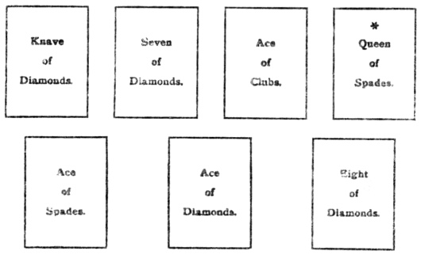
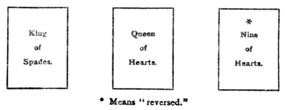

  
[Intangible Textual Heritage](../../index)  [Tarot](../index) 
[Index](index)  [Previous](ftc07)  [Next](ftc09) 

------------------------------------------------------------------------

[Buy this Book at
Amazon.com](https://www.amazon.com/exec/obidos/ASIN/0879800356/internetsacredte)

------------------------------------------------------------------------

*Fortune Telling by Cards*, by P.R.S. Foli, \[1915\], at Intangible
Textual Heritage

------------------------------------------------------------------------

p. 39

### CHAPTER VI

#### Your Fortune in Twenty-one Cards

*A reduced pack—An example—The three packs—The
surprise*.

THIS method requires a pack of thirty-two cards, although only
twenty-one of them are actually used in the process. The whole pack must
be well shuffled and cut with the left hand. The dealer then takes off
the first eleven cards and throws them aside. From the twenty-one left
in his hand he takes the uppermost card and places it apart for "the
surprise" before dealing out the other twenty and placing them in order
on the table before him. If the card representing the inquirer is not
among them the whole process must be repeated from the beginning.

The signification of the cards must be read, taking care to notice any
set of two, three, or four of a kind, as their collective meaning should
be added to the individual explanation. After this has been done the
twenty cards should be taken in order, starting from the left, and their
meanings linked up together as a continuous message.

The cards must now be taken up again, shuffled, and cut as before. The
dealer then makes them into three packs, having been careful to place
the first card apart for "the surprise." Two of the packs will consist
of seven cards, the third of only six. The inquirer is then asked to
choose one of the packs, which must be exposed face upwards, moving from
left to right, and these six or seven cards, as the case may be, should
be read according to their significations. This operation is repeated
three times, so that at the finish "the surprise" consists of three
cards, which Are exposed and read last of all.

p. 40

#### An Example.

The accompanying example will make the foregoing explanation more lucid
and interesting.

We will take the knave of clubs as the representative of the inquirer, a
dark, clever, well-intentioned young man. The twenty-one cards come out
in the following order, beginning from the left:—

The king of spades.  
Queen of hearts, reversed.  
Ace of hearts.  
Knave of clubs.  
Ace of spades, reversed.  
Ace of clubs.  
Knave of hearts.  
King of hearts.  
Queen of spades, reversed.  
Nine of hearts.  
Knave of diamonds.  
Ten of spades.  
Ace of diamonds, reversed.  
King of diamonds.  
Seven of diamonds.  
Eight of diamonds.  
Eight of spades, reversed.  
Seven of clubs, reversed.  
Nine of clubs, reversed.  
Nine of diamonds.  
The surprise, placed apart.

Before taking the individual significance of each card we will look at
some of the combinations. There are the four aces, telling of bad news,
relating to trouble through the affections, but two being reversed
mitigate the evil, and give a ray of hope to the inquirer. The three
kings tell of an important undertaking which will be discussed and
carried through successfully by the young man, who has excellent
abilities. The two queens, both reversed, warn the inquirer that he will
suffer from the result of his own actions, more especially as the queen
of spades in an inverted position represents a

p. 41

malicious and designing widow. It will be found as the process develops
that she is very much to the fore with regard to the inquirer's affairs.
The three knaves confirm the foregoing reading, for they betoken
annoyances and worries from acquaintances, ending even in slander. The
three nines, one of them reversed, speak of happiness and entire success
in an undertaking, though the inversion shows that there will be a
slight, passing difficulty to overcome. The two eights refer to
flirtations on the part of the inquirer, and one being reversed warns
him that he will have to pay for some of his fun. The two sevens tell of
mutual love between the young man and the lady of his choice, but as the
one is reversed there will be deceit at work to try and separate them.

Now let us see what the twenty cards have to say taken consecutively. We
start off with the king of spades, a clever, ambitious, but unscrupulous
man who has been instrumental in thwarting the love affairs of the fair,
lovable, and tender-hearted woman, the queen of hearts, upon whom the
inquirer has set his affections. The ace of hearts following her is the
love letter she will receive from the inquirer, the knave of clubs; but
he is next to the ace of spades, reversed, foretelling grief to him,
which may affect his health, and the ace of clubs coming immediately
after points to the cause being connected with money. The next three
cards are court cards, and that means gaiety, in which the inquirer will
be mixed up with a lively young bachelor—the knave of hearts—a fair,
generous, but hot-tempered man—the king of diamonds—and the malicious,
spiteful widow represented by the queen of spades, reversed. The
inquirer will meet with pleasure, caused by success, the nine of hearts;
but this is closely followed by the knave of diamonds, an unfaithful
friend, who will try to bring disgrace, the ten of spades, upon his
betters, and will write a letter containing unpleasant news—the ace of
diamonds, reversed—which will concern or be prompted by the king of
diamonds, a military man who has a grievance with regard to his love
affairs and who is not above having recourse to scandal, the seven of
diamonds, to avenge his wounded vanity. The next card is the eight of
diamonds, the sign of some love-making, but our young people are not at
the end of their troubles yet, for the eight of spades, reversed, tells
us that his offer of marriage will be rejected. The seven of clubs is

p. 42

a card of caution, and implies danger from the opposite sea, so we
gather that the spiteful widow has been at work, and is possibly to
blame for his rejection; this idea is further strengthened by the nine
of clubs, also reversed, coming immediately, which suggests letters that
may have done the mischief. The nine of diamonds tells of the annoyance
caused by these events, and their effect upon the affections of a dark
person, the inquirer, who is a man well worth having.

#### The Three Packs.

In the first deal the inquirer chooses the middle pack, which contains
the following cards: the knave of diamonds, the seven of diamonds, the
ace of clubs, the queen of spades, reversed, the ace of spades, the ace
of diamonds, the eight of diamonds.

We notice that three aces come out in this pack and show passing
troubles in love affairs. The knave of diamonds, an unfaithful friend,
is mixed up in scandal, the seven of diamonds, conveyed in a letter, the
ace of clubs, written or instigated by the spiteful widow, the queen of
spades. The ace of spades betokens sickness, but it is followed by the
ace of diamonds, the wedding ring, and the pack closes with the eight of
diamonds, telling of a happy marriage for the inquirer after all his
worries.

In the second deal he again selects the middle pack, and we see the
following: the queen of spades, reversed as usual, the nine of clubs,
reversed, the seven of clubs, reversed, the nine of hearts, the seven of
diamonds, the eight of clubs.

There are two nines, one reversed, speaking of small worries, and two
sevens, one reversed, which show there is deceit at work. The pack reads
thus: the queen of spades, the spiteful widow, who seems to be
ubiquitous, is followed by the nine of clubs, representing the letter
referred to above, and the seven of clubs standing next to it sounds a
word of caution to the inquirer as to his lady friend, so-called; be
will probably succeed in outwitting the widow, for the next card is the
nine of hearts, implying joy and success in spite of scandal, the seven
of diamonds with reference to his affections represented by the eight of
clubs.

In the third deal the inquirer still is faithful to the middle

p. 43

#### The Three Packs

 

What the first selected pack contains—

 

The three cards forming the Surprise—

 

p. 44

pack, and we find the following cards: the ace of diamonds, ten of
spades, reversed, queen of spades, reversed, nine of diamonds, reversed,
seven of clubs, reversed, ace of clubs, reversed.

The two aces, one of them reversed, tell of a union between two parties,
but as the colours cross and one is reversed the result will not be
known at. present. Here we get the wedding-ring, the ace of diamonds,
followed by the ten of spades, reversed, which speaks of brief sorrow,
occasioned doubtless by the spiteful widow, who again appears reversed,
and intent upon mischief; next to her comes the nine of diamonds,
reversed, signifying a love quarrel; the seven of clubs, reversed, gives
a word of caution to the inquirer with regard to the opposite sex; the
last card is the ace of clubs, reversed, which means joy soon followed
by sorrow.

It is remarkable that the queen of spades comes out in each of the packs
and is reversed every time.

#### The Surprise.

The surprise is now turned up and contains the king of spades, a dark,
ambitious unscrupulous man who has interfered with the love affairs of
the fair woman, the queen of hearts, to whom the inquirer has made an
offer, so far without success; the third card is the nine of hearts,
reversed, which tells that it will be but a passing cloud that will
separate the lovers.

------------------------------------------------------------------------

[Next: Chapter VII. Combination of Sevens](ftc09)

