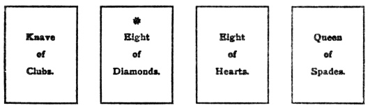
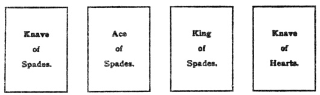
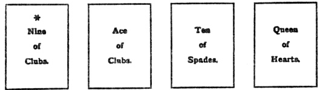
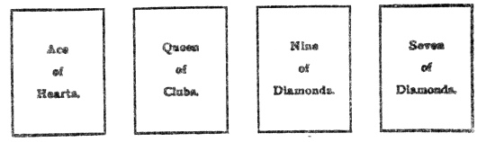

  
[Intangible Textual Heritage](../../index)  [Tarot](../index) 
[Index](index)  [Previous](ftc10)  [Next](ftc12) 

------------------------------------------------------------------------

[Buy this Book at
Amazon.com](https://www.amazon.com/exec/obidos/ASIN/0879800356/internetsacredte)

------------------------------------------------------------------------

*Fortune Telling by Cards*, by P.R.S. Foli, \[1915\], at Intangible
Textual Heritage

------------------------------------------------------------------------

p. 57

### CHAPTER IX

#### A French Method

*French system—The reading—An example*.

#### French System.

TAKE the pack of thirty-two cards, shuffle them thoroughly, then cut
them in the usual way and deal them out in two packs of sixteen cards
each. The inquirer must choose one of the packs and the first card is
placed apart to supply the surprise. The remaining fifteen cards must
then be turned face upwards, and placed in order, from left to right,
before the dealer. It is essential that the card representing the
inquirer should be found in the pack selected by him or her, otherwise
it is useless to proceed; so the cards must be shuffled, cut, and dealt
out over and over again, until the representative card is found in the
right quarter.

#### The Reading.

The reading is conducted as follows. First, take any two, three, or four
of a kind, kings, knaves, eights, or whatever may appear, and give their
explanation as pairs, triplets, or quartettes; then start from the
representative card, and count in sevens, moving from right to left;
thirdly, pair the end cards together and consider their meaning. The
next move is to shuffle the fifteen cards again, cut, and deal them out
into three packs, each of which will naturally have five cards. The
uppermost card of the three packs is removed, and placed with that which
has been set apart for "The Surprise,"

p. 58

and by this arrangement there will be four packs containing an equal
number of cards.

The inquirer must then be asked to choose one of these packs for himself
or herself, after which the four cards are exposed on the table from
left to right, and their individual and collective meanings are read.
The left hand pack will be for "The House," the third pack is "For Those
Who do not Expect It," and the fourth supplies "The Surprise."

#### An Example.

Here is an example of the way in which the packs may turn out. We will
suppose that the inquirer is represented by the queen of clubs. Her
choice falls on the middle pack, which contains the following cards: the
knave of clubs, the eight of diamonds, reversed,, the eight of hearts,
and the queen of spades.

##### 1. FOR THE INQUIRER.

 

The reading will be thus, taking the cards in the above order;—The
thoughts of the inquirer are running upon an unsuccessful love-affair,
and, though moving in good society, she is exposed to the interference
of a dark, malicious widow.

The next pack, standing for "The House," is made up of the knave of
spades, the ace of spades, the king of spades, and the knave of hearts.
We will take their signification as they stand. The three spades mean
disappointment. The presence of two knaves together speaks of evil
intentions.

p. 59

The legal agent, knave of spades, is employed in some underhand business
by his master, king of spades, the dishonest lawyer, who is an enemy to
the inquirer just as he is that of her friend, the festive, thoughtless
young bachelor, knave of hearts, who follows him.

##### 2. THE HOUSE.

 

The third pack is composed of the nine of clubs, reversed, the ace of
clubs, the ten of spades, and the queen of hearts. We find short-lived
joy and good news, followed by tears, for the fair, soft-hearted lady,
who is susceptible to the attractions of the other sex.

##### 3. FOR THOSE WHO DO NOT EXPECT.

 

"The Surprise" is very closely connected with the inquirer herself, for
we find her included in the four cards. There are the ace of hearts, the
queen of clubs, the nine of diamonds, and the seven of diamonds. From
this we gather that there is a love letter for the inquirer, which,
however, may be delayed by some cross accident, and she will thus be
exposed

p. 60

to the foolish ridicule of tactless, unkindly persons. But she will get
the letter all the same.

##### 4. THE SURPRISE.

 

------------------------------------------------------------------------

[Next: Chapter X. The Grand Star](ftc12)

