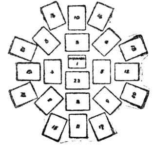

  
[Intangible Textual Heritage](../../index)  [Tarot](../index) 
[Index](index)  [Previous](ftc11)  [Next](ftc13) 

------------------------------------------------------------------------

[Buy this Book at
Amazon.com](https://www.amazon.com/exec/obidos/ASIN/0879800356/internetsacredte)

------------------------------------------------------------------------

*Fortune Telling by Cards*, by P.R.S. Foli, \[1915\], at Intangible
Textual Heritage

------------------------------------------------------------------------

p. 61

### CHAPTER X

#### The Grand Star

*The number of cards may vary—The method—The reading
in pairs—Diagram of the Grand Star—An example*.

#### The Number of Cards may Vary.

THERE are various ways of telling fortunes with cards arranged in the
form of a star, and whichever of these may be preferred, it will always
be found necessary to use an uneven number of cards in addition to the
one representing the inquirer. Some stars are done with thirteen cards,
some with fifteen, and so on, but the real Grand Star must have
twenty-one cards placed round the representative one.

#### The Method.

Suppose the inquirer be a fair man, the king of hearts would be the card
selected to form the centre of the star. This representative card is
placed face upwards on the table, and the remaining thirty-one cards of
the pack (the twos, threes, fours, fives, and sixes having been
previously removed) must then be shuffled, and cut with the left hand.

In the accompanying diagram the cards are numbered in the order that
they are placed in upon the table, taking the representative as No. 1.
The mode of withdrawing the cards from the pack is as follows: The first
ten cards are thrown aside after the first cut, and the eleventh card is
placed *below* No. 1; then cut out a second time, and place the *top*
card of the pack on the table *above* No. 1; cut a third time, take the
bottom card of the pack in the hand and place it to the left of No. s.
The cards must be cut every time a card is to be

p. 62

withdrawn, and they are taken alternately from the top and bottom of the
pack as above directed. Great care should be observed in the placing of
the cards in due order, as any deviation will affect the reading at a
subsequent stage of the process. The last card, No. 22, is placed across
the foot of the representative.

#### The Reading in Pairs.

When the Grand Star has been thus formed, the cards must read in pairs,
taking the outside circle in this order: 14 and 16, 21 and 19, 15 and
17, 20 and 18. Then take the inner circle, moving from left to right
thus: 6 and 10, 9 and 12, 8 and 13, 7 and 11; the four centre points are
paired thus: 4 and 2, 5 and 3; and the last card, No. 22, is taken
separately. The significations are, of course, taken with regard to the
relative positions of the cards, and their special reference to the
central figure of the inquirer. This is a picturesque and simple way of
consulting the cards, and will probably be a favourite with most people.

#### Diagram of the Grand Star.

The central card, No. 1, represents the inquirer, and each card is
numbered in the order in which it is taken from the pack.

 

p. 63

We will take the king of hearts as representative of the inquirer, and
the twenty-one cards come out in the following order:—

1\. King of hearts.  
2. Ten of spades.  
3. Ten of hearts.  
4. Ace of hearts.  
5. Nine of spades.  
6. Ace of spades.  
7. Nine of diamonds, reversed.  
8. Queen of hearts.  
9. Knave of diamonds.  
10. Queen of spades.  
11. Knave of clubs.  
12. King of clubs.  
13. Eight of clubs.  
14. Queen of diamonds.  
15. Nine of clubs, reversed.  
16. King of spades.  
17. Queen of clubs.  
18. Eight of diamonds, reversed.  
19. Ace of diamonds.  
20. Knave of spades.  
21. Knave of hearts.  
22. Ace of clubs.

Before taking the above in pairs as directed, it will be well to glance
at the groups contained in the star as it lies before us. We find:—

*Four aces*.—Love troubles and hasty news for the inquirer.

*Three kings*.—Success in an important undertaking.

*Four queens*.—A good deal of social intercourse.

*Four knaves*.—Somewhat noisy conviviality.

*Two tens*.—Unexpected good luck.

*Three nines*.—Health, wealth, and happiness discounted by imprudence as
one is reversed.

*Two eights*.—Passing love fancies, one being reversed. The king of
hearts, a fair, open-handed, good-natured man

p. 64

is the starting-point in reading the pairs which surround him. He is
connected with (14) the queen of diamonds, a fair woman with a tendency
to flirtation. She is amusing herself with (16) a very dark man,
probably a lawyer, of an ambitious and not too scrupulous character, who
does not wish well to the inquirer. The next pair (21) shows the knave
of hearts, representing Cupid, or the thoughts of the one concerned,
linked with (19) the ace of diamonds, a wedding ring. While this
important item is occupying his thoughts he gives a small present (15),
the nine of clubs, reversed, to (17) the queen of clubs, a charming dark
lady, who is the real object of his affections. (20) The knave of
spades, figuring a legal agent, or the wily lawyer's thoughts, makes
mischief, and (18) the eight of diamonds, reversed, causes the
inquirer's love-making to be unsuccessful. (6) The ace of spades warns
the inquirer against false friends who will frustrate his matrimonial
projects, and in (10) we find one of them, the queen of spades, a widow
with possible designs upon him herself; (9) the knave of diamonds,
reversed, shows the mischief-maker trying to breed strife with the
inquirer's trusty friend (12), the king of clubs, and (8) the queen of
hearts, a fair lovable woman possessing (13) eight of clubs, a dark
person's affections; (7) the nine of diamonds, reversed, tells of a love
quarrel, owing to (11) the knave of clubs, reversed, a harmless flirt
The inquirer will get (4) the ace of hearts, a love letter, but his
happiness will be succeeded by (2) the ten of spades, a card of bad
import; (5) the nine of spades, tells of grief or sickness, possibly
news of a death; but (3) the ten of hearts, counteracts the evil, and
promises happiness to the inquirer, who shall triumph over the obstacles
in his path, and find (22) joy in love and life.

------------------------------------------------------------------------

[Next: Chapter XI. Important Questions](ftc13)

