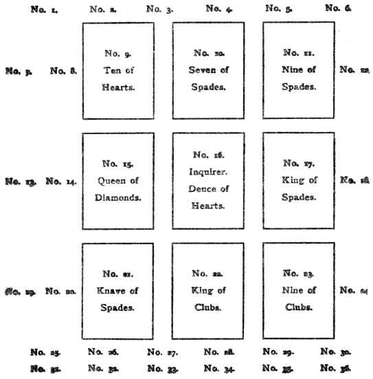

  
[Intangible Textual Heritage](../../index)  [Tarot](../index) 
[Index](index)  [Previous](ftc15)  [Next](ftc17) 

------------------------------------------------------------------------

[Buy this Book at
Amazon.com](https://www.amazon.com/exec/obidos/ASIN/0879800356/internetsacredte)

------------------------------------------------------------------------

*Fortune Telling by Cards*, by P.R.S. Foli, \[1915\], at Intangible
Textual Heritage

------------------------------------------------------------------------

p. 89

### CHAPTER XIV

#### Signification of Suits in the Master Method

*Court cards—Plain cards—An example of the Master
Method*.

#### Hearts.

*THE King of Hearts*.—In this method he represents a married man or a
widower. Should the inquirer be a woman, and this card fall upon either
of the squares, 14, 22, 23, 24, or 32, he then denotes a lover. Should
the inquirer be a man, the king falling in the above-named squares
signifies a rival.

When this card falls on either of the following numbers, 2, 3, 4, 13,
14, 15, 16, 18, 29, 23, 24, 29, 31, 32, 34, the situation is favourable,
and the inquirer will have his wishes granted with respect to the
special meaning of the square.

When the king falls on No. 1, 5, 6, 9, 12, 22, 26, 27, or 28, it
foretells a satisfactory solution of any matter connected with the
subject represented by the squares.

Should he fall upon an unlucky square, namely, No. 7, 8, 10, 11, 27, 20,
22, 30, 33, 35, or 36, he mitigates the evil fortune of the positions.

*The Queen of Hearts*.—She signifies a married woman or a widow who
desires the happiness of the inquirer, and does her best to promote it.

If the inquirer is a man, this card falling on the squares 24, 22, 23,
24, or 32, represents his lady-love. In the event of his being already
engaged, his fiancée will possess all the most lovable and desirable
qualities.

When the inquirer is a woman, and the queen of hearts

p. 90

falls on either of the above-named squares, it shows that she has a
rival to reckon with. Should she be engaged, it indicates that her
future husband is both young and well equipped for social and
professional success.

When a very elderly person consults the cards, the above combination
foretells a peaceful, contented old age.

To any one interested in agriculture, the same combination promises
abundant crops.

*The Knave of Hearts*.—This card represents a good-natured, amiable, but
rather insipid young man, devoid alike of violent passions and exalted
aspirations.

When a young girl consults the cards, this knave falling on the squares
14, 22, 23, 24, or 32, may be taken to personate her fiancé.

When the inquirer is a young, unmarried man, the same combination
indicates that he will marry the object of his choice, after he has
surmounted considerable obstacles by his tact and quiet determination.

*The Ten of Hearts*.—The signification of this card does not differ from
that given in the general definitions save in the following cases:—

When it falls on square No. 10, it signifies success.

When it falls on square No. 14, it signifies success in love.

When it falls on square No. 16, it signifies a happy marriage. If, in
the last-named case, a knave or a seven falls on No. 7, 15, 17, or 25,
there will be several children born of the union.

If the ten of hearts falls on squares 18, 19, 31, or 32, it foretells
wealth, intense enjoyment, and real happiness.

*The Nine of Hearts*.—The only addition to the general signification is,
that when this card falls near the seven of clubs, it denotes that a
promise already made to the inquirer will shortly be fulfilled.

*The Eight of Hearts*.—This card is the special messenger of good things
when it falls on one of the following squares: 5, 9, 15, 18, 19, 22, or
31.

*The Seven of Hearts*.—If this card falls on No. 14, 23, 23, 24, or 32,
when the inquirer is a bachelor, it signifies that he will very soon
take unto himself a wife.

*The Two of Hearts*.—This is frequently taken as the representative
card, and in that case is entirely influenced by its

p. 91

position on the chart, taken in connection with the cards that touch or
surround it.

*The Ace of Hearts*.—This card represents the house of the inquirer as
it does in other methods. It is very important to note its position on
the chart and its surroundings.

#### Clubs.

*The King of Clubs*.—Taken generally, this card represents a married man
or a widower, whose worth as a friend is not to be excelled.

When the inquirer is a young girl, and this king falls on No. 14, 22,
23, 24, or 32, she may rejoice, for she will shortly be united in
marriage to the man she loves.

Should a young man be consulting the cards, this king falling on any of
the above-named squares denotes a generous, high-minded rival who will
meet him in fair fight, and who is far above anything like taking a mean
advantage.

When this card falls on No. 18, 19, 20, 27, or 28, it represents the
guardian of a minor, whose line of conduct will be determined by the
cards which surround or touch it.

*The Queen of Clubs*.—When a bachelor consults the cards, and this queen
falls on No. 14, 22, 23, 24, or 32, it promises him a lady-love whose
beauty shall be her strongest attraction.

Should a woman be seeking to know her fate, this queen falling on either
of the above-named squares warns her that she has a rival. In the case
of the inquirer being a married man or woman, this card represents a
woman of high position and great influence who is attractive, to the
inquirer, and who will be the means of bringing him or her valuable and
pleasing intelligence.

In the case of a business man the above combination denotes that he will
be entirely successful in the enterprise which is engrossing all his
thoughts at the moment.

*The Knave of Clubs*.—This card may be taken to represent a sincere and
lasting friendship founded upon a basis that will endure.

When the inquirer is a young girl, and this card falls upon either of
the matrimonial squares, namely, 14, 22, 23, 24, or 32, it signifies
some man who wants to marry her.

p. 92

In the case of a bachelor, this card on the same squares tells him that
he has a rival, either in love or in his business career.

*The Ten of Clubs*.—This card is the harbinger of good luck if it falls
on No. 3, 5, 15, 18, 19, 22, 25, 28, 31, or 32.

Should this card fall on squares 10, 17, or 36, it implies that the
inquirer will be asked for a loan in money, which he will be unable to
lend.

*The Nine of Clubs*.—This card means a present, and if it follows a
club, the gift will be in money; if it follows a heart, the inquirer may
look for a present of jewellery; if it follows a diamond, the gift will
be but trifling in value; and if it follows a spade, the recipient of
the present will derive no pleasure from it.

*The Eight of Clubs* has no special significance outside the general
definition.

*The Seven of Clubs*.—This represents a young girl capable of the
highest self-devotion, even to risking her life in the interests of the
inquirer. The exact nature of her relations and services to the object
of her affection will be decided by the surrounding cards.

In the case of a bachelor, this card falling on any of the squares 14,
22, 23, 24, or 32, represents the lady of his choice.

In the case of an unmarried girl or a widow, the same combination points
to a generous rival.

Whenever this seven comes out near the nine of hearts, the wish card, it
is a token of some signal success for the inquirer.

*The Two of Clubs*.—This represents the trusted friend of the inquirer,
and the square on which it falls will give the requisite information, if
its meaning be taken in conjunction with those of the surrounding cards.

*The Ace of Clubs*.—This card is the sign of a well-ordered life and
legitimate hopes, and foretells success in an ordinary career, or the
attainment of celebrity in special cases.

Should the inquirer be a soldier by profession, it signifies a fortunate
turn of events, that will secure him a rapid rise in the army.

To one interested in agriculture, it promises plentiful crops.

To a traveller, it foretells a most satisfactory result from his
journey.

To an actress, it promises phenomenal success in a leading

p. 93

rôle. Should the inquirer or one of his parents be a dramatic or lyrical
author, this card is the augury of theatrical success.

#### Diamonds.

*The King of Diamonds*.—Should the inquirer be a young girl, she will do
well to note whether this card falls on any of the matrimonial squares,
14, 22, 23, 24, or 32, for in that case her present admirer is not to be
trusted, unless he has cards of good import touching him, or is preceded
by either a heart or a club.

*The Queen of Diamonds*.—If this card falls on any of the matrimonial
squares, 14, 22, 23, 24, or 32, it signifies to a bachelor that he will
be engaged to one whose character is to be read in the surrounding
cards. If this queen be preceded by a heart or a club, it promises good
luck on the whole; but if by a diamond or a spade, the augury is bad.

Should the inquirer be a young unmarried woman or a widow, this card
falling on the above-named squares indicates that she has a rival whose
character is revealed by the cards touching it.

*The Knave of Diamonds*.—For an unmarried woman or a widow, this card
represents a lover from a foreign country. If it is accompanied by a
heart, he has many good points to recommend him; if by a club, he is
kind and generous; if by a diamond, he is bad-tempered, exacting, and
jealous; if by a spade, he is an undesirable, and she had better have
nothing to do with him.

*The Ten of Diamonds*.—The general meaning of this card is a journey.

If it falls between two spades, the journey will be long.

If it falls between two hearts, the journey will be short.

If it falls between two clubs, the journey will be successful.

If it falls between two diamonds, the journey will have bad results.

*The Nine of Diamonds*.—This card signifies news. If preceded by a heart
or a club, the news will be good. If preceded by a diamond or a spade,
the news will be bad.

*The Eight of Diamonds*.—This card signifies a short journey. If it fall
between two hearts, the expedition will be an enjoyable pleasure trip.

p. 94

If between two clubs, it denotes a satisfactory business journey.

If between two diamonds, it signifies a trip begun for pleasure and
ending in misadventure.

If between two spades, it signifies an unsuccessful business journey.

*The Seven of Diamonds*.—This card stands for a young girl of foreign
birth and breeding. Taken by itself it means love-sorrows and
heart-searchings.

Should the inquirer be a bachelor, and this card fall on one of the
matrimonial squares, 14, 22, 23, 24, or 32, it signifies a lady-love as
above described.

This seven is an excellent augury when it falls on No. 2, 3, 15, 16, 18,
or 27.

The Two of Diamonds has practically the same signification as the deuce
of clubs, unless it be selected as the representative card.

*The Ace of Diamonds*.—The signification of this card is a letter.

If preceded by a heart, it is a letter from a lover or friend.

If preceded by a club, it ist a letter on business or one containing
money.

If preceded by a diamond, the letter is dictated by jealousy.

If preceded by a spade, the letter contains bad news.

#### Spades.

*The King of Spades*.—When the inquirer is an unmarried woman or a
widow, this card falling on one of the squares, 14, 22, 23, 24, or 32,
is indicative of a false lover whose character is mean and base.

When the inquirer is an unmarried man, the above combination signifies
that he has a rival.

This card falling on the squares numbered 10, 18, 19, 20, 27, 28, or 29,
represents a guardian or the executor of a will.

To a married man, this king is a warning that there are domestic
ructions in store for him.

To a married woman, the card cautions her to be very much on her guard
when in the society of an attractive but unprincipled man whom she has
to meet frequently, and who will bring scandal upon her if she is not
most careful.

p. 95

*The Queen of Spades*.—When the inquirer is a bachelor, this card
falling on No. 14, 22, 23, 24, or 32, represents the lady to whom he
will be engaged.

In the case of an unmarried woman or a widow, the combination signifies
a rival in love.

*The Knave of Spades*, *the Ten of Spades*, *the Nine of Spades*, and
*the Eight of Spades* have no special signification other than that
given in the general definitions.

*The Seven of Spades*.—This card signifies all troubles and worries
connected with the tender passion.

Should the inquirer be a man, this seven falling on squares 14, 22, 23,
24, or 32 foretells faithlessness on the part of his *fiancée*, a
betrayal of trust by some other woman, or a robbery.

When the inquirer is a woman, this card on any of the same squares
points to a rival who will be preferred before her.

*The Two of Spades* may be taken as a representative card, but otherwise
has no special signification.

*The Ace of Spades* is a card of good omen, meaning perseverance
followed by possession, a happy marriage, success, and rapid advancement
in business or profession.

#### An Example of the Master Method.

We have taken the deuce of hearts as the representative card of the
inquirer, who is a fair young girl seeking to know her fate. We will
give the order in which the thirty-six cards come out, but intend to
leave the bulk of them for the reader to solve according to the
instructions given.

We have taken the inquirer and her immediate surroundings as an example
of the working of the method, and feel sure that any intelligent reader
will be able to complete the reading for himself.

|     |      |                                                |
|-----|------|------------------------------------------------|
| No. | 1\.  | Ace of clubs.                                  |
| „   | 2\.  | Eight of spades.                               |
| „   | 3\.  | Two of clubs.                                  |
| „   | 4\.  | Knave of hearts.                               |
| „   | 5\.  | King of diamonds.                              |
| „   | 6\.  | King of hearts.                                |
| „   | 7\.  | Eight of diamonds.                             |
| „   | 8\.  | Ten of clubs.                                  |
| No. | 9\.  | Ten of hearts.                                 |
| „   | 10\. | Seven of spades.                               |
| „   | 11\. | Nine of spades.                                |
| „   | 12\. | Two of spades.                                 |
| „   | 13\. | Nine of hearts.                                |
| „   | 14\. | Eight of clubs.                                |
| „   | 15\. | Queen of diamonds.                             |
| „   | 16\. | Two of hearts. p. 96 |
| No. | 17\. | King of spades.                                |
| „   | 18\. | Queen of hearts.                               |
| „   | 19\. | Ace of spades.                                 |
| „   | 20\. | Ten of spades.                                 |
| „   | 21\. | Knave of spades.                               |
| „   | 22\. | King of clubs.                                 |
| „   | 23\. | Nine of clubs.                                 |
| „   | 24\. | Eight of hearts.                               |
| „   | 25\. | Queen of clubs.                                |
| „   | 26\. | Knave of diamonds.                             |
| No. | 27\. | Queen of spades.                               |
| „   | 28\. | Seven of diamonds.                             |
| „   | 29\. | Seven of hearts.                               |
| „   | 30\. | Ten of diamonds.                               |
| „   | 31\. | Knave of clubs.                                |
| „   | 32\. | Ace of diamonds.                               |
| „   | 33\. | Ace of hearts.                                 |
| „   | 34\. | Seven of clubs.                                |
| „   | 35\. | Two of diamonds.                               |
| „   | 36\. | Nine of diamonds.                              |

We find the inquirer in No. 16, which square when covered by a heart
indicates a happy and well-suited marriage. On her left in No. 15
(prosperity) she has the queen of diamonds, a very fair woman who is
fond of gossip, and somewhat wanting in refinement of feeling. She will
interfere with the inquirer's prosperity through jealousy, but on the
whole she will bring good luck because she is preceded by a club. To the
right. in No. 17 (sorrow) we have the king of spades, a dark, ambitious,
but unscrupulous man, who is the inquirer's legal adviser, and will
bring grave sorrow upon her by his underhand dealings. Immediately above
her we have in No. 10 (loss) the seven of spades, a card representing
troubles connected with a love affair. This square being covered by a
spade indicates that she will be unjustly compelled to relinquish her
rights, and her chance of marriage may be lessened or postponed by the
loss of her fortune.

On the left above her we get in No. 9 (association) the ten of hearts, a
most cheering and excellent card, promising her success and happiness in
a partnership which she is contemplating. On the right, above, in No. 11
(trouble) we have the nine of spades, a bad omen, signifying the failure
of her hopes through the jealousy of some other person.

Immediately below her we find in No. 22 (a gift) the king of clubs, who
is her true and valued friend, either a married man or a widower. He
will make her a present, and will be actuated by certain motives of
self-interest in so doing; but she may keep a good heart, for his
presence in that position on the chart indicates that she will soon be
united to the man of her choice. On the left, below, in No. 21 (rival)
we find the knave of spades, a legal agent whose influence will be

p. 97

instrumental in enabling a rival to triumph over and bring discredit
upon the inquirer. On the right, below, we have in No. 23 (a lover) the
nine of clubs, which in this case means a gift in money. We may take it
that her faithful lover, uninfluenced by her pecuniary losses, has
decided to make her a present, probably in the form of marriage
settlements.

The remainder of the chart will provide the student with many more
interesting particulars regarding the fate of this fair inquirer, and at
the same time prove an excellent exercise in the art of cartomancy.

 

------------------------------------------------------------------------

[Next: Chapter XV. Combination of Nines](ftc17)

